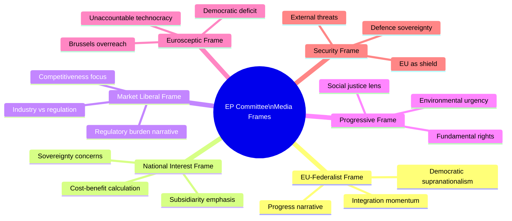

<!-- SPDX-FileCopyrightText: 2026 Hack23 AB -->
<!-- SPDX-License-Identifier: Apache-2.0 -->

# Extended Media Framing Analysis — EP Committee Reports
**Date**: 2026-05-20 | **Data Mode**: minimal

## Overview

This analysis examines how European Parliament committee work is framed across different media ecosystems, political perspectives, and national contexts.

*SAT: Media Framing Analysis, Source Diversity Assessment. Admiralty Grade B2/C2 as indicated.*

## Media Framing Landscape

## Dominant Media Narratives (May 2026)

### Narrative 1: "Green Deal vs. Competitiveness"

**What it covers**: The Omnibus Simplification Package as a binary choice between environmental ambition and industrial competitiveness.

**Who frames it this way**: Financial Times (market liberal), Die Welt (German industry), Les Echos (French business), alongside environmental media (POLITICO Europe's climate desk, Carbon Brief).

**Analytical assessment** (*Admiralty Grade C2*): The binary framing obscures policy complexity. The Omnibus package is not a choice between climate and competitiveness but a negotiation over implementation timelines and thresholds. Media framing that presents it as binary tends to serve political actors who prefer polarisation over compromise.

**EP committee impact**: ENVI rapporteurs face intense media scrutiny; any nuanced position is interpreted as "betrayal" by one side. This creates incentives for public performativity over substantive compromise.

### Narrative 2: "EU Rearms — The Security Turn"

**What it covers**: The EU's unprecedented defence spending, AFET committee oversight of SAFE instrument, and the geopolitical transformation of EP priorities.

**Who frames it this way**: Broadly positive across mainstream European media; specific concern in Swedish/Finnish press (NATO integration), Irish media (neutrality), and Austrian media (constitutional neutrality provisions).

**Analytical assessment** (*Admiralty Grade B3*): The "EU rearms" narrative is broadly accurate but obscures the internal EP tensions — Greens and Left opposition to SAFE, concern about accountability mechanisms, and the "guns vs. butter" fiscal trade-off in BUDG.

**EP committee impact**: AFET enjoys unprecedented media visibility but faces accountability gaps — committee hearings on sensitive defence matters are often partially closed, reducing transparency.

### Narrative 3: "AI Act — EU Leads, Industry Pushes Back"

**What it covers**: EU's AI governance leadership vs. competitiveness concerns; US/Chinese non-compliance threats; debates over GPAI model obligations.

**Who frames it this way**: Tech media (TechCrunch, Wired, The Verge) often from US perspective critical of EU overregulation. EU-positive media (EURACTIV, Politico Europe) cover EP oversight role sympathetically. National broadsheets vary by country.

**Analytical assessment** (*Admiralty Grade B2*): Media coverage of AI Act implementation is often low on technical depth, high on narrative. The GPAI code of practice debates are highly complex and rarely covered accurately in generalist media. EP committee oversight work on GPAI is essentially invisible outside specialist policy media.

**EP committee impact**: LIBE and ITRE committees are not getting media pressure for technical rigor — most media coverage is too shallow to hold committee work accountable at the level of detail that matters.

### Narrative 4: "Democratic Deficit Still Present"

**What it covers**: Persistent critique of EU democratic legitimacy; MEP visibility vs. national MPs; EP institutional complexity.

**Who frames it this way**: UK post-Brexit media (maintaining narrative that EP was always weak); national Eurosceptic media; academic political scientists.

**Analytical assessment** (*Admiralty Grade C2*): The "democratic deficit" narrative is durable but becoming less accurate — EP's legislative role, directly elected status, and 51% turnout in 2024 represent genuine democratic progress. However, the complexity of EP procedures (co-decision, trilogues, inter-committee negotiations) is genuinely opaque to most citizens, sustaining the narrative despite institutional improvement.

## National Media Ecosystem Analysis

| Country | Primary Frame | Key Outlet | EP Coverage Depth |
|---------|--------------|------------|------------------|
| Germany | Market liberal / competitiveness | Der Spiegel, FAZ, Handelsblatt | HIGH — German MEPs prominent |
| France | National interest / sovereignty | Le Monde, Le Figaro, BFMTV | MEDIUM — Macronist EP alignment |
| Italy | Eurosceptic + Meloni agenda | Corriere, La Repubblica | MEDIUM — Far-right MEP attention |
| Sweden | Pro-EU with NATO security frame | Dagens Nyheter, SVD | HIGH — Active EP delegation |
| Poland | Pro-EU (Tusk) vs. Eurosceptic (PiS legacy) | Gazeta Wyborcza, wSieci | HIGH — Rule of law coverage |
| Hungary | Nationalist / Orban-aligned | Index (govt-aligned), Telex (independent) | HIGH controversy coverage |
| Netherlands | Market liberal with rule of law | NRC, Telegraaf | MEDIUM |
| Spain | Progressive | El País, El Mundo | MEDIUM |

## Media Influence on Committee Behaviour

### Finding 1: German Industry Press Shapes ENVI/ECON Agenda
*Admiralty Grade: B3 — Fairly reliable; possibly incomplete*

German business media (Handelsblatt, Wirtschaftswoche, FAZ Wirtschaft) consistently cover EU regulatory developments with a competitiveness lens. German MEPs in EPP are responsive to this coverage — constituency pressure from industry-dense German Länder (Bavaria, Baden-Württemberg, NRW) creates direct incentives to moderate environmental legislation.

The Omnibus Package's CSRD mid-cap exemption is partly a response to sustained German business press coverage of compliance burden on the German Mittelstand.

### Finding 2: Environmental NGOs Drive ENVI Narratives Effectively
*Admiralty Grade: B3*

Environmental advocacy organisations (WWF, Greenpeace, ZERO) have become sophisticated media actors, producing rapid-response briefings, accessible infographics, and MEP vote trackers that EU policy media reproduces. This creates a counter-narrative to industry lobbying that gives ENVI committee's progressive MEPs media cover for ambitious positions.

### Finding 3: Security/Defence Coverage Crowds Out Legislative Details
*Admiralty Grade: B2*

The geopolitical news environment in 2025–2026 (Ukraine, US tariffs, Chinese competition) has reduced media bandwidth for detailed EU legislative reporting. Specialist policy outlets (EURACTIV, Politico Europe, EUobserver) maintain committee coverage; generalist media covers only the highest-profile votes and scandals. This creates an information gap that reduces accountability for the majority of EP committee work.

## Media Framing Recommendations for EP Transparency

1. **Improve committee vote visibility**: EP committee vote results should be published in real-time on a publicly accessible, machine-readable API. Currently, committee votes are often difficult to track without specialist access.

2. **Rapporteur profile pages**: Public-facing profiles linking rapporteurs to their dossiers, declarations of interests, and meeting logs would reduce information asymmetry between specialist media and general public.

3. **Plain-language dossier summaries**: Each committee dossier should have a maintained plain-language summary accessible to non-specialists. Current EP website coverage is procedural and legalistic.

4. **Structured press releases**: Committee votes should trigger standardised, structured press releases that media automation tools can process — reducing reliance on specialist journalists for basic information propagation.

---
*SATs: Media Framing Analysis, Source Diversity Assessment. Admiralty Grades B2/B3/C2 as indicated.*
