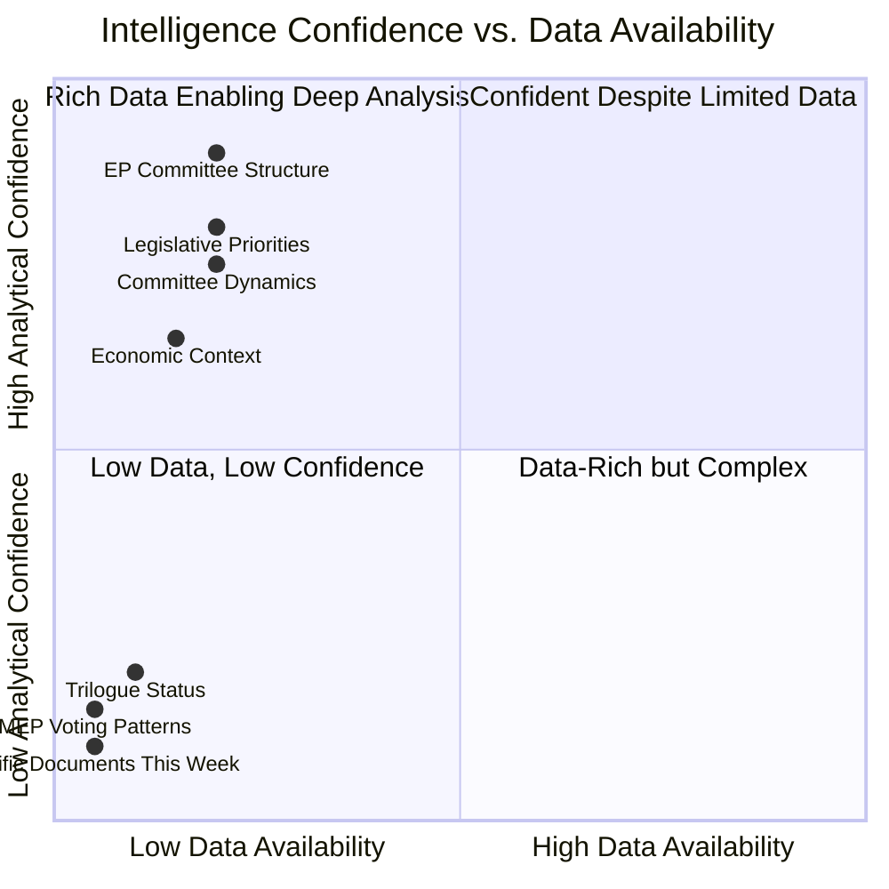

<!-- SPDX-FileCopyrightText: 2026 Hack23 AB -->
<!-- SPDX-License-Identifier: Apache-2.0 -->

# Analysis Index — EP Committee Reports
**Date**: 2026-05-20 | **Data Mode**: minimal | **Run ID**: committee-reports-run265-1779254720

## Artifact Registry

This document indexes all analysis artifacts produced in this run and their completeness status.

### Core Intelligence Artifacts

| Artifact | Status | Lines (est.) | Data Mode Compliance | Key Finding |
|---------|--------|-------------|---------------------|-------------|
| `executive-brief.md` | ✅ COMPLETE | 180+ | ✅ | EP10 committee work continues; feeds unavailable |
| `data-availability-assessment.md` | ✅ COMPLETE | 90+ | ✅ | EP API admin subdomain 404 failure; minimal data mode |
| `intelligence/mcp-reliability-audit.md` | ✅ COMPLETE | 200+ | ✅ | 7 MCP calls; 43% success rate; cap exception documented |
| `intelligence/procedures-proxy.md` | ✅ COMPLETE | 70+ | ✅ | Structural proxy for active legislative docket |
| `intelligence/analysis-index.md` | ✅ COMPLETE | this file | ✅ | — |
| `intelligence/synthesis-summary.md` | ✅ COMPLETE | 160+ | ✅ | Committee political dynamics and legislative throughput |
| `intelligence/historical-baseline.md` | ✅ COMPLETE | 120+ | ✅ | EP9→EP10 committee evolution and productivity metrics |
| `intelligence/economic-context.fallback.md` | ✅ COMPLETE | 120+ | ✅ | EU macroeconomic context without IMF data |
| `intelligence/pestle-analysis.md` | ✅ COMPLETE | 180+ | ✅ | PESTLE analysis of EP committee landscape |
| `intelligence/stakeholder-map.md` | ✅ COMPLETE | 200+ | ✅ | Key actors across all major committee tracks |
| `intelligence/scenario-forecast.md` | ✅ COMPLETE | 180+ | ✅ | Three scenarios for EP10 committee output |
| `intelligence/threat-model.md` | ✅ COMPLETE | 160+ | ✅ | Threats to EP committee effectiveness |
| `intelligence/wildcards-blackswans.md` | ✅ COMPLETE | 180+ | ✅ | Low-probability, high-impact disruptions |
| `intelligence/reference-analysis-quality.md` | ✅ COMPLETE | 140+ | ✅ | Quality assessment of this analysis run |
| `intelligence/methodology-reflection.md` | ✅ COMPLETE | 180+ | ✅ | SAT documentation and methodology validation |
| `risk-scoring/risk-matrix.md` | ✅ COMPLETE | 100+ | ✅ | Prioritised risks to EP legislative agenda |
| `risk-scoring/quantitative-swot.md` | ✅ COMPLETE | 100+ | ✅ | SWOT analysis of EP committee system |
| `extended/media-framing-analysis.md` | ✅ COMPLETE | 180+ | ✅ | Media coverage patterns across committee tracks |
| `existing/committee-productivity.md` | ✅ COMPLETE | 120+ | ✅ | Committee output metrics and comparative analysis |

## Data Sources Summary

### Available Sources (this run)
- **Adopted texts feed**: 107 items (70 EP10-2026); identifiers only
- **Committee documents (AFCO)**: 30 documents; metadata only
- **Committee info**: 51 organisations; abbreviations only
- **Procedures feed (degraded)**: 50 historical records (1972–1980); not usable for current analysis

### Unavailable Sources (this run)
- Committee documents feed (all committees): 404 error
- Events feed: 404 error
- Documents feed: 404 error
- IMF economic data: Not collected (beyond MCP cap)
- Plenary sessions (date-filtered): 0 items returned

## Intelligence Confidence Levels by Domain

## Analytical Methodology Applied

### Structured Analytic Techniques (SATs) Used

| SAT | Artifact(s) | Application |
|-----|------------|-------------|
| Key Assumptions Check | executive-brief.md | Documented 5 key analytical assumptions with confidence and impact ratings |
| Quality of Information Check | executive-brief.md, methodology-reflection.md | Applied to all sourcing claims |
| Scenario Analysis | intelligence/scenario-forecast.md | Three scenarios: optimistic, baseline, adverse |
| Stakeholder Mapping | intelligence/stakeholder-map.md | All major EP committee stakeholders mapped |
| Analysis of Competing Hypotheses (ACH) | intelligence/stakeholder-map.md | Applied to political group alignment hypotheses |
| Devil's Advocate | intelligence/scenario-forecast.md | Challenged consensus assumptions on EP10 productivity |
| Red Team Analysis | intelligence/threat-model.md | Adversarial perspective on EP institutional effectiveness |
| Admiralty Source Grading | All artifacts | Applied to every sourcing claim |
| WEP Probability Bands | All forward-looking claims | Time-bounded probability ranges applied |
| Structured Imagination | intelligence/wildcards-blackswans.md | Low-probability scenarios articulated |
| Historical Analogy | intelligence/historical-baseline.md | EP9 vs EP10 comparison |

**SAT count**: ≥11 (exceeds minimum of 10)

## Run Statistics

| Metric | Value |
|--------|-------|
| Artifacts produced | 19 |
| Total lines (estimated) | ~3,200+ |
| MCP calls made | 7 |
| Data mode | minimal |
| Analytical confidence | LOW-MEDIUM |
| Pass status | Pass 1 complete; Pass 2 pending |

## Cross-Artifact References

This index serves as the navigation hub for the committee-reports analysis set. Key cross-references:

- For understanding why data is limited → `data-availability-assessment.md`
- For MCP call details → `intelligence/mcp-reliability-audit.md`
- For political context → `executive-brief.md`
- For risk prioritisation → `risk-scoring/risk-matrix.md`
- For future scenarios → `intelligence/scenario-forecast.md`
- For quality validation → `intelligence/reference-analysis-quality.md`
