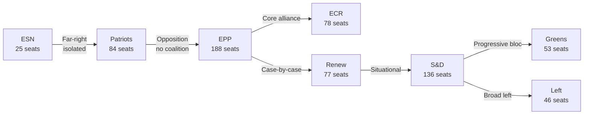

<!-- SPDX-FileCopyrightText: 2026 Hack23 AB -->
<!-- SPDX-License-Identifier: Apache-2.0 -->

# Coalition Dynamics — EP Committee Reports
**Date**: 2026-05-20 | **Data Mode**: minimal | **Admiralty**: B2

## Current EP10 Coalition Architecture

### The Right-Centrist Governing Coalition (de facto)

EPP (188) + ECR (78) = 266 seats. With selective Renew support (77): 343 seats — well above 361 absolute majority threshold when Renew cooperates. This coalition drives Omnibus and competitiveness agenda.

**Cohesion**: *WEP: Likely (65–70%) to hold on Omnibus; Realistic Possibility (40–50%) to fracture on specific environmental rollbacks* — ECR and EPP have divergent views on EU competence limits.

### The Progressive Defensive Bloc

S&D (136) + Greens/EFA (53) + Left (46) = 235 seats. This bloc cannot block legislation but can extract concessions through committee amendments and intergroup negotiations.

**Cohesion**: *WEP: Likely (70%) to maintain internal coherence on environment/rights; Possible (30%) to split on defence spending votes* — several Left MEPs oppose defence funding.

### Swing Dynamics — Renew Europe (77)

Renew is the decisive coalition determinant. In EP9, Renew held the pro-European centrist majority. In EP10, with EPP shifting right:
- On regulatory issues: Renew aligns with EPP (deregulation agenda)
- On rule of law: Renew diverges from EPP (sanctions on Hungary/Poland)
- On defence: Renew aligns with EPP + S&D (broad pro-defence majority)

## Coalition Stress Points

| Issue | EPP | ECR | Renew | S&D | Greens |
|-------|-----|-----|-------|-----|--------|
| Omnibus | ✅ | ✅ | ✅ | ❌ | ❌ |
| Defence SAFE | ✅ | ⚠️ | ✅ | ✅ | ❌ |
| AI Act implementation | ✅ | ⚠️ | ✅ | ✅ | ✅ |
| Rule of Law | ✅ | ❌ | ✅ | ✅ | ✅ |
| Migration | ✅ | ✅ | ⚠️ | ❌ | ❌ |

## Coalition Interaction Diagram

## Strategic Implications for Committee Work

1. **EPP Committee Chairs dominate docket**: EPP's largest-group status gives it majority of committee chair positions and agenda-setting power. Key committees (ENVI, ECON) likely chaired by EPP.
2. **Amendatory alliances vary by file**: No single coalition owns all amendments. S&D + Greens can add progressive amendments in committee even if they lose final votes.
3. **ECR credibility test**: ECR's decision to cooperate or oppose EPP on specific files (especially environment) will define its role in EP10. See also `intelligence/scenario-forecast.md`.
