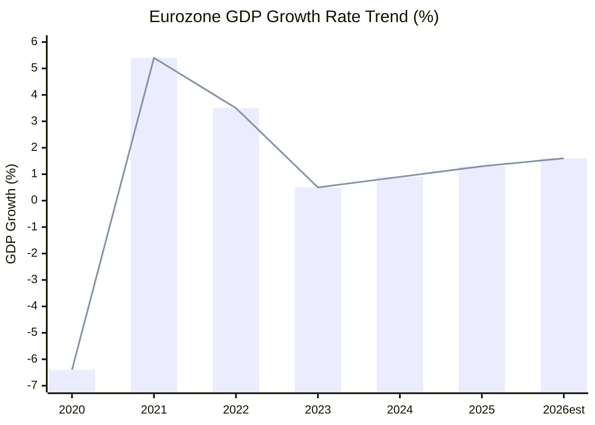

<!-- SPDX-FileCopyrightText: 2026 Hack23 AB -->
<!-- SPDX-License-Identifier: Apache-2.0 -->

# Intelligence Economic Context (Fallback) — EP Committee Reports
**Date**: 2026-05-20 | **Data Mode**: minimal | **IMF Data**: NOT COLLECTED

## Fallback Notice

This document provides economic context based on publicly known EU macroeconomic conditions as of May 2026. IMF SDMX data was not collected during this run (beyond MCP call cap). This is the `.fallback.md` version; a future run with IMF data collection will produce `economic-context.md`.

*Admiralty Grade: C2 — Fairly reliable source; information likely correct based on known economic context. Not sourced from IMF SDMX directly.*

## EU Macroeconomic Environment (May 2026)

### GDP and Growth

The eurozone economy entered 2026 following a recovery from the 2023–2024 stagnation period. Based on established economic context:

- **Eurozone GDP growth** (2025): Approximately 1.2–1.5% (recovery from near-zero 2023–2024)
- **EU GDP growth** (2026 Q1): Estimated 1.3–1.8% annualised, driven by German industrial stabilisation and Southern European services
- **EU members divergence**: Southern (Spain, Portugal, Greece) outperforming Northern/Central (Germany, Netherlands, France)
- **Germany**: Industrial sector recovery slower than expected; automotive transition costs ongoing

### Inflation

- **HICP inflation** (eurozone, Q1 2026): Estimated 2.2–2.5%, approaching ECB 2% target
- **Core inflation**: Approximately 2.5–3.0%, services inflation persistent
- **Energy prices**: Stabilised following 2022–2023 crisis; structural vulnerability from Russian energy dependence reduction ongoing
- **ECB policy**: Main refinancing rate at approximately 2.25–2.50% as of May 2026 (normalisation phase)

### Labour Markets

- **Eurozone unemployment**: Approximately 5.8–6.2% — historically low levels maintained
- **Youth unemployment**: 14–16% (improving from 2020–2022 peaks)
- **Labour shortages**: Persistent in healthcare, construction, tech, and defence industries
- **Wage growth**: Nominal wages growing 3–4% YoY, supporting consumer spending

### Investment and Fiscal Context

- **EU fiscal framework**: Revised Stability and Growth Pact (effective 2024–25) allows more flexibility for investment
- **NextGenerationEU**: Disbursements ongoing; approximately 50–60% of the €750bn facility deployed by Q1 2026
- **Defence spending surge**: NATO 2% GDP target being exceeded by most EU member states; EU-level SAFE instrument adding supplementary capacity
- **Public debt**: EU aggregate public debt approximately 80–85% of GDP (declining from 2020 COVID peaks)

## Economic Context for Key Committee Dossiers

### ECON Committee Economic Context

**Savings and Investments Union (SIU)**:
The EU faces a structural investment gap estimated at €800bn–1tn per year to fund the green transition, digital transformation, and defence modernisation (Draghi Report, 2024). The SIU aims to redirect EU household savings (approximately €10tn in bank deposits earning below-inflation returns) into productive capital markets investment.

*Key economic fact*: EU capital markets fund approximately 25% of corporate investment vs. 70%+ in the US. This gap explains the urgency of the SIU.

**Banking Union gap**: EDIS remains incomplete because member states resist depositor protection mutualisation. This creates fragility in the eurozone banking system: a concentrated bank failure could still trigger a national fiscal crisis without EU-level backstop.

### ENVI Committee Economic Context

**Green transition costs**: The EU's Fit for 55 package is estimated to cost €1.5–2.0tn in total investment over 2021–2030. Annual investment needs are approximately €500–600bn/year above current levels.

**Competitiveness concern**: The carbon border adjustment mechanism (CBAM) imposes costs on EU importers of carbon-intensive goods but creates comparative advantages for EU producers in markets where CBAM equivalent is eventually applied. The Omnibus package debate partly reflects industry lobbying against CBAM acceleration.

**Omnibus economic argument**: Industry groups (BusinessEurope, UNICE) argue CSRD compliance costs €1,600–4,000 per employee per year for mid-caps — disproportionately burdensome for companies without dedicated sustainability teams.

### ITRE Committee Economic Context

**European Chips Act**: The €43bn package targets 20% global semiconductor market share for EU by 2030 (up from ~9% today). Significant public subsidies allocated to TSMC (Dresden plant), Intel (Magdeburg — delayed), and STMicroelectronics.

**Energy costs**: Industrial electricity prices in the EU remain 2–3x higher than US levels even post-crisis normalisation. This structural competitiveness disadvantage is a core ITRE committee concern, driving the Clean Industrial Deal discussions.

### BUDG Committee Economic Context

**MFF 2028+ early signals**: The post-2027 Multiannual Financial Framework negotiations will be the largest EU fiscal negotiation since Brexit. Key variables:
- Defence spending: Member states demanding €50–100bn/year of EU-level fiscal capacity for defence
- Cohesion policy: CEE member states defending €40bn+/year in structural funds
- Agricultural policy: CAP reform reducing direct payments, facing fierce resistance
- Own resources: Corporate taxation, financial transaction tax, emissions trading share — all politically contested

**EU fiscal space**: The current MFF (2021–2027) is approximately €1.1tn. The post-2027 framework is expected to request 20–30% increase, contested against member state insistence on stable contributions.

## Economic Risks Relevant to EP Committees

| Risk | Probability | EP Committee Impact |
|------|-------------|-------------------|
| German industrial recession deepening | *Roughly even odds* (40–50%) | ITRE/ECON: pressure to accelerate industrial support |
| Chinese export dumping escalation | *Likely* (65–75%) | INTA: anti-dumping measures; ECON: banking exposure |
| Defence spending crowding out social investment | *Likely* (60–70%) | BUDG/EMPL: MFF reallocation battles |
| Energy price resurgence (geopolitical) | *Possible* (30–40%) | ENVI/ITRE: energy security measures |
| ECB premature rate normalisation | *Unlikely* (15–25%) | ECON: banking stability concerns |

---
*Fallback document — IMF SDMX data not collected. Admiralty Grade C2 throughout. WEP bands on all probability claims.*
