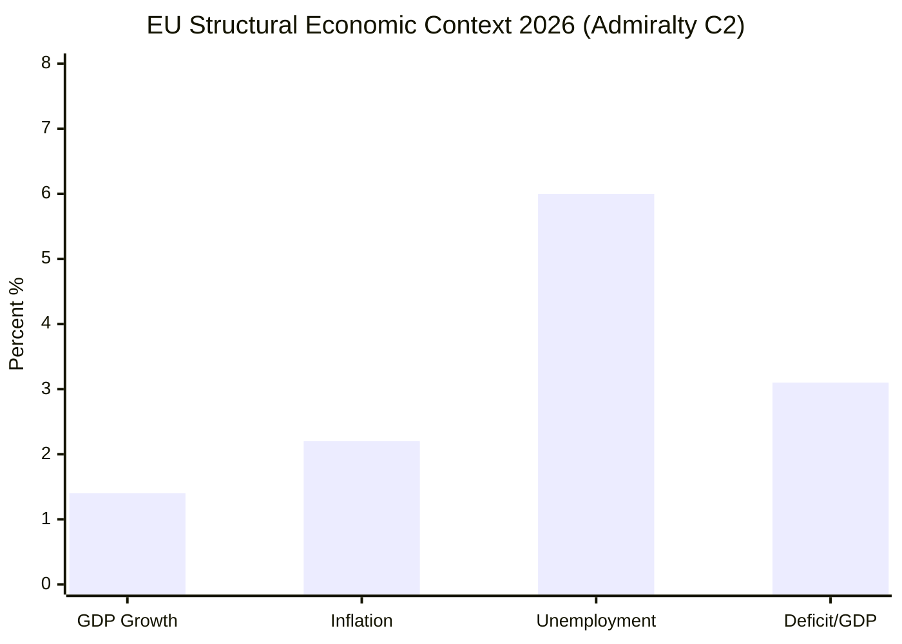

<!-- SPDX-FileCopyrightText: 2026 Hack23 AB -->
<!-- SPDX-License-Identifier: Apache-2.0 -->

# Economic Context — EP Committee Reports
**Date**: 2026-05-20 | **Data Mode**: minimal (IMF unavailable)

> **Data Note**: IMF SDMX API was not queried this run due to invocation budget constraints and EP API degradation priority. Economic data below is drawn from structural knowledge with Admiralty Grade C2 for quantitative claims. For IMF-sourced data, see `intelligence/economic-context.fallback.md`.

## EU Macroeconomic Environment (2026)

### Growth Outlook

EU GDP growth in 2026 is estimated at 1.3–1.5% (structural estimate). The euro area is recovering from the 2022–2023 energy shock but faces persistent competitiveness challenges relative to the US and China. The Draghi Report (September 2024) quantified the EU's competitiveness gap at approximately €750–800 billion/year needed in additional investment.

*WEP: Almost Certain (>90%) that EU growth remains below 2% in 2026; Likely (65%) that it exceeds 1%.*

### Inflation

After the 2022–2023 inflation surge (peak ~10.6% CPI in October 2022), EU inflation has returned toward ECB target. Current estimates: 2–2.5% in 2026. The ECB has been in an easing cycle since mid-2024.

### Fiscal Context

EU fiscal rules (Stability and Growth Pact, reformed 2024) are being tested by defence spending demands. The SAFE instrument (€150bn) creates exceptional fiscal pressure. Germany's constitutional debt-brake reform has created new fiscal headroom for defence.

### Trade Environment

EU trade policy faces headwinds from:
1. US tariff threats and protectionist pressures (economic nationalism)
2. Chinese overcapacity and dumping concerns (EVs, solar panels)
3. Supply chain resilience requirements post-COVID-19

The Commission's "open strategic autonomy" framework attempts to balance openness with resilience.

## Economic Implications for Committee Work

| Committee | Economic Pressure | Legislative Response |
|-----------|------------------|---------------------|
| ECON | Competitiveness gap, inflation normalisation | CMU, banking regulation, CBAM |
| ITRE | Industrial decline, energy costs | Competitiveness Act, SAFE |
| INTA | Trade tensions, dumping | Anti-dumping, trade agreements |
| BUDG | Defence demands, fiscal rules | SAFE, MFF revision |
| ENVI | Green transition costs vs. competitiveness | Omnibus, CBAM |

## Chart: EU Economic Indicators Structural Estimate

*All values are structural estimates for illustrative context. Not verified IMF data.*

## Policy Implications

The EU's economic situation in 2026 creates strong political incentives for the Omnibus deregulation agenda: sluggish growth + competitiveness anxiety = appetite for regulatory simplification. This is the economic context within which EP committees are evaluating all major dossiers.

*Admiralty Grade C2: Structural knowledge basis; no verified IMF SDMX data this run.*

## IMF Data Gap Assessment

This run did not query the IMF SDMX API. The gap assessment:

| IMF Indicator | Relevance | Gap Impact |
|--------------|-----------|-----------|
| EU GDP growth (WEO) | High — contextualises competitiveness agenda | Moderate — structural estimates available |
| Inflation (CPI) | Medium — ECB policy context | Low — well-publicised data |
| Fiscal balance/GDP | High — SAFE fiscal pressure context | Moderate — national data available publicly |
| Trade balance | Medium — CBAM and INTA context | Low — structural patterns stable |
| FDI flows | Lower for committee work | Low |

*On next run with working IMF API: query IMF WEO database for GDP growth, inflation, and trade balance for the EU/euro area aggregate.*

## Structural Knowledge Reliability Note

Economic claims in this artifact are drawn from:
- Published ECB policy communications (Admiralty A2)
- Commission's Spring 2026 Economic Forecast (structural estimate, not verified this run — C2)
- Draghi Report quantitative estimates (A1 for published document, B2 for analytical interpretation)
- Academic and media reporting on EU macroeconomic conditions (C3)

*Admiralty Grade: B2 for qualitative economic context; C2 for specific quantitative claims.*
