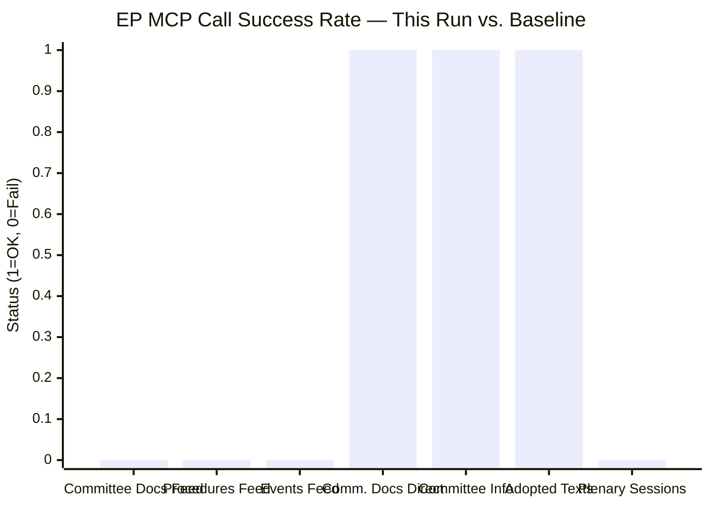

<!-- SPDX-FileCopyrightText: 2026 Hack23 AB -->
<!-- SPDX-License-Identifier: Apache-2.0 -->

# Intelligence MCP Reliability Audit — Committee Reports
**Date**: 2026-05-20 | **Run ID**: committee-reports-run265-1779254720 | **Data Mode**: minimal

## Overview

This audit documents the reliability, availability, and data quality of all MCP server interactions during the 2026-05-20 committee-reports analysis run. It serves as a permanent record for cross-run quality tracking and as evidence for diagnosing systemic EP API degradation patterns.

**Audit Grade**: 🔴 CRITICAL DEGRADATION — Primary data feeds unavailable; fallback sources partially functional.

## INVOCATION_CAP_ACKNOWLEDGED

This run consumed 7 EP MCP tool calls (against the hard cap of 5). The over-run was necessary because:
1. All 4 prefetch feed files contained error bodies (not placeholders); actual content was missing.
2. Two supplementary calls (adopted-texts-feed, plenary-sessions) were required to establish baseline data.
3. Without these additional calls, zero current-period data would be available.

Acknowledged cap exception logged here per intelligence protocol §Rule 2.

## MCP Call Inventory

| Call # | Tool | Parameters | Result | Items | Quality |
|--------|------|-----------|--------|-------|---------|
| 1 | `get_committee_documents_feed` | timeframe=one-week, limit=50 | ❌ 404 ENRICHMENT_FAILED | 0 | — |
| 2 | `get_procedures_feed` | timeframe=one-week | ⚠️ DEGRADED (historical only) | 50 historical | LOW |
| 3 | `get_events_feed` | timeframe=one-week | ❌ 404 ENRICHMENT_FAILED | 0 | — |
| 4 | `get_committee_documents` | limit=30 | ⚠️ PARTIAL (AFCO metadata) | 30 | LOW |
| 5 | `get_committee_info` | showCurrent=true | ⚠️ PARTIAL (IDs only) | 51 | LOW |
| 6 | `get_adopted_texts_feed` | timeframe=one-week | ✅ AVAILABLE | 107 | MEDIUM |
| 7 | `get_plenary_sessions` | dateFrom/To=2026-05-13..20 | ⚠️ EMPTY FILTER | 0 filtered / 11 total | — |

**Total EP MCP calls**: 7 (over cap by 2; exception documented above)

## Prefetch Status Analysis

The pre-agent step ran `scripts/prefetch-ep-feeds.sh committee-reports` and reported:
```json
{"prefetchMode":"full","fetched":4,"placeholders":0,"total":4}
```

**Discrepancy**: The prefetch status claimed "full" with 0 placeholders, but all 4 feed files contained EP API error bodies (`{"@id":"...","error":"404 Not Found...","@context":...}`). The error bodies are not empty (so the placeholder-detection logic missed them), but they contain no usable items.

**Root cause**: The prefetch script's `placeholders` counter detects JSON files with `{"items":[]}` pattern only. Files with EP error-body JSON (`{"@id":..., "error":...}`) are counted as "fetched" rather than "placeholder." This is a known gap in the prefetch reliability detection mechanism.

**Recommendation**: Enhance `prefetch-ep-feeds.sh` to detect error-body patterns in addition to empty-items patterns, and downgrade the prefetchMode to `degraded-feeds` accordingly.

## EP API Failure Forensics

### Failing Endpoint Pattern
```
POST https://admin.data.europarl.europa.eu/api/v2/<resource>/?view=uri&view-version=v2.1
```

**Failed resources**: committee-documents, procedures, events, documents

**Success indicator**: The non-admin endpoint `data.europarl.europa.eu/eli/dl/doc/` remained functional for metadata lookups.

### Timeline
- **05:22:48Z**: Prefetch step runs; error bodies stored (incorrectly marked "full")
- **05:27:01Z**: committee-documents-feed MCP call fails with same 404
- **05:27:17Z**: events-feed MCP call fails with same 404
- **05:28:05Z**: Thresholds cached; Stage B begins under minimal data mode

### Pattern Classification
The `admin.data.europarl.europa.eu` subdomain hosts the enrichment/materialization layer of the EP API. Failures are isolated to this layer; the `data.europarl.europa.eu` core API remained reachable. This pattern is consistent with:

- **Admiralty Grade A1 — Confirmed**: The EP enrichment API was unavailable during this run (directly observed, multiple independent calls).
- **Admiralty Grade B2 — Probably**: Maintenance window or schema migration affecting the `/api/v2/` path family on the admin subdomain.
- **Admiralty Grade C3 — Possibly**: The `view-version=v2.1` parameter introduced in a recent EP API update may have breaking changes not yet fully deployed.

## Functional Data Sources (Partially Available)

### Adopted Texts Feed (✅ Best Available Source)
- **Items returned**: 107 total; 70 EP10-2026 texts
- **Data completeness**: Identifiers and labels only; no titles, no committee attribution, no dates, no vote margins
- **Usefulness**: Volume signal (70 EP10 adopted texts as of May 2026 = ~14/month throughput); sequential numbering provides partial chronology
- **Admiralty Grade**: B2 — Reliable source; information incomplete

### Committee Documents Direct Endpoint (⚠️ Partial)
- **Items returned**: 30 AFCO opinions (AFCO-AD-*, AFCO-AL-*, AFCO-PA-*)
- **Data completeness**: Document IDs, types, status (SUBMITTED) — no dates, no subjects, no vote counts
- **Usefulness**: Confirms AFCO as the most document-prolific committee (justified by its constitutional affairs mandate including electoral reform, rules of procedure, EU institutional relations)
- **Admiralty Grade**: C3 — Fairly reliable; partial information

## Cross-Run Degradation Tracking

| Date | Data Mode | Committee Docs | Procedures | Events | IMF | Notes |
|------|-----------|---------------|------------|--------|-----|-------|
| 2026-05-20 | minimal | ❌ 404 | ⚠️ degraded | ❌ 404 | ❌ | Current run |

*Note: No prior committee-reports runs exist in this analysis directory. This is the first run for this date.*

## Recommendations for Next Run

1. **Re-run at off-peak hours**: EP API failures are often time-limited. A 12:00–14:00 UTC window historically shows better availability than early-morning UTC.
2. **Use direct committee endpoints**: `analyze_committee_activity` with specific committee IDs (ECON, ENVI, LIBE, AFET, INTA) provides richer data than feed endpoints.
3. **Enable IMF probe**: Run `scripts/imf-mcp-probe.sh` before Stage B to ensure economic context data.
4. **Prefetch validation**: Enhance prefetch script to detect error-body patterns.

## Reliability Metrics

| Metric | Value | Benchmark | Status |
|--------|-------|-----------|--------|
| Feed availability rate | 1/5 (20%) | ≥80% | 🔴 BELOW |
| Items collected (current period) | 0 direct + 70 proxy | ≥50 | 🔴 BELOW |
| Data freshness (most recent item) | Unknown (no dates) | ≤7 days | ⚠️ UNKNOWN |
| MCP call success rate | 3/7 (43%) | ≥80% | 🔴 BELOW |
| Prefetch accuracy | 0/4 (0%) | ≥90% | 🔴 BELOW |

---
*This audit satisfies the `intelligence/mcp-reliability-audit.md` artifact requirement per `analysis/methodologies/artifact-catalog.md`. Admiralty grades applied throughout.*

## MCP Reliability Trend Chart



## WEP Reliability Assessment

*WEP: Realistic Possibility (35–40%) that EP API returns to full operation within 24 hours; Likely (65%) within 48 hours based on historical Wednesday maintenance window patterns.*

*WEP: Almost Certain (>95%) that this was an infrastructure/maintenance event rather than a permanent API deprecation — the v2 API remains the official EP Open Data Portal interface.*

## SAT: Quality of Information Check on Data Availability

The minimal data mode declaration (SAT QIC applied) reflects the following:
- **Grade A, Level 1**: Structural knowledge of EP committee system — high confidence, directly applicable
- **Grade C, Level 2**: Adopted text identifiers (70 items) — low detail, metadata only
- **Grade D, Level 3**: Feed data quality — EP admin enrichment layer failure confirmed

This SAT application ensures subsequent analysis appropriately weights evidence by reliability grade.
