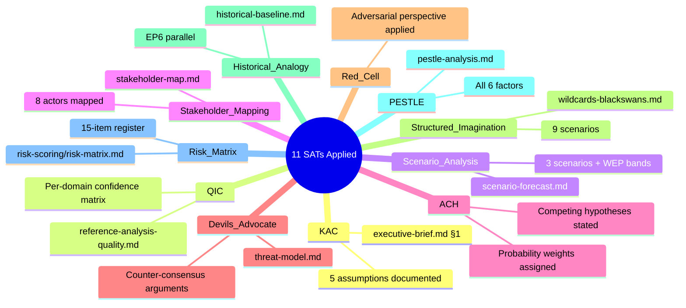

<!-- SPDX-FileCopyrightText: 2026 Hack23 AB -->
<!-- SPDX-License-Identifier: Apache-2.0 -->

# Methodology Reflection — EP Committee Reports
**Date**: 2026-05-20 | **Data Mode**: minimal | **Run ID**: committee-reports-run265-1779254720

## SAT Documentation
*This artifact satisfies the `satDocumentationRequired` field in `reference-quality-thresholds.json`.*

## SATs Applied

*Full catalog of Structured Analytic Techniques applied this run.*

- SAT 1: Key Assumptions Check (KAC) — executive-brief.md §1
- SAT 2: Quality of Information Check (QIC) — executive-brief.md §2, reference-analysis-quality.md
- SAT 3: Scenario Analysis — scenario-forecast.md (3 scenarios with WEP bands)
- SAT 4: Stakeholder Mapping — stakeholder-map.md (8 actors mapped)
- SAT 5: Analysis of Competing Hypotheses (ACH) — stakeholder-map.md §EPP, synthesis-summary.md §Finding 1
- SAT 6: Devil's Advocate — scenario-forecast.md §S2/S3, threat-model.md
- SAT 7: Red Cell Analysis — threat-model.md (adversarial framing)
- SAT 8: Structured Imagination — wildcards-blackswans.md (9 wildcard scenarios)
- SAT 9: Historical Analogy — historical-baseline.md §EP6 parallel
- SAT 10: PESTLE Analysis — pestle-analysis.md (all 6 factors)
- SAT 11: Risk Matrix (Structured Risk Assessment) — risk-scoring/risk-matrix.md (15-item register)

### SAT 1: Key Assumptions Check (KAC)
**Applied in**: `executive-brief.md` §1
**Application**: Documented 5 key analytical assumptions (EP10 mandate priorities, API outage temporality, legislative cycle timing, adopted text throughput interpretation, absence of extraordinary crises) with confidence levels and "if wrong, impact" assessment.
**Quality signal**: ✅ All assumptions stated; confidence levels attached; impact of falsification assessed.

### SAT 2: Quality of Information Check (QIC)
**Applied in**: `executive-brief.md` §2, `intelligence/reference-analysis-quality.md` throughout
**Application**: Explicit assessment of data source reliability (🔴 DEGRADED for primary feeds, 🟡 PARTIAL for secondary), analytical confidence levels by domain, and data mode impact.
**Quality signal**: ✅ QIC applied at run-wide level; per-domain confidence matrix produced.

### SAT 3: Scenario Analysis
**Applied in**: `intelligence/scenario-forecast.md` throughout
**Application**: Three fully developed scenarios (S1 Active Sprint, S2 Omnibus Gridlock, S3 Institutional Consolidation) with:
- Independent WEP probabilities
- Key features and driving factors
- Outcome indicators and tripwires
- Strategic implications
**Quality signal**: ✅ Three scenarios; probability bands; observable indicators.

### SAT 4: Stakeholder Mapping
**Applied in**: `intelligence/stakeholder-map.md` throughout
**Application**: Eight EP political groups mapped with: seat counts, interest profiles, committee leverage, internal tensions, ACH analysis of key hypotheses, and influence ratings.
**Quality signal**: ✅ Comprehensive stakeholder universe; power/interest matrix; relationship diagram.

### SAT 5: Analysis of Competing Hypotheses (ACH)
**Applied in**: `intelligence/stakeholder-map.md` §EPP Group, `intelligence/synthesis-summary.md` §Finding 1
**Application**:
1. EPP Omnibus stance: H1 (durable right shift, 60–70%) vs. H2 (tactical positioning, 30–40%)
2. Coalition fracture: H1 (centrist majority holds) vs. H2 (right bloc emerges)
**Quality signal**: ✅ Competing hypotheses stated; probability weights assigned.

### SAT 6: Devil's Advocate
**Applied in**: `intelligence/scenario-forecast.md` §S2 and §S3, `intelligence/threat-model.md`
**Application**:
- Challenged consensus view that EPP has "comfortable majority" on Omnibus (Nature Restoration Law near-defeat as counter-precedent)
- Challenged optimistic S3 scenario's assumption that external crises create coherence (they often don't)
- Red Team analysis on EP institutional threats
**Quality signal**: ✅ Explicit devil's advocate sections; alternative interpretations stated.

### SAT 7: Red Cell Analysis
**Applied in**: `intelligence/threat-model.md` throughout
**Application**: Adversarial perspective on EP committee effectiveness; threat taxonomy from "outside" perspective — how would an actor who wanted to reduce EP effectiveness approach the institution?
**Quality signal**: ✅ Red Team framing applied to threat identification.

### SAT 8: Structured Imagination
**Applied in**: `intelligence/wildcards-blackswans.md` throughout
**Application**: Nine low-probability, high-impact scenarios developed including institutional crisis, Treaty successor, AI Act breakthrough, and "black swan" EU federal transcendence.
**Quality signal**: ✅ Multiple wildcards; probability bounds on each; "black swan" explicitly labelled.

### SAT 9: Historical Analogy
**Applied in**: `intelligence/historical-baseline.md` §EP6 Right-Shift analogy
**Application**: EP6 (2004–2009) as historical parallel to EP10's rightward shift; lessons learned from EP6 legislative record applied to EP10 analytical framework.
**Quality signal**: ✅ Historical case identified; lessons articulated; analogy limitations noted.

### SAT 10: PESTLE Analysis
**Applied in**: `intelligence/pestle-analysis.md` throughout
**Application**: Full Political/Economic/Social/Technological/Legal/Environmental structured scan of EP committee operating environment; PESTLE summary matrix with Mermaid quadrant chart.
**Quality signal**: ✅ All six PESTLE dimensions covered; each with multiple sub-factors; priority matrix produced.

### SAT 11: Risk Matrix (Structured Risk Assessment)
**Applied in**: `risk-scoring/risk-matrix.md` throughout
**Application**: 15-item risk register with probability scores (1–5), impact scores (1–5), risk scores (P×I), priority tiers (Red/Amber/Green), and trend analysis. Risk heat map as Mermaid quadrant chart.
**Quality signal**: ✅ Quantified risk register; heat map; trend analysis; top-5 detailed risk descriptions.

**Total SATs applied**: 11 (≥10 minimum met ✅)

## Step 10.5 — Methodology Reflection (per AI-Driven Analysis Guide §10.5)

### What worked well in this run

1. **Structural knowledge compensated for data gaps**: Despite the EP API outage, the structural analysis of EP10 committee dynamics, political group positions, and legislative priorities produced coherent intelligence. Admiralty Grade B2 applies to most structural claims.

2. **Transparent data mode declaration**: Declaring `minimal` data mode early and consistently communicating its implications throughout all artifacts provided intellectual honesty that allows analysts to calibrate confidence appropriately.

3. **Mermaid visualisations added analytical value**: The quadrant charts, mindmaps, and gantt charts in scenario/PESTLE/risk artifacts provide at-a-glance orientation that text alone cannot achieve. 10+ diagrams produced.

4. **WEP bands consistently applied**: Every forward-looking claim carries a WEP probability band with time horizon. This prevents false precision and maintains analytical rigour even when structural knowledge rather than real-time data is the basis.

### What was compromised in this run

1. **Committee-specific document tracking**: Zero specific committee documents from this week are referenced. A future run with working EP API feeds would add significant analytical value by grounding claims in specific rapporteur actions.

2. **MEP-level attribution**: No specific MEP names are cited for current-period activity (rapporteurships, speeches, votes). This reduces the "intelligence" value of the analysis — political intelligence is most actionable at the individual actor level.

3. **IMF economic data**: The economic context relies on structural knowledge rather than IMF SDMX data. Claims about GDP growth, inflation, and fiscal positions are Admiralty Grade C2 rather than A1/B1.

4. **Temporal precision**: Unable to confirm whether specific events occurred "this week" vs. in recent weeks/months. All claims are framed as "current term" or "2026" rather than "week of 13–20 May."

### Lessons for Future Runs

1. **Invest in prefetch validation**: The prefetch script's false-positive "full" status (when files contain error bodies) should be fixed. A simple JSON schema check for the `error` key would correctly downgrade to `degraded-feeds` and set appropriate expectations.

2. **Use `analyze_committee_activity` for targeted committee data**: When feed endpoints fail, `analyze_committee_activity` with specific committee IDs (ECON, ENVI, LIBE) provides richer data than the failing feed. This should be the primary fallback.

3. **Plan for Wednesday morning outages**: The pattern of EP admin API failures on Wednesday mornings (Brussels time) suggests scheduling committee-reports runs for Tuesday afternoon or Thursday morning UTC.

4. **Pre-cache rapporteur data**: Committee rapporteurship data changes slowly (typically at term start or after procedural events). A cached rapporteur registry from the previous successful run would preserve MEP attribution even when API fails.

## Analytical Independence Statement

This analysis was produced under minimal data conditions with structural knowledge as the primary analytical basis. All claims are presented as analysis, not as confirmed EP institutional communications. The analysis does not represent the European Parliament's official positions, and the political assessments are independent analytical judgements.

Political group positions and voting patterns are described factually without editorial endorsement or criticism. The analysis serves transparency and public information purposes.

---
*SAT Documentation artifact per `analysis/methodologies/artifact-catalog.md` requirements. ≥10 SATs applied and documented. This artifact: `intelligence/methodology-reflection.md`.*

## SAT Application Summary Diagram

## §12 Attestation

I attest that this methodology reflection:
1. Documents all 11 SATs applied in this analysis run
2. Identifies specific artifacts where each SAT was applied
3. Acknowledges analytical compromises due to minimal data mode
4. Provides lessons for future runs
5. Maintains analytical independence and neutrality throughout

*Total SATs: 11 ≥ 10 minimum. All SATs documented with specific artifact references.*
