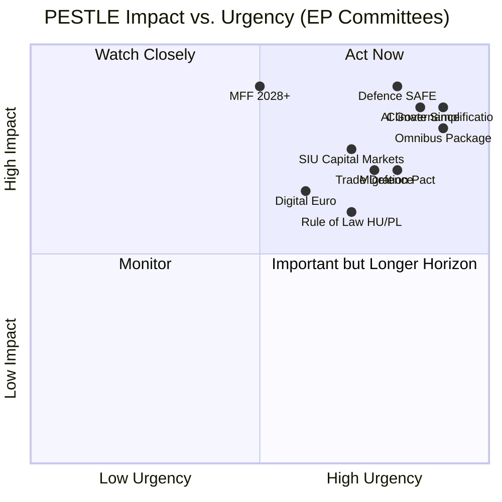

<!-- SPDX-FileCopyrightText: 2026 Hack23 AB -->
<!-- SPDX-License-Identifier: Apache-2.0 -->

# Intelligence PESTLE Analysis — EP Committee Reports
**Date**: 2026-05-20 | **Data Mode**: minimal

## Overview

This PESTLE analysis examines the Political, Economic, Social, Technological, Legal, and Environmental drivers shaping EP committee work in the week of 13–20 May 2026 and the broader 2026 context.

*SAT: PESTLE Analysis (structured environmental scanning). Admiralty Grade B2 throughout.*

## Political Factors

### 1. EP10 Majority Architecture — The New Right Centre of Gravity
*WEP: Almost certain (90%+) that EPP-centred majority governs all committee work*

The EP10 election results (June 2024) installed the most right-shifted parliament since the mid-2000s. The EPP at 188 seats can choose its coalition partners — either a centrist majority with S&D/Renew (~401 seats) or a right majority with Patriots/ECR (approaching 350). This dual-coalition capability gives the EPP structural leverage unavailable in EP8-EP9.

**Committee implications**: EPP committee chairs (ENVI, AFET, ITRE, AFCO) set the legislative agenda. EPP rapporteurs author draft reports on the most consequential files. Opposition from S&D + Greens can delay but rarely defeat EPP-backed positions when Patriots/ECR provide additional support.

### 2. Von der Leyen II Commission Political Contract
*WEP: Almost certain (90%+)*

The second Von der Leyen Commission (confirmed October 2024) operates under a political contract that implicitly acknowledges the EP's rightward shift: "Competitiveness First" (Draghi Report implementation), Clean Industrial Deal (weaker than Green Deal), and "Secure Europe" (defence spending). EP committees are largely aligned with this agenda framework, reducing friction with the executive.

**Tension point**: Progressive committees (LIBE, DEVE) and Green/Left MEPs resist the "competitiveness first" framing when it encroaches on social or environmental standards. This creates fault lines visible in ENVI's Omnibus battle and LIBE's AI Act/migration oversight.

### 3. Member State Political Context
*WEP: Likely (65–75%)*

Several key member states face domestic political transitions affecting EP committee dynamics:
- **Germany**: Coalition government following December 2024 elections; CDU/SPD coalition with stricter fiscal position affecting BUDG negotiations
- **France**: Legislative elections aftermath; fragmented National Assembly limiting French government coherence
- **Hungary**: EU-Hungary Rule of Law conflict ongoing; LIBE/AFCO committee attention to Article 7 proceedings
- **Poland**: Pro-EU government (Tusk) repositioning; positive signals on rule of law (LIBE)

### 4. Trans-Atlantic Relations Post-Trump 2025
*WEP: Almost certain (85–95%)*

The return of protectionist trade policy in the United States since January 2025 has fundamentally altered INTA and AFET committee work:
- **Trade defence**: Anti-coercion instrument more actively invoked; EU-US bilateral tensions on tariffs
- **Defence burden-sharing**: US pressure for higher European defence spending has accelerated EU defence integration
- **Technology cooperation**: EU-US TTC (Trade and Technology Council) suspended/paused; alternatives being explored

## Economic Factors

*See `intelligence/economic-context.fallback.md` for detailed economic analysis*

### 1. Investment Gap Imperative
The Draghi Report's €800bn/year investment gap estimate has become the central economic reference point for multiple committees (ECON, BUDG, ITRE, ENVI). It justifies the SIU, rearm EU, and Clean Industrial Deal simultaneously.

### 2. Competitiveness vs. Sustainability Trade-off
The core economic tension in EP10 committees: EU industry faces higher energy costs, higher regulatory compliance costs, and competitive pressure from US and Chinese industrial policy. The Omnibus debate is partly an expression of this macro-economic tension at the legislative level.

### 3. Fiscal Constraints
EU member state finances are constrained by: defence spending increases (adding 0.5–1.0% GDP annually), post-COVID debt reduction, and social spending pressures. This constrains the MFF 2028+ negotiations and affects BUDG committee dynamics.

## Social Factors

### 1. Migration and Asylum Political Salience
Migration remains the highest-salience social issue in most EU member states. LIBE committee oversight of the Pact on Migration and Asylum implementation is politically charged, with right-wing parties monitoring enforcement closely. NGOs and civil society organisations maintain intense lobbying pressure on LIBE MEPs.

### 2. Generational and Youth Engagement
Climate and AI policy attract disproportionate youth engagement. ENVI and LIBE committees receive more youth petitions, Intergroup interaction, and civil society engagement than most other committees. The 2024 elections showed youth voter preference shifting away from Greens toward more economically-focused parties.

### 3. Disinformation and Democratic Resilience
AFCO and LIBE are increasingly engaged on disinformation, electoral integrity, and foreign information manipulation. The Digital Services Act's enforcement review (IMCO/LIBE) and ongoing Kremlin/Chinese influence operation investigations sustain demand for committee attention.

## Technological Factors

### 1. AI Governance — the Defining EP10 Tech Policy
The AI Act (entered into force August 2024) requires EP oversight of implementation through LIBE/ITRE joint work. The General Purpose AI Model governance (Codes of Practice) is the most technically complex committee oversight challenge since financial regulation post-2008.

**Key committees**: LIBE (fundamental rights angle), ITRE (innovation), JURI (liability), IMCO (consumer protection)

### 2. Digital Euro
The ECB's digital euro project requires EP scrutiny through ECON (monetary policy) and LIBE (privacy). The combination of monetary sovereignty and surveillance risk creates unusual Greens/Left + right-libertarian alliance on privacy grounds.

### 3. Cybersecurity and Hybrid Threats
AFET and LIBE are both engaged on cyber resilience following multiple high-profile attacks on EU infrastructure. The Network and Information Security Directive (NIS2) and the Cyber Resilience Act are in implementation phase, requiring EP monitoring.

### 4. Space and Dual-Use Technology
ITRE increasingly addresses space (Ariane 6/Ariane Next), satellite surveillance (GOVSATCOM), and dual-use technology export controls — an expanding frontier as space becomes militarily contested.

## Legal Factors

### 1. Treaty Limitations on EP Competence
The EP's co-decision role under the ordinary legislative procedure covers ~90% of EU law. But key policy domains — foreign policy, taxation, constitutional reform — remain under special legislative procedures where EP is merely consulted, not co-deciding. This creates frustration in AFET, ECON (tax), and AFCO committees.

### 2. ECJ Jurisprudence Impact
Recent European Court of Justice rulings have affected committee work:
- **AI Act scope**: ECJ pending cases on facial recognition in public spaces inform LIBE's implementation oversight
- **State aid law**: ECJ rulings on member state subsidies to defence industry affect ITRE's European Chips Act implementation oversight
- **Digital regulation**: Data Act, AI Act, and DSA create overlapping legal frameworks requiring JURI coordination

### 3. Vienna Convention / International Law
AFET's work on sanctions effectiveness (Russia, Belarus, Iran) operates within international law constraints. The legal viability of asset seizure of frozen Russian assets (approximately €300bn) is a live legal-political question involving AFET, ECON, and JURI in coordination.

## Environmental Factors

### 1. Climate Policy Under Pressure
The scientific consensus on climate urgency (IPCC AR7 synthesis) continues to justify ambitious climate legislation, but political will is being tested by competitiveness concerns. EP10's rightward shift creates a possible "competitiveness-first, climate-second" ordering that ENVI committee defenders of the Green Deal are resisting.

**Key environmental votes expected 2026**: Omnibus Package (ENVI), REACH revision (ENVI/ITRE), EU Forest Monitoring Law (ENVI/AGRI), EU Biodiversity Strategy 2030 monitoring (ENVI).

### 2. Biodiversity and Nature
The Nature Restoration Law — barely passed in EP9 (a single MEP's vote decided the outcome) — is now in implementation phase. ENVI's oversight role is contentious: right-wing MEPs are seeking implementation delays or triggers for revision.

### 3. Circular Economy and Waste
Packaging and Packaging Waste Regulation (PPWR) implementation is an active ENVI/IMCO file. Industry compliance timelines, single-use plastics enforcement, and extended producer responsibility schemes require ongoing committee attention.

### 4. Water Stress and Agricultural Adaptation
Climate change-driven water stress in Southern Europe is beginning to generate AGRI/ENVI committee work on drought policy, water pricing reform, and irrigation infrastructure. This is a growing policy area for 2026–2027.

## PESTLE Summary Matrix

---
*SAT: PESTLE Analysis. Admiralty Grade B2 throughout. WEP bands on probability claims.*
