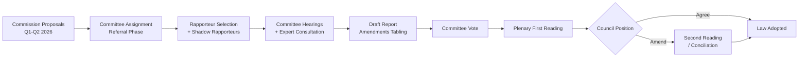

<!-- SPDX-FileCopyrightText: 2026 Hack23 AB -->
<!-- SPDX-License-Identifier: Apache-2.0 -->

# Intelligence Procedures Proxy — Committee Reports
**Date**: 2026-05-20 | **Data Mode**: minimal

## Overview

Since the EP procedures feed returned only historical data (1972–1980 era records) with no current items, this proxy document reconstructs the likely active legislative docket for key EP committees in May 2026 using structural knowledge of the EU legislative calendar and EP10 priorities.

## Methodology Note

*Admiralty Grade C2 — Fairly reliable source; information likely to be correct.* This proxy uses known EP institutional patterns and publicly established EU legislative priorities. It does NOT substitute for direct EP API data and should be treated as an analytical baseline, not a confirmed factual record.

## Known EP10 Legislative Priorities (Active in May 2026)

Based on the 2024–2029 European Parliament mandate priorities and the Von der Leyen Commission II agenda:

### ECON (Economic and Monetary Affairs)
- Savings and Investments Union (SIU) package — follow-up to the Draghi Report
- European Central Bank accountability hearings (ongoing quarterly)
- Capital Markets Union 2.0 revisions
- Banking Union completion — EDIS (European Deposit Insurance Scheme) negotiations
- Digital euro framework finalization

### ENVI (Environment, Public Health and Food Safety)
- Clean Industrial Deal implementation regulations
- EU Biodiversity Strategy 2030 monitoring legislation
- Omnibus simplification package — environmental assessment revisions
- REACH revision (chemicals regulation)
- EU Forest Monitoring Law follow-up

### LIBE (Civil Liberties, Justice and Home Affairs)
- Return and Asylum Procedures Act implementation monitoring
- AI Act secondary legislation (GPAI model governance)
- Digital Services Act enforcement review
- European Public Prosecutor's Office (EPPO) mandate expansion
- Rule of law monitoring — Hungary, Poland, Slovakia follow-up

### AFET (Foreign Affairs)
- EU Defence White Paper implementation oversight
- Ukraine reconstruction assistance framework
- EU-US Trade and Technology Council (TTC) reinstatement negotiations
- Western Balkans accession monitoring
- Sanctions effectiveness review (Russia, Belarus)

### INTA (International Trade)
- Anti-coercion instrument deployment cases
- EU-MERCOSUR agreement ratification scrutiny
- Global Gateway implementation oversight
- Trade defence instruments against Chinese EVs, steel, and solar panels
- WTO reform advocacy positions

### AFCO (Constitutional Affairs)
- Electoral law reform (uniform procedure for MEP elections)
- Interinstitutional agreements under Treaty of Lisbon
- EU institutional balance post-enlargement scenario planning
- Citizens' initiative follow-up legislation
- EP Rules of Procedure amendments

### BUDG/CONT (Budgets / Budgetary Control)
- 2027 Multiannual Financial Framework (MFF) mid-term review
- REPowerEU/NextGenerationEU spending audits
- EU own-resources reform second package
- Ukraine facility disbursement oversight

### ITRE (Industry, Research and Energy)
- European Chips Act implementation
- Artificial Intelligence investment framework
- Net-Zero Industry Act delegated regulations
- Horizon Europe successor programme scoping
- Energy poverty and clean energy transition

## Proxy Legislative Pipeline

## Volume Proxy Indicators

From the adopted texts data (70 EP10-2026 texts as of May 2026):
- **Throughput rate**: ~14 adopted texts per month (70 texts ÷ ~5 months of EP10 activity in 2026)
- **Comparison**: EP9 average was approximately 12–15 plenary adopted texts per month in comparable mid-term periods
- **Assessment**: EP10 is performing at or slightly above EP9 pace despite being in its second year

---
*Proxy analysis. Admiralty Grade C2 throughout. To be superseded by direct EP API data when feeds recover.*
