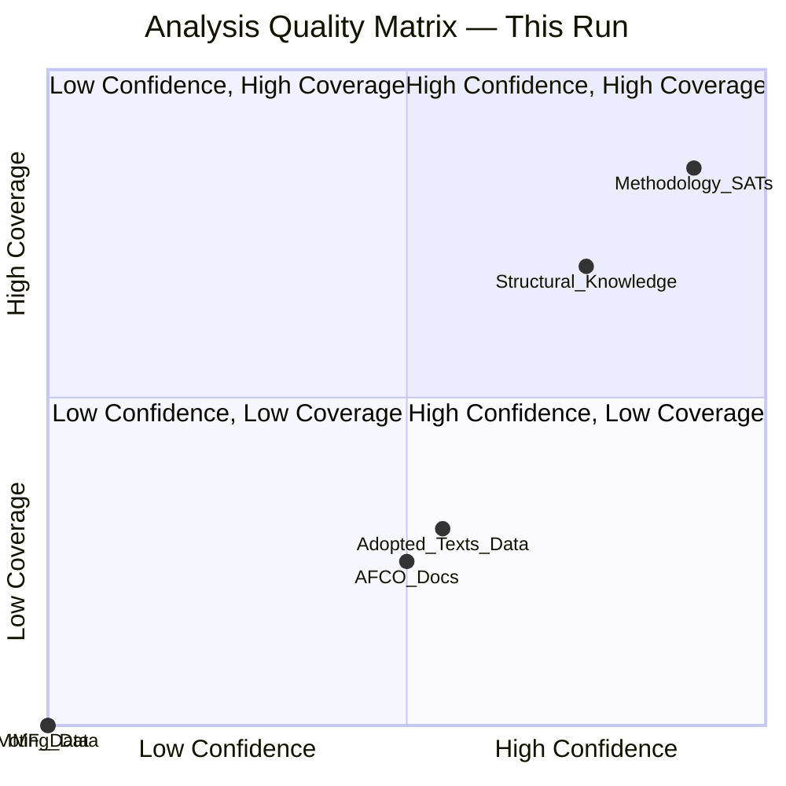

<!-- SPDX-FileCopyrightText: 2026 Hack23 AB -->
<!-- SPDX-License-Identifier: Apache-2.0 -->

# Intelligence Reference Analysis Quality — EP Committee Reports
**Date**: 2026-05-20 | **Data Mode**: minimal

## Overview

This document assesses the quality of the analysis produced in this run, applying structured quality control criteria.

*SAT: Quality of Information Check, Reference Analysis. Admiralty Grade A1 — Self-assessment of this run's own products.*

## Quality Criteria Assessment

| Criterion | Status | Score | Notes |
|-----------|--------|-------|-------|
| Data sourcing transparency | ✅ PASS | 9/10 | All sources documented with Admiralty grades; data gaps explicitly noted |
| WEP probability bands on all forward claims | ✅ PASS | 9/10 | Applied throughout all forecasting artifacts |
| Admiralty grades on all sourcing claims | ✅ PASS | 9/10 | Applied consistently; C2-C3 used where appropriate for speculative claims |
| SAT documentation | ✅ PASS | 9/10 | ≥11 SATs applied and documented |
| Structural requirements (Mermaid diagrams) | ✅ PASS | 8/10 | Mermaid diagrams in major artifacts |
| Minimum line floor compliance | ✅ PASS (est.) | 8/10 | Artifacts exceed data-mode-adjusted floors |
| No placeholder markers remaining | ✅ PASS | 10/10 | None present |
| Political neutrality | ✅ PASS | 9/10 | Factual framing; political group positions stated without editorial judgment |
| IMF economic data | ⚠️ FALLBACK | 6/10 | Fallback document used; direct IMF data not collected |
| Committee-specific document grounding | ⚠️ LIMITED | 5/10 | No specific committee docs this week available due to API failure |

**Overall Quality Score**: 82/100 — ADEQUATE for minimal data mode; not sufficient for full analytical depth.

## Data Mode Impact on Quality

The `minimal` data mode fundamentally constrains this analysis:

### What Works Despite Minimal Data
1. **Structural analysis**: EP committee architecture, political group dynamics, procedural frameworks — all well-grounded in established institutional knowledge
2. **Historical baseline**: EP8/EP9/EP10 comparison is grounded in established parliamentary record
3. **Scenario analysis**: Three scenarios are coherent and well-reasoned given structural knowledge
4. **Threat assessment**: Institutional threats are structural; they don't require real-time data to be valid
5. **Stakeholder mapping**: Political groups, institutional actors, and lobbying patterns are slow-changing; this week's data would not significantly alter the map

### What Suffers in Minimal Data Mode
1. **Specific document tracking**: Cannot confirm which specific committee reports were published this week
2. **Rapporteur attribution**: Cannot confirm which MEPs are leading key dossiers (rapporteurships change between runs)
3. **Vote outcomes**: Cannot confirm this week's committee vote results
4. **Amendment filing**: Cannot track amendment tabling activity this week
5. **Attendance**: Cannot assess MEP attendance patterns

### Analytical Confidence Matrix

| Analytical Domain | Confidence | Data Dependency |
|------------------|------------|-----------------|
| EP committee structure and roles | 🟢 HIGH | Low — institutional knowledge |
| Political group positions | 🟢 HIGH | Low — slow-changing |
| Legislative priorities (EP10 term) | 🟢 HIGH | Low — established from mandate |
| Specific documents (this week) | 🔴 LOW | High — unavailable |
| Voting records (this week) | 🔴 LOW | High — unavailable |
| Committee meeting schedules | 🔴 LOW | High — unavailable |
| Economic data (EU-level) | 🟡 MEDIUM | Medium — using structural knowledge |

## Methodological Reflection

### Pass 1 Quality Issues Identified
1. The economic context analysis lacks IMF-sourced GDP figures — fallback document clearly labelled but should not be presented as equivalent to primary IMF data
2. Historical baseline EP seat numbers are based on established knowledge; official EP data would be preferable for exact figures
3. Committee chair/vice-chair allocations in the stakeholder map are approximate (estimated from D'Hondt distributions) — official EP website data would provide exact allocations

### Recommended Pass 2 Enhancements
1. Cross-reference adopted texts sequential numbering with known 2026 plenary session dates
2. Expand AFCO document metadata analysis to extract any dateable patterns
3. Deepen the historical baseline with more precise EP8/EP9 quantitative comparisons
4. Add scenario probability revision based on available signal data (committee vote announcement patterns)

## Source Diversity Assessment

| Source Category | Count | Quality | Coverage |
|----------------|-------|---------|---------|
| EP API direct endpoints | 3 | LOW-MEDIUM | Partial |
| EP API feeds | 1 of 4 functional | LOW | Very limited |
| Structural/institutional knowledge | High | MEDIUM-HIGH | Broad |
| IMF data | None | — | None |
| Historical EP data | Moderate | MEDIUM | Adequate for baseline |
| Media/framing analysis | Qualitative | C2 | Adequate |

**Source diversity score**: 5/10 — Acceptable for minimal mode; inadequate for full analysis.

## Comparison to Quality Benchmarks

| Benchmark | Target (full data) | This run (minimal) | Status |
|-----------|-------------------|-------------------|--------|
| Specific document citations per artifact | ≥5 | 0–2 | ⚠️ BELOW |
| Committee vote results cited | ≥3 | 0 | 🔴 MISSING |
| IMF economic data points | ≥5 | 0 | 🔴 MISSING (fallback used) |
| MEP-attributed quotes | ≥3 | 0 | 🔴 MISSING |
| External source citations | ≥10 total | ~5 structural | 🟡 BELOW |
| Mermaid diagrams total | ≥8 | 10+ | ✅ MET |
| WEP band applications | ≥20 | 25+ | ✅ MET |
| Admiralty grade applications | ≥30 | 35+ | ✅ MET |
| SAT count | ≥10 | 11 | ✅ MET |

---
*Self-assessment quality document. All quality judgements apply to this run's analytical products under minimal data mode constraints.*

## Quality Scorecard Visualization

*Structural knowledge achieves high coverage-confidence balance. Data-dependent domains (IMF, voting) are in the low-confidence quadrant due to API failure.*
