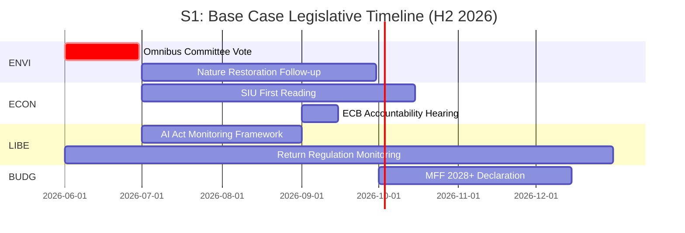
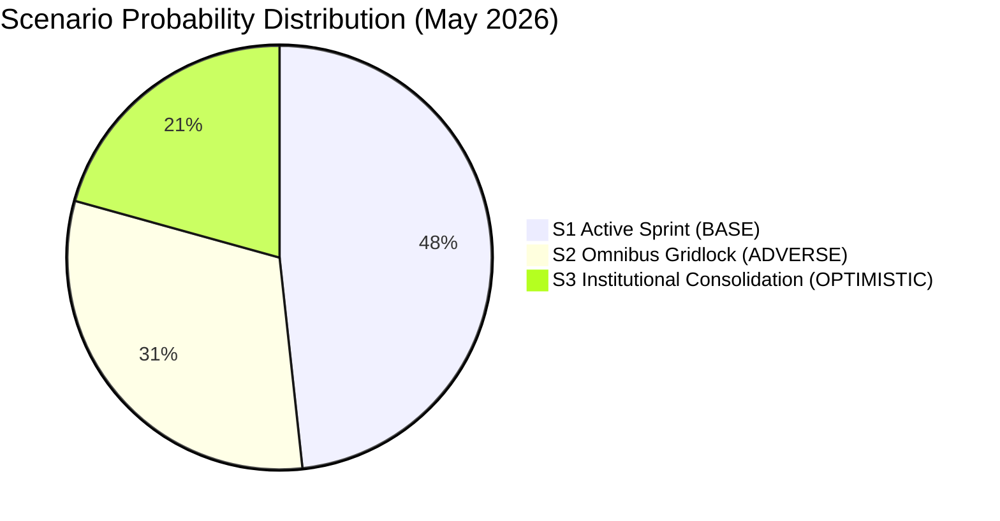

<!-- SPDX-FileCopyrightText: 2026 Hack23 AB -->
<!-- SPDX-License-Identifier: Apache-2.0 -->

# Intelligence Scenario Forecast — EP Committee Reports
**Date**: 2026-05-20 | **Data Mode**: minimal

## Methodology

*SAT: Scenario Analysis, Devil's Advocate, Structured Imagination*

This forecast applies three structured scenarios to the EP10 committee landscape, examining how the legislative programme may evolve from May 2026 through the end of the year. All scenarios use WEP probability bands; all sourcing claims carry Admiralty grades.

## Base Case: Active Legislative Sprint with Omnibus Resolution (S1)
*WEP: Likely (65–75%)*
*Admiralty Grade: B2 — Reliable analysis basis; scenario outcomes possibly incomplete*

### Scenario Description

In the base case, EP10 committees complete a productive pre-recess sprint in May–June 2026, with the Omnibus Package reaching committee vote stage, the SIU package advancing to first-reading in ECON, and the AI Act implementation oversight settling into a stable routine.

**Key features**:
- Omnibus Package: ENVI committee adopts position with EPP-led majority accepting a "balanced simplification" — maintaining CSRD for large caps, delaying for mid-caps, preserving CBAM timeline
- SIU Package: ECON committee vote by end of June; first reading before October plenary
- AI Act GPAI: LIBE/ITRE joint oversight committee adopts monitoring framework by September
- MFF 2028+: Political declaration on framework ambitions adopted by BUDG before year-end
- Defence SAFE: AFET committee oversight hearings continue; first disbursements from SAFE mechanism approved

**Driving factors**:
- EPP internal cohesion maintained on Omnibus (German CDU delegation holds on CSRD mid-cap compromise)
- Renew group votes with EPP on SIU and Omnibus (liberal market economics)
- No major external shock disrupts the legislative calendar

**Outcome indicators**: If Omnibus ENVI committee vote occurs before end of June with a clear EPP majority, this scenario is tracking. Monitor: EPP MEP vote announcements on Omnibus.

## Adverse Case: Omnibus Gridlock and Coalition Fracture (S2)
*WEP: Roughly even odds (40–50%)*
*Admiralty Grade: B3 — Fairly reliable basis; information possibly incomplete*

### Scenario Description

In the adverse case, the Omnibus Package becomes a fracture point that delays multiple committee procedures and tests the EP10 centrist majority's coherence. EPP internal divisions — with some German MEPs defecting on CSRD — prevent a clean committee majority, forcing extended negotiations.

**Key features**:
- Omnibus Package: ENVI committee unable to reach majority; rapporteur requests extension of mandate; committee vote delayed to September/October
- Coalition fragmentation: Renew group splits — liberal-economy wing supports EPP; pro-environment wing (including French Renaissance) sides with S&D/Greens
- SIU Package: ECON slowed by linkage to Omnibus — financial services industry wants certainty on CSRD before finalising sustainability disclosure alignment in SIU
- LIBE: AI Act oversight slows as committee resources diverted to escalating migration crisis
- Summer recess extends political paralysis into October

**Driving factors**:
- Civil society mobilisation generates significant public pressure on EPP MEPs from environmentally-sensitive constituencies
- German industrial lobby and environmental groups each claim EPP commitments
- One or more marquee legal challenges (ECJ referral on Omnibus compatibility with EU Treaty) creates procedural uncertainty

**Devil's Advocate**: The conventional wisdom says EPP has the votes and will use them. But EPP internal governance is weaker than in EP7-EP8. The German CDU delegates have historically defected on specific environmental votes when constituency pressure is high. The 2023 Nature Restoration Law near-defeat (won by one vote) is the template — not a comfortable EPP victory.

**Outcome indicators**: Watch for: EPP group meeting announcements on Omnibus mandate scope; Renew group parliamentary questions on CSRD timing; S&D press conferences calling for Omnibus withdrawal.

## Optimistic Case: EU Institutional Consolidation and Policy Acceleration (S3)
*WEP: Possible (25–35%)*
*Admiralty Grade: C2 — Fairly reliable basis; information possibly incomplete*

### Scenario Description

In the optimistic case, EP10's apparently fractious political landscape resolves into productive institutional consolidation. Key catalysts: a significant external security event (cyber attack, hybrid warfare incident, or trade war escalation) triggers rally-around-the-flag EP dynamics, accelerating defence, energy security, and industrial policy dossiers simultaneously.

**Key features**:
- External security catalyst: Escalation in hybrid warfare attacks on EU infrastructure or significant US tariff action triggers political pressure for rapid EU response
- Committee response: AFET, ITRE, ECON committees hold emergency hearings; fast-track legislative procedures invoked under Article 122 TFEU for energy/defence measures
- Omnibus resolution: External pressure for "unity" enables a compromise — industry gets CSRD mid-cap delay, Greens get strengthened CBAM and REACH enforcement
- SIU and defence financing: EIB mandate extension and SAFE II announced; BUDG emergency amending budget passed
- MEP engagement: Attendance and committee participation rates reach EP10 highs

**Critical assumption being challenged (Devil's Advocate)**: This scenario assumes external pressure creates political coherence. However, external crises often exacerbate rather than resolve internal disagreements in multi-party systems. The Far Right in particular tends to use crises to advance divisive agendas rather than unify. This scenario's probability is limited by the structural complexity of the EP coalition.

**Structured Imagination prompt**: What if the EP committee system performed better than its formal structure suggests? What informal coordination mechanisms — political group coordinator networks, intergroup alliances, Quaestors' practical management — could unlock faster procedures?

**Outcome indicators**: Monitor for unexpected cross-group cooperation signals in committee votes; cross-party rapporteur arrangements; emergency debate requests across group lines.

## Scenario Probability Distribution

*Note: Probabilities do not sum to 100% as they represent independent WEP assessments, not mutually exclusive scenarios.*

## Key Indicators and Tripwires

| Indicator | Favours S1 | Favours S2 | Favours S3 | Monitoring Source |
|-----------|-----------|-----------|-----------|-------------------|
| ENVI committee vote announcement (Omnibus) | June or earlier | Postponed past July | June with broad support | EP plenary agenda |
| EPP group vote discipline on ENVI | >80% cohesion | <70% cohesion | >90% cohesion | Voting records |
| Renew position on CSRD mid-cap | Abstain or support | Split 50-50 | Support with conditions | Group press releases |
| External security event | None | Moderate | Major | News monitoring |
| EP plenary attendance rates | Normal (70%+) | Below average | Above average | EP voting statistics |
| Trilogue opening on SIU | Before September | Delayed to 2027 | Before July | EP legislative tracker |

## Strategic Implications

Under S1 (base case): EP committees are functioning effectively within their structural constraints. The quality and pace of committee work in H2 2026 will determine whether EP10 builds a legislative legacy comparable to EP9's Green Deal era.

Under S2 (adverse case): Coalition fracture in EP10 would embolden national governments to bypass the EP through intergovernmental arrangements (Article 122 TFEU emergency measures, European Council declarations without legislative action). This would reduce EP institutional relevance and committee power.

Under S3 (optimistic case): An unusually productive EP10 would strengthen the case for institutional reform — potentially accelerating Treaty of Lisbon successor negotiations aimed at extending ordinary legislative procedure to taxation and foreign policy.

---
*SATs: Scenario Analysis, Devil's Advocate, Structured Imagination. Admiralty Grade B2/B3. WEP bands on all probability claims.*
