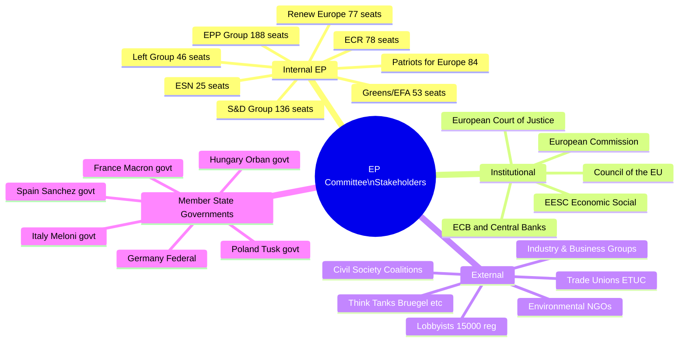
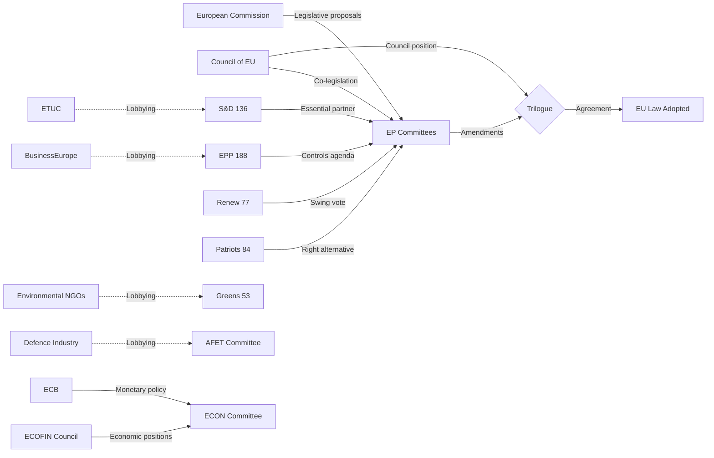

<!-- SPDX-FileCopyrightText: 2026 Hack23 AB -->
<!-- SPDX-License-Identifier: Apache-2.0 -->

# Intelligence Stakeholder Map — EP Committee Reports
**Date**: 2026-05-20 | **Data Mode**: minimal

## Overview

This stakeholder map identifies and analyses the key actors shaping European Parliament committee work in May 2026, their interests, influence levels, and interaction patterns.

*SAT: Stakeholder Mapping, Analysis of Competing Hypotheses (ACH). Admiralty Grade B2 throughout.*

## Stakeholder Universe

## Key Internal EP Stakeholders

### EPP Group (188 seats) — Dominant Agenda-setter
**Interest Profile**: Economic competitiveness, regulatory simplification, moderate climate action, pro-European defence integration, rule of law (selectively applied), trans-Atlantic solidarity.

**Committee leverage**: Holds chairs in ENVI, AFET, ITRE, AFCO, and vice-chairs in most others. Controls rapporteurship on the highest-profile dossiers through D'Hondt allocation.

**Internal tensions**:
- Northern European EPP (Dutch EVP, German CDU/CSU) historically more pro-climate vs. Southern/Eastern (Forza Italia, PiS-adjacent, Hungarian Fidesz-aligned, though Fidesz left EPP in 2021)
- New EP10 EPP is more homogeneous and right-leaning than EP9 EPP
- Climate file: EPP's shift to supporting Omnibus simplification creates friction with its own past Green Deal legislative record

**ACH Analysis**: Is EPP's support for Omnibus Package a durable shift or tactical positioning?
- H1: Durable shift (EPP has permanently moved right on environment) — *Likely* 60–70%
- H2: Tactical positioning (EPP hedging ahead of 2029 elections) — *Possible* 30–40%

**Influence**: 🔴 CRITICAL — No major committee outcome moves without EPP agreement.

### S&D Group (136 seats) — Essential Moderate Partner
**Interest Profile**: Social Europe, strong labour rights, green transition (but with just transition emphasis), pro-rule-of-law, pro-Ukraine, Keynesian economic approach.

**Committee leverage**: Holds ECON, INTA committee chairs; key rapporteurs on social policy, trade, anti-money-laundering.

**Key dynamic**: S&D's relevance in EP10 depends on being the essential swing vote in centrist majority vs. right-bloc contests. When EPP goes right (Patriots/ECR), S&D is marginalised. When EPP stays centrist, S&D is pivotal.

**Current position**: S&D is leading opposition to Omnibus Package rollbacks; tabling amendments to maintain CSRD, deforestation law, CBAM timelines. Their success depends on Renew group cohesion.

**Influence**: 🟠 HIGH — Essential for centrist majority; marginalised if EPP-right bloc forms.

### Renew Europe (77 seats) — Swing Vote Holder
**Interest Profile**: Market liberalism, pro-European federalism, rule of law, pro-Ukraine, digital economy, free trade.

**Committee leverage**: LIBE chair; BUDG chair; key rapporteurs on digital single market, capital markets, data.

**EP10 challenge**: Having lost 25 seats in 2024 (from 102 to 77), Renew is under structural pressure. Its liberal market orientation makes it swing between EPP positions on economic files and S&D positions on social/environmental files.

**Key vote dynamics**: Renew is the decisive group on the Omnibus Package — if Renew votes with EPP/Patriots, Omnibus simplification passes; if Renew votes with S&D/Greens, it fails or is significantly amended.

**Influence**: 🟠 HIGH — Decisive swing vote on Omnibus and multiple other contested files.

### Patriots for Europe (84 seats) — Right Populist Force
**Interest Profile**: EU sovereignty limitation, anti-immigration, pro-energy security (including fossil fuels), national identity, reduced EU regulation.

**Committee leverage**: Limited formal access (excluded from some sub-committee chairs initially); growing influence through numbers on vote outcomes.

**Key dynamic**: Patriots provide EPP with a viable right majority on issues where S&D/Renew won't support EPP. This includes migration, energy (LNG/nuclear), and some aspects of regulatory simplification.

**Influence**: 🟡 MEDIUM-HIGH — Provides EPP right alternative but excluded from some institutional roles.

### ECR (78 seats) — Eurosceptic Right
**Interest Profile**: National sovereignty, limited EU competence, deregulation, pro-Ukraine (unlike Patriots), anti-mass migration.

**Committee leverage**: Limited at committee level but growing in plenary through numbers.

**Key dynamic**: ECR's pro-Ukraine position distinguishes it from Patriots (where Hungary's Fidesz is influential). ECR can swing defence and Ukraine support votes without the Orban/Le Pen complication.

**Influence**: 🟡 MEDIUM — Important on security and trade files.

### Greens/EFA (53 seats) — Weakened Environmental Champions
**Interest Profile**: Climate ambition, biodiversity, social justice, federalism, pro-Ukraine, digital rights.

**Committee leverage**: ENVI vice-chairs; rapporteur rights on environmental and digital files; AFCO vice-chair.

**EP10 reality**: The Greens lost 19 seats in 2024 — a severe blow to their ability to defend Green Deal achievements. They are now dependent on S&D + Left + Renew coalition, which doesn't always hold.

**Influence**: 🟡 MEDIUM — Can block some outcomes with S&D support; insufficient to advance ambitious agenda.

## Key Institutional Stakeholders

### European Commission — Legislative Initiator
**Role**: Holds exclusive right of legislative initiative; provides legislative packages that EP committees scrutinise.

**Von der Leyen II priorities**: Competitiveness (Draghi agenda), Clean Industrial Deal, Defence (SAFE/ReArm), Digital, Enlargement.

**Committee interactions**: Each Commissioner attends their respective lead committee for quarterly hearings; DG staff brief committee secretariats; formal inter-institutional dialogue through legislative documents.

**Influence**: 🔴 CRITICAL — Controls legislative agenda; EP amends but rarely initiates from scratch.

### Council of the EU — Co-legislator
**Role**: Shares legislative power with EP under ordinary legislative procedure; holds sole legislative power under special procedures (taxation, foreign policy, CFSP).

**EP-Council dynamic**: Negotiations happen in informal "trilogue" meetings where COREPER (member state ambassadors) meet EP rapporteurs. The quality of these negotiations determines both speed and substance of outcomes.

**Current tensions**: Council resists EP environmental ambitions (Omnibus); Council more hawkish than EP on migration; Council supportive of EP on defence.

**Influence**: 🔴 CRITICAL — Cannot be overruled; must agree for legislation to pass.

## External Stakeholders

### BusinessEurope / Industry Groups
**Interest**: Regulatory burden reduction, energy cost competitiveness, Omnibus simplification, trade liberalisation.

**Lobbying activity**: Intensive lobbying on ENVI, ECON, ITRE. Major submissions on Omnibus Package, REACH revision, CSRD. Approximately 4,000–5,000 registered lobbyists from industry coalitions in Brussels.

**Influence**: 🟠 HIGH — Strong access to EPP and some Renew MEPs.

### ETUC (European Trade Union Confederation)
**Interest**: Just transition, living wages, strong CSRD (supply chain due diligence), worker participation in AI governance.

**Lobbying activity**: Regular S&D, Left, and some Renew contacts. Major campaigns on Platform Work Directive implementation, AI Act worker protections.

**Influence**: 🟡 MEDIUM — High with S&D; limited with EPP/right groups.

### Environmental NGOs (WWF, Greenpeace, CAN Europe)
**Interest**: Maintain Green Deal ambitions, resist Omnibus rollbacks, stronger biodiversity protection.

**Lobbying activity**: Intense pressure campaigns on ENVI MEPs; public mobilisation (petitions, demonstrations). MEP contact data shows environmental NGOs are among the highest-volume petitioners.

**Influence**: 🟡 MEDIUM — High with Greens/S&D; declining with EPP in EP10 compared to EP9.

### Defence Industry (Airbus, BAE Systems, KNDS, Rheinmetall)
**Interest**: SAFE instrument procurement rules, European Defence Industrial Strategy contracts, export control frameworks.

**Lobbying activity**: Rapidly growing AFET, ITRE, BUDG presence. This is the fastest-growing lobbying sector in Brussels in 2025–2026.

**Influence**: 🟠 HIGH and GROWING — Especially with AFET and EPP; unprecedented engagement level.

## Stakeholder Influence Map

---
*SAT: Stakeholder Mapping, ACH. Admiralty Grade B2. WEP bands on probability claims.*
