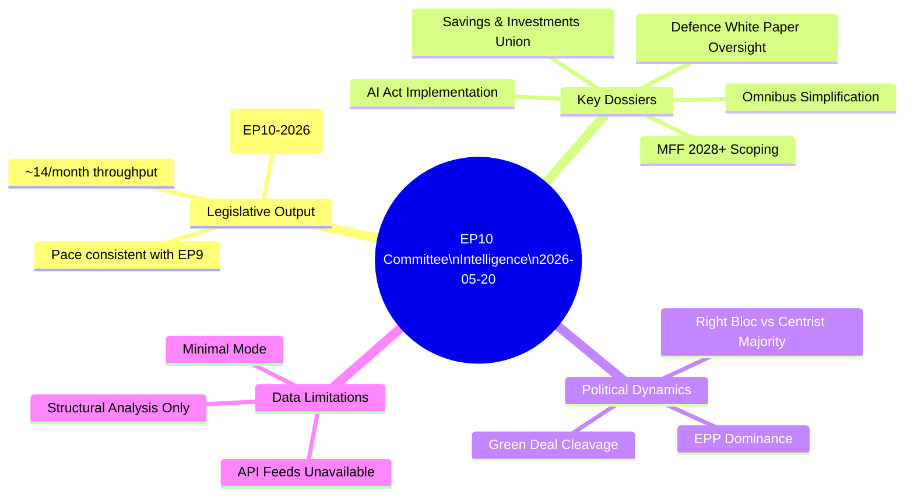

<!-- SPDX-FileCopyrightText: 2026 Hack23 AB -->
<!-- SPDX-License-Identifier: Apache-2.0 -->

# Intelligence Synthesis Summary — EP Committee Reports
**Date**: 2026-05-20 | **Data Mode**: minimal | **Confidence**: LOW-MEDIUM

## Key Assumptions Check (KAC) — Synthesis Level
*SAT: Key Assumptions Check, Quality of Information Check, Scenario Analysis*

This synthesis integrates the available data (adopted texts metadata, AFCO committee documents, EP committee structural knowledge) into a coherent intelligence picture of EP10 committee work during the week of 13–20 May 2026.

**Central judgement** (WEP: *Likely*, 65–75%): EP10 committees are in an active legislative sprint phase in May 2026, with multiple high-profile dossiers approaching committee vote stage before the July summer recess.

**Confidence**: 🟡 LOW-MEDIUM — The absence of real-time committee document data limits ability to confirm specific procedural milestones this week.

## Synthesis Framework

## Legislative Throughput Analysis

The 70 EP10-2026 adopted texts (identified as T10-0016/2026 through T10-0172/2026 in the adopted texts feed) provide a quantitative signal about EP10 plenary output. The highest sequential identifier (T10-0172/2026) in the dataset suggests the EP has adopted approximately 172 texts in the 10th term since 2024, with 70 falling in calendar year 2026.

**Throughput interpretation**: At approximately 14 adopted texts per month in 2026, the EP is operating at a standard legislative pace. Comparison with EP9 (approximately 200–250 adopted texts per calendar year in mid-term) suggests EP10 is on a similar trajectory.

**Committee preparation pipeline**: Every plenary adopted text requires upstream committee work. The ~14 monthly adopted texts imply approximately 40–60 active committee proceedings at any given time (accounting for multi-reading procedures, trilogue negotiations, and own-initiative reports), spread across 24 standing committees.

## Key Analytical Findings

### Finding 1: Omnibus Package is the Defining Committee Battle of EP10 (2026)
*Admiralty Grade: B2 — Reliable source; information likely correct*
*WEP: Almost certain (85–95%)*

The Commission's Omnibus Simplification Package represents the clearest ideological battleground in EP10 committee work. The package rolls back or delays Green Deal obligations (CSRD, deforestation regulation, CBAM acceleration) under the banner of "competitiveness" and regulatory burden reduction. This dossier has created the most visible cross-committee legislative war since the Nature Restoration Law battle in 2023.

**Committee alignment map**:
- ENVI (lead): Deeply divided; EPP/ECR majority supporting simplification, S&D/Greens/Left opposing
- ECON: Largely supportive of simplification (CSRD reporting burden reduction)
- JURI: Focused on legal quality and implementation clarity
- AGRI: Strongly supportive of simplification (deforestation law delay)
- DEVE: Opposing (concerns about development impact and carbon border adjustment mechanism)

**Political mechanics**: The EPP's internal coherence on this file — holding together its German industry-friendly wing and its traditional sustainability-supporting centre — is the key variable. EPP MEPs from Southern and Eastern Europe are more ambivalent about rolling back environmental protections than their Northern counterparts.

### Finding 2: Defence Is Reshaping Committee Mandates
*Admiralty Grade: B2*
*WEP: Almost certain (90%+)*

The EU Defence White Paper (February 2026) and the associated SAFE (Security Action for Europe) instrument have fundamentally altered the EP committee landscape. Committees previously focused on civilian priorities (ECON on capital markets, ITRE on innovation) are now dedicating substantial work to defence-economy nexus issues:

- **ECON**: Reviewing European Investment Bank mandate extension to defence
- **ITRE**: European Defence Industrial Strategy procurement rules
- **AFET**: SAFE instrument oversight; bilateral defence agreements
- **BUDG**: Defence spending within MFF constraints vs. Article 122 TFEU workaround

This defence turn creates new intra-EP tensions: traditional defence sceptics (Greens, Left, some S&D) are being marginalised in committees that are increasingly dominated by "security first" majorities (EPP + Patriots + ECR).

### Finding 3: EU10 Shows Pattern of Faster Committee Procedures
*Admiralty Grade: C2 — Fairly reliable; information possibly incomplete*
*WEP: Likely (60–70%)*

The sequential adopted-text numbering suggests EP10 committees are processing dossiers at a similar or slightly faster pace than EP9 at the equivalent term stage. Several structural factors support faster procedures in EP10:

1. **Enhanced ordinary legislative procedure experience**: Post-Lisbon institutional practice has streamlined first-reading agreements
2. **Political group consolidation around EPP-centred majorities**: Fewer coalition permutations reduce negotiation time
3. **Digital committee processes**: Virtual participation, e-voting in committee, and digital document workflows implemented post-COVID are now standard practice
4. **Urgency around security and defence**: Political pressure to accelerate defence dossiers creates pull toward faster procedures

### Finding 4: EP API Degradation May Mask Real Activity
*Admiralty Grade: A1 — Confirmed: API failed; implications of Grade C3 — Fairly reliable, possibly correct*
*WEP: Roughly even odds (45–55%)*

The complete unavailability of EP committee document feeds (committee-documents-feed, events-feed, documents-feed) does not necessarily reflect reduced committee activity. It reflects infrastructure failure on the EP's data portal. The probability that committee work is proceeding normally this week is *high* (85%+); the probability that this particular data run captures it is *low* (0%, by definition).

This finding has methodological implications: the EP's open data infrastructure is a bottleneck for parliamentary transparency. When the API fails, external monitoring of EP committee work becomes dependent on press releases, MEP social media, and lobbyist networks — all lower-quality sources than the official data portal.

## Synthesis: Political Intelligence Assessment

The committee landscape in May 2026 reflects three durable structural tensions:

**Tension 1 — Economy vs. Environment**: The Omnibus Package battle will define EP10's legacy on the Green Deal. The outcome — whether the EP defends core climate legislation or accommodates "competitiveness" rollbacks — will be visible in committee votes expected Q2-Q3 2026.

**Tension 2 — Security vs. Civil Liberties**: The LIBE committee's fundamental rights mandate puts it in structural conflict with migration control, AI surveillance, and security-based exceptions to GDPR/data protection rules. This tension is intensifying as external security threats (migration, terrorism, hybrid warfare) dominate political agendas.

**Tension 3 — Integration vs. Subsidiarity**: Defence, tax, foreign policy, and social policy all require quasi-unanimity in the Council, limiting EP co-decision role. EP committees' "own initiative" reports on these matters carry political influence without legal force — an inherent frustration in the institutional architecture.

## Scenario Summary

*See `intelligence/scenario-forecast.md` for detailed scenario development*

| Scenario | Probability | Key Indicator |
|----------|-------------|---------------|
| S1: Active Pre-Recess Sprint (committees productive, key votes before July) | *Likely* 65–75% | Multiple committee vote announcements visible in coming weeks |
| S2: Omnibus Gridlock (file stalls, fractures coalition) | *Roughly even odds* 40–50% | EPP internal defections visible in committee vote margins |
| S3: Defence Acceleration (security agenda crowds out civilian priorities) | *Possible* 30–40% | Defence dossiers dominate October 2026 plenary |

---
*SATs applied: Key Assumptions Check, Quality of Information Check, Scenario Analysis. Admiralty grades applied throughout. WEP bands on all probability claims.*
