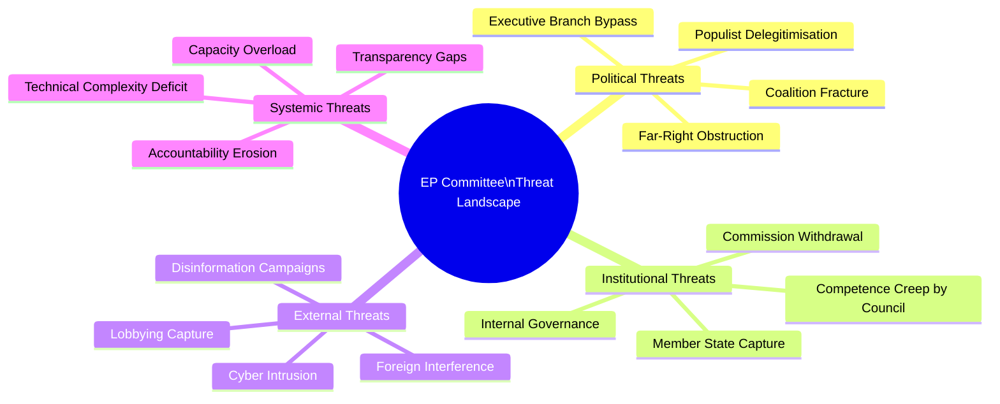
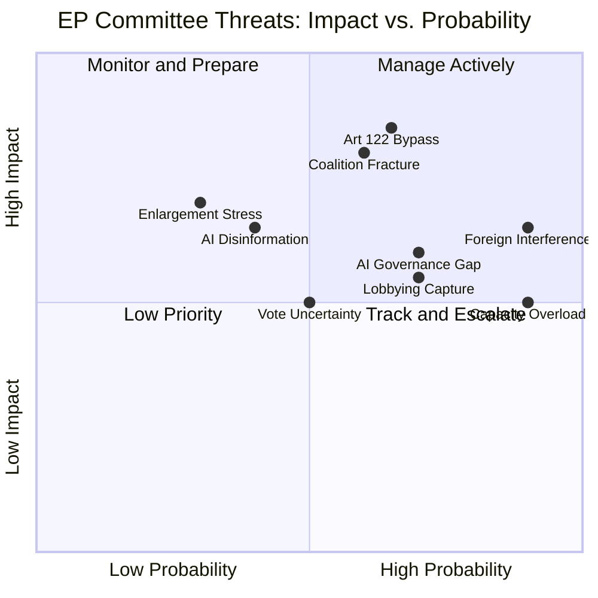

<!-- SPDX-FileCopyrightText: 2026 Hack23 AB -->
<!-- SPDX-License-Identifier: Apache-2.0 -->

# Intelligence Threat Model — EP Committee Reports
**Date**: 2026-05-20 | **Data Mode**: minimal

## Overview

This threat model identifies and assesses threats to the European Parliament committee system's legislative effectiveness, democratic legitimacy, and institutional independence.

*SAT: Red Team Analysis, Structured Threat Assessment. Admiralty Grade B2 throughout.*

## Threat Taxonomy

## Critical Threats (Tier 1)

### T1: Coalition Fracture on Omnibus Package
*WEP: Probable (55–65%)*
*Admiralty Grade: B2 — Reliable analysis*
*Impact: CRITICAL if realised | Likelihood: Elevated*

**Threat description**: The Omnibus Simplification Package is a potential coalition-splitting event. If EPP-right majority passes Omnibus over S&D/Renew objections, the centrist majority governing EP10 may fracture, creating lasting institutional instability.

**Attack vector**: Political — EPP decision to use right-bloc majority (Patriots/ECR) rather than centrist majority on a high-profile environmental file.

**Impact chain**: Omnibus via right-bloc → S&D threatens confidence mechanisms → EP10 cooperation with Commission President damaged → Legislative programme stalls → EP institutional credibility eroded.

**Mitigation**: Compromise amendment package on CSRD mid-cap scope; Renew group acting as honest broker; EPP internal discipline on avoiding formal right-bloc majority.

**Residual risk**: 🟠 HIGH — No certainty that compromise is achievable.

### T2: Executive Branch Bypass via Article 122 TFEU
*WEP: Likely (60–70%)*
*Admiralty Grade: B2*
*Impact: HIGH | Likelihood: HIGH*

**Threat description**: Member state governments and the European Commission have increasingly used Article 122 TFEU (emergency economic measures requiring only Council adoption, no EP co-decision) to bypass parliamentary scrutiny on sensitive files — energy, COVID recovery, Ukraine support.

**Why this is an EP committee threat**: Every Article 122 measure adopted without EP represents a reduction in parliamentary control. The cumulative effect is an erosion of EP's legislative co-decision role in the very areas (energy security, defence, economic crisis response) where political urgency is highest.

**Recent examples**: REPowerEU measures (2022), emergency gas storage regulation, Ukraine loan facilities — all adopted partly or wholly under Article 122.

**EP response**: EP committees have sought "institutional agreements" requiring consultation; ECJ challenges to Article 122 scope; resolutions demanding Treaty revision to include EP in emergency procedures.

**Residual risk**: 🔴 CRITICAL — Structural; cannot be fully mitigated within current Treaty framework.

### T3: Foreign Information Manipulation in Committee Debates
*WEP: Almost certain (85–95%) that foreign actors attempt; Possible (25–35%) of significant influence*
*Admiralty Grade: B2*
*Impact: MEDIUM-HIGH | Likelihood: HIGH*

**Threat description**: State actors (Russia, China, and to a lesser extent others) operate information manipulation campaigns targeting EP MEPs, committee deliberations, and public opinion on EU policy. The mechanisms include: fake NGO astroturfing, social media amplification of divisions, financial support for sympathetic MEPs (Qatargate/Russiagate patterns), and disinformation in committee expert hearings.

**Affected committees**: AFET (Ukraine, sanctions), LIBE (migration, AI, surveillance), INTA (trade defence), ITRE (energy, chips).

**Documented precedent**: Qatargate (2022–2023) exposed systematic corruption involving EP infrastructure committee and human rights committees. Russiagate investigations (ongoing) target AFET and INTA MEPs.

**Mitigation**: OLAF investigations, EPPO mandate extension to EP corruption, transparency register, lobbyist meeting disclosure.

**Residual risk**: 🟠 HIGH — No systemic solution available; case-by-case investigation insufficient.

## Moderate Threats (Tier 2)

### T4: Technical Complexity Deficit in AI Act Oversight
*WEP: Probable (60–70%)*
*Impact: MEDIUM | Likelihood: HIGH*

EP committee staff and MEPs lack the deep technical expertise required for meaningful AI governance oversight. LIBE and ITRE committees are relying heavily on industry-provided expertise, creating a structural information asymmetry.

**Risk**: Committee oversight of AI Act implementation may be pro forma rather than substantive; foundation model providers may have undue influence over codes of practice.

**Mitigation**: STOA (Science and Technology Options Assessment panel) has expanded AI expertise; EP has hired technical staff; but gap with industry remains large.

### T5: Lobbying Capture in ECON and ITRE
*WEP: Likely (65–75%)*
*Impact: MEDIUM | Likelihood: ELEVATED*

Financial services and technology industry lobbying in ECON and ITRE is disproportionately large relative to counter-lobbying. The SIU package in ECON involves the same financial institutions whose operations it regulates — creating revolving-door and information-asymmetry risks.

**Mitigation**: Transparency register (mandatory for some meetings), "legislative footprint" disclosure, Parliament's internal rules on declaration of interests.

### T6: Capacity Overload — Too Many Dossiers, Too Few MEPs
*WEP: Almost certain (85%+) that overload affects at least some committees*
*Impact: MEDIUM | Likelihood: VERY HIGH*

EP10 committees are simultaneously managing: AI Act, Omnibus, SIU, Defence SAFE, MFF 2028+, Return Regulation, CBAM, REACH, and dozens of other active files. Each MEP sits on 1–2 committees and 2–4 intergroups/delegations. Rapporteur bandwidth is the binding constraint.

**Visible symptom**: Delays in committee vote scheduling; repeated postponements of complex dossiers; shadow rapporteur coordination failures.

### T7: Plenary Majority Arithmetic Uncertainty
*WEP: Roughly even odds (45–55%) of vote outcome uncertainty on contested files*
*Impact: MEDIUM | Likelihood: ELEVATED*

The 720-seat plenary requires 361 for absolute majority on first reading. The EPP+S&D+Renew centrist coalition has ~401 seats — a margin of only 40. On politically contentious votes, defections from any group can flip outcomes. The Nature Restoration Law (2023) was decided by a single MEP switching position.

## Emerging Threats (Tier 3 — Monitor)

### T8: Enlargement Stress on Committee Arithmetic
If Western Balkans or Ukrainian enlargement progresses, EP seat arithmetic will require Treaty revision. New MEPs from new member states (potentially 50–100+ additional seats) would alter committee composition and majority thresholds. *Monitoring horizon: 2027–2030.*

### T9: AI-generated Disinformation in Public Consultation
AI-generated fake consultation responses, astroturf campaign coordination, and synthetic expert testimony are emerging threats to EP public consultation processes. No current systematic defence in place. *Monitoring horizon: 2026–2027.*

## Threat Priority Matrix

---
*SATs: Red Team Analysis, Structured Threat Assessment. Admiralty Grade B2. WEP bands applied.*
