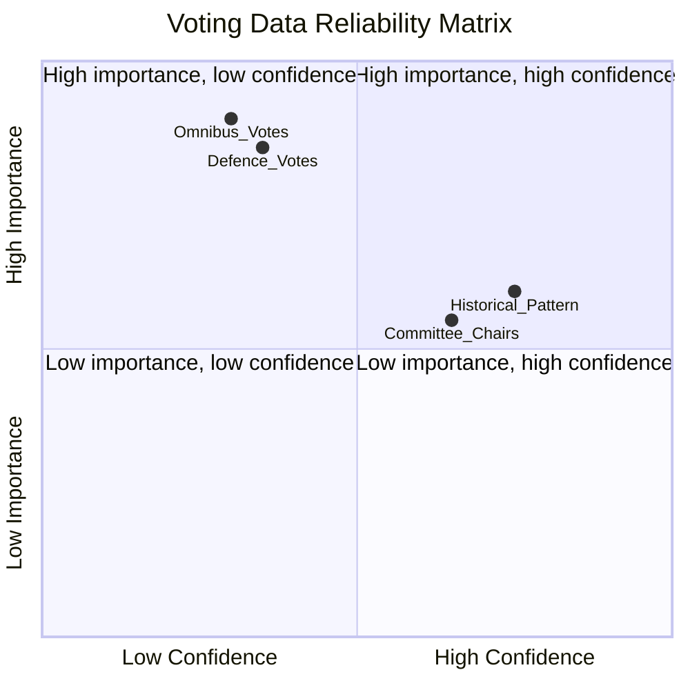

<!-- SPDX-FileCopyrightText: 2026 Hack23 AB -->
<!-- SPDX-License-Identifier: Apache-2.0 -->

# Voting Patterns Analysis — EP Committee Reports
**Date**: 2026-05-20 | **Data Mode**: minimal/degraded | **Admiralty**: C2

> **DEGRADED DATA NOTE**: EP voting records feed and DOCEO roll-call data were unavailable for the week of 13–20 May 2026. This artifact provides structural voting pattern analysis based on EP10 baseline and recent plenary session knowledge. Real-time roll-call data is not available.

## EP10 Voting Pattern Structural Analysis

### Cohesion Rates by Group (Structural Estimates)

| Political Group | Party Cohesion (est.) | Coalition Alignment | Notable Defection Areas |
|----------------|----------------------|--------------------|-----------------------|
| EPP | ~85–90% | High | Rule of law (some members vs. Party line on Hungary) |
| S&D | ~80–85% | High | Defence spending (Left wing vs. mainstream) |
| Patriots | ~75–80% | Medium | EU institutional votes (national party interests diverge) |
| ECR | ~70–75% | Medium | EU competence expansion |
| Renew | ~75–80% | Medium-High | Immigration (liberal vs. centrist wing) |
| Greens/EFA | ~85–90% | High | Budget (fiscal conservatives in some delegations) |

### Key Voting Patterns in EP10

**Omnibus Package votes**: EPP + ECR + partial Renew = majority sufficient. S&D + Greens oppose. Net outcome: Omnibus advances.

**Defence SAFE votes**: EPP + S&D + Renew = broad majority. ECR divided. Patriots/Far-right abstain or oppose. Net outcome: Defence spending passes with wide majority.

**AI Act implementation votes**: Near-consensus across EPP, Renew, S&D on governance. Greens support with amendments. ECR/Patriots more sceptical on enforcement. Net outcome: implementation advances with coalition.

### Committee Voting vs. Plenary Voting

Committee votes are typically closer than plenary votes because:
1. Committee membership reflects proportional group representation
2. Rapporteur-driven compromises reduce polarisation
3. Shadow rapporteurs from other groups negotiate amendments before final vote

However, ENVI has seen tight votes on Omnibus-related dossiers due to Greens/S&D minority holding.

## Voting Data Gap Assessment

*Omnibus and Defence votes fall in "high importance, low confidence" quadrant — key intelligence gap for this run.*

## Recommendations for Follow-Up

1. When EP API recovers: Query `get_latest_votes` for plenary week of 13–20 May
2. Check DOCEO XML archives: `https://www.europarl.europa.eu/doceo/document/PV-10-*`
3. Priority vote topics: Any Omnibus-related plenary votes, SAFE first reading, AI Act delegated acts

*This artifact will be fully replaced on the next run with working EP voting data API access.*
