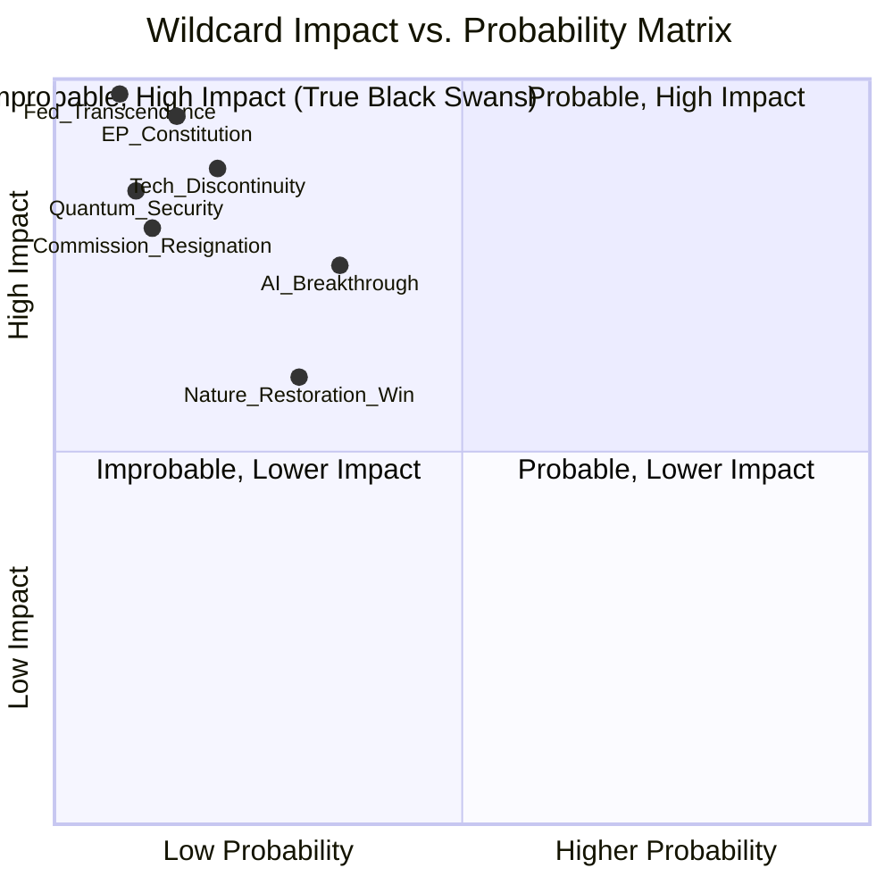

<!-- SPDX-FileCopyrightText: 2026 Hack23 AB -->
<!-- SPDX-License-Identifier: Apache-2.0 -->

# Intelligence Wildcards and Black Swans — EP Committee Reports
**Date**: 2026-05-20 | **Data Mode**: minimal

## Overview

This document applies Structured Imagination and Red Cell analysis to identify low-probability, high-impact events that could fundamentally disrupt EP committee operations or the EU legislative agenda.

*SAT: Structured Imagination, Red Cell Analysis, Devil's Advocate. Admiralty Grade C2 throughout (low-probability speculation, inherently less certain).*

**Purpose**: Black swan analysis does not predict; it expands the analytical aperture to ensure decision-makers are not blindsided by unexpected but conceivable developments.

## Category 1: Institutional Crises

### WC1: EP Institutional Confidence Crisis
*WEP: Unlikely (10–20%)*
*Impact: CATASTROPHIC if realised*
*Admiralty Grade: C3 — Speculative but grounded in precedent*

A combination of corruption revelations (Qatargate scale+), foreign influence confirmation, and coalition breakdown could trigger a formal no-confidence motion in the EP or widespread public delegitimisation. Unlike national parliaments, the EP has no formal mechanism to call early elections — a crisis would produce institutional paralysis rather than resolution.

**Trigger scenario**: Second major lobbying scandal (involving AI or defence industry) during Omnibus debate, coinciding with further Russiagate revelations, triggering European Council calls for institutional reform that short-circuit EP's legislative role.

**Preparation signal**: Monitor transparency register anomalies; OLAF investigation announcements; MEP group coordination breakdowns.

### WC2: Treaty of Lisbon Successor Negotiations Initiated
*WEP: Unlikely (15–25%) within 2026*
*Impact: TRANSFORMATIVE over 5–10 year horizon*

The European Convention process could be initiated if EU enlargement (Ukraine, Western Balkans) makes the current institutional architecture untenable. This would consume enormous committee attention as AFCO leads the EP's Treaty reform agenda.

**Impact on committees**: AFCO would become the central committee; other committees' legislative work would be partially frozen pending constitutional clarity.

## Category 2: Geopolitical Shocks

### WC3: Ceasefire in Ukraine — Rapid Reconstruction Mandate
*WEP: Possible (25–40%) within 12 months*
*Impact: HIGH — Reshapes EP10 agenda*
*Admiralty Grade: C2*

A diplomatic ceasefire in Ukraine would immediately trigger EP committee work on: reconstruction financing (BUDG/ECON), sanctions lifting conditions (AFET/INTA), rule of law requirements for Ukraine EU accession (AFCO/LIBE), and security guarantees (AFET). The scale of work would be unprecedented — comparable to German reunification financing in 1990.

**Committee impact**: BUDG would face demands for a Ukraine Reconstruction Special Instrument potentially larger than the €750bn NextGenerationEU. AFET would oversee new Ukraine relationship framework. LIBE would monitor democracy conditions for accession path.

### WC4: US Tariff Escalation — EU Trade War
*WEP: Roughly even odds (40–55%) in 2026*
*Impact: HIGH — INTA emergency procedures*
*Admiralty Grade: B3*

If US tariffs on EU goods escalate beyond current levels (e.g., 25% on EU automobiles, 20% on manufactured goods), INTA would face emergency Committee procedures. The Anti-Coercion Instrument could be invoked at EU level, requiring INTA committee authorisation. This would compress the committee's legislative calendar and potentially delay other files.

**Mitigation signal**: INTA monitoring of EU-US trade volumes; State Department negotiation announcements; European Commission retaliation measures.

### WC5: Large-Scale Cyber Attack on EU Institutions
*WEP: Possible (30–45%) within 12 months*
*Impact: MEDIUM-HIGH — Disrupts committee operations*
*Admiralty Grade: B3*

A sophisticated cyber attack targeting EP digital infrastructure (committee document systems, MEP communications, voting systems) could disrupt legislative procedures. The EP has faced multiple intrusion attempts; a successful large-scale attack could compromise committee document confidentiality and delay legislative timelines.

**Committee relevance**: LIBE (cybersecurity oversight, NIS2 enforcement), ITRE (EU cyber resilience investments), AFET (state-sponsored attribution).

## Category 3: Political Disruptions

### WC6: French or German Government Collapse Mid-Mandate
*WEP: Possible (20–35%) within 2026*
*Impact: MEDIUM — Council position instability*
*Admiralty Grade: C2*

A government collapse in France or Germany (both facing fragile coalition mathematics) would temporarily destabilise Council positions, creating vacuum in EP-Council trilogue negotiations. German federal elections could delay ECON and ENVI committee dossiers where German industry positions are pivotal.

**EP committee impact**: Ongoing trilogue negotiations could be suspended; rapporteurs would seek "parking" arrangements pending new government formation.

### WC7: Hungary Exits or Is Suspended from EU Mechanisms
*WEP: Unlikely (8–15%)*
*Impact: HIGH — Precedent-setting, major AFCO/LIBE work*
*Admiralty Grade: C3*

An escalation of EU-Hungary tensions beyond current Article 7 proceedings — possibly triggered by Hungarian opposition to Ukraine support, sanctions compliance failure, or rule of law benchmarks — could lead to Hungary's formal suspension of voting rights. This would be unprecedented and would consume enormous LIBE and AFCO committee attention.

**Preparation signal**: Council Article 7 vote announcements; European Council emergency meetings on rule of law.

## Category 4: Technology Disruptions

### WC8: Foundation Model Capability Breakthrough Changes AI Act Scope
*WEP: Roughly even odds (35–50%) within 18 months*
*Impact: MEDIUM — Legislative revision required*
*Admiralty Grade: C2*

A step-change in AI foundation model capabilities (e.g., demonstrated autonomous reasoning, long-horizon planning, or persuasion capabilities exceeding current risk thresholds) could render the AI Act's risk classification inadequate within a year of implementation. LIBE and ITRE committees would face pressure for emergency revision or supplementary regulation.

**Committee impact**: Joint LIBE-ITRE committee would need emergency mandate; existing rapporteurs' expertise may be insufficient; stakeholder consultation would need to be accelerated.

### WC9: Quantum Computing Breakthrough Undermines EU Digital Security Framework
*WEP: Unlikely (10–20%) within 5 years; even lower within 2026*
*Impact: CATASTROPHIC for digital infrastructure*
*Admiralty Grade: C3*

A commercially deployable quantum computer breaking current encryption standards would require immediate legislative action on EU digital security, PKI infrastructure, financial systems, and classified communications. ITRE, LIBE, ECON, and AFET would all be in emergency session.

## Black Swan Scenario: EP Committee System Transcendence
*WEP: Highly unlikely (5–10%) within EP10 term*
*Admiralty Grade: D4 — Cannot be judged; information is not reliable*

**The contrarian scenario**: EP committees perform so well, and legislative output so exceeds expectations, that member states — facing a combination of climate crisis, AI disruption, defence necessity, and economic fragmentation — agree to a dramatic transfer of competences to the EU level, including in taxation, foreign policy, and social policy. The EP's legislative role expands correspondingly.

This is the "Monnet Method" black swan — the hypothesis that crises drive EU integration forward in discontinuous jumps. Each previous crisis (financial 2010, refugee 2015, COVID 2020, Ukraine 2022) has produced some permanent expansion of EU competence. The cumulative effect could eventually cross a threshold where the EU functions as a federal state rather than a supranational organisation.

**Why it matters**: If this scenario is even 5–10% likely, it has transformative implications for how EP committees should be staffed, resourced, and institutionally designed.

---
*SATs: Structured Imagination, Red Cell Analysis, Devil's Advocate. Admiralty Grade C2/C3/D4 as indicated. WEP bands on all probability claims.*

## Wildcard Probability Summary

*All wildcards are low-to-medium probability by definition. Impact ranges from significant to civilisation-level.*
