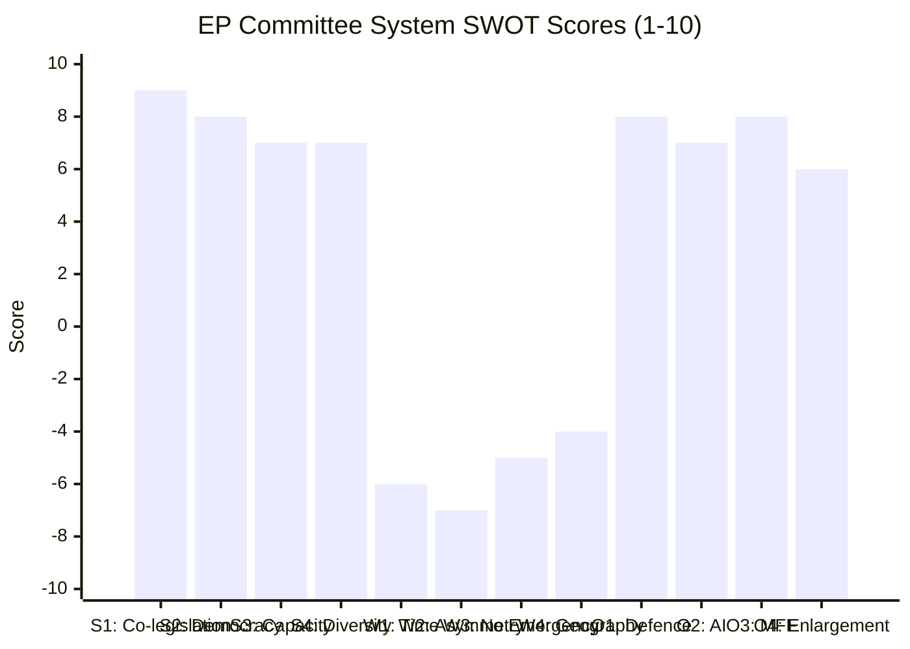

<!-- SPDX-FileCopyrightText: 2026 Hack23 AB -->
<!-- SPDX-License-Identifier: Apache-2.0 -->

# Quantitative SWOT Analysis — EP Committee Reports
**Date**: 2026-05-20 | **Data Mode**: minimal

## Overview

This SWOT analysis provides a structured assessment of the European Parliament committee system's Strengths, Weaknesses, Opportunities, and Threats as of May 2026.

*SAT: SWOT Analysis, Stakeholder Mapping. Admiralty Grade B2 throughout.*

## Strengths

### S1: Co-Legislative Power (Ordinary Legislative Procedure)
**Quantification**: EP holds co-equal legislative power with Council on ~90% of EU legislation. This covers approximately 400–450 legislative acts per parliamentary term.

**Score**: 9/10 — Constitutional; not easily diminished.

EP committees are not consultative bodies; they are co-legislators. The power to amend, block, or accelerate Commission proposals gives committees genuine influence over EU law. The EP has used this power to introduce stronger fundamental rights protections (GDPR, AI Act), stricter environmental standards (Green Deal legislation), and enhanced anti-corruption measures (anti-money-laundering package) than the Commission or Council originally proposed.

**Evidence**: EP amendments to the AI Act (biometric surveillance prohibitions, 2023), EP strengthening of Nature Restoration Law science basis before near-defeat (2023), EP improvement of CSRD scope relative to Commission proposal (2021).

### S2: Democratic Legitimacy Through Direct Election
**Quantification**: 720 MEPs directly elected by ~350m eligible voters across 27 member states. 2024 turnout: 51% (highest since 1994).

**Score**: 8/10 — Improving; but still lower than national parliament legitimacy in most member states.

The EP's democratic mandate is unique in international law: no other supranational institution is directly elected at this scale. The 2024 election's 51% turnout suggests growing EU political engagement. EP committees derive their democratic authority from this mandate — committee rapporteurs act as trustees of their electoral constituencies in shaping EU law.

**Quantitative benchmark**: EP10's 720 seats represent 29 nationalities and 8 (soon to be 7) political groups; the most diverse directly elected legislature in the world.

### S3: Institutional Memory and Technical Capacity
**Score**: 7/10 — Strong, with gaps in newest technology sectors.

EP committee secretariats comprise approximately 1,500 professional staff across 24 committees. Secretariat officials develop deep technical expertise over careers spanning multiple parliamentary terms. The STOA (Science and Technology Options Assessment) panel provides independent scientific advice. The EP's research service (EPRS) produces legislative impact assessments, comparative law analysis, and economic modelling.

**Limitation**: Technical capacity lags in AI, quantum computing, space, and defence technology — precisely the areas growing fastest.

### S4: Political Group Diversity (Multi-stakeholder Input)
**Score**: 7/10 — Strength and weakness simultaneously.

Eight political groups representing the full spectrum from communist left to hard-right populist ensures EP committees hear perspectives unavailable in any national parliament. Shadow rapporteurs from each group engage deeply with every dossier. This diversity — while creating governance complexity — produces more comprehensive legislation than any single-party or two-party majority system.

## Weaknesses

### W1: Invocation Cap / Limited Session Time
**Score**: -6/10 — Structurally constrained.

MEPs spend approximately 40% of their working time in plenary (Strasbourg/Brussels), 30% in committee, 20% in constituency, and 10% in administrative duties. The committee calendar is intensively packed but insufficient for the volume of dossiers. Key bottleneck: rapporteur bandwidth — a single MEP may be lead rapporteur on multiple complex files simultaneously.

**Quantification**: 24 committees × 60+ active procedures = ~1,440 concurrent dossiers managed by 720 MEPs (~2 dossiers/MEP average, but leading rapporteurs carry 5–10+).

### W2: Asymmetric Information with Industry Lobbyists
**Score**: -7/10 — Significant structural disadvantage.

The ~15,000 registered EU lobbyists (approximately €1.5bn annual lobbying spend estimated) vs. ~1,500 committee secretariat staff creates a 10:1 information asymmetry. Industry groups fund detailed impact assessments, organise expert briefings, and maintain continuous MEP relationship management that committee staff cannot match.

**Consequence**: Committee amendments on complex technical files (chemicals, financial services, AI) are often drafted with significant industry input, sometimes verbatim adoption of industry language.

### W3: No Formal Emergency Powers
**Score**: -5/10 — Constitutional gap exploited by executive.

The EP has no emergency legislative procedures comparable to national parliaments. Under Article 122 TFEU, the Council can adopt emergency economic measures without EP co-decision. This means that in crises — which are increasingly frequent (COVID, Ukraine, energy, defence) — EP committees are bypassed precisely when public interest in transparency is highest.

### W4: Geographic Fragmentation (Strasbourg/Brussels)
**Score**: -4/10 — Efficiency cost.

The EP's two-seat arrangement (Strasbourg plenary, Brussels committees) costs approximately €100–120m/year in travel, logistics, and duplicated infrastructure. More importantly, it fragments committee work: MEPs commute 4 days/month to Strasbourg, disrupting committee schedules. AFCO has repeatedly sought Treaty revision to rationalise the seat question; member states (France) block it.

## Opportunities

### O1: Defence Policy — Unprecedented Expansion of EP Role
**Score**: +8/10 — Transformative opportunity if seized.

The EU's defence turn creates an opportunity for AFET and BUDG committees to establish EP oversight over a policy area previously conducted almost entirely intergovernmentally. The SAFE instrument, EDIS, and military mobility funds all provide footholds for EP co-decision expansion.

**Quantification opportunity**: EU defence spending could reach €100–200bn/year at EU level by 2030. EP oversight of this resource would be the largest expansion of EP budgetary control since the 1970s.

### O2: AI Act Implementation — Standard-Setting Global Influence
**Score**: +7/10 — Brussels Effect opportunity.

If EP committees deliver rigorous, technically credible AI Act implementation oversight, the EU's AI governance framework will influence global AI regulation through the "Brussels Effect." This would be the largest regulatory export operation since GDPR's global impact on privacy law.

### O3: MFF 2028+ — Fiscal Architecture of EU for Next Decade
**Score**: +8/10 — Enormous but politically contested.

The post-2027 Multiannual Financial Framework negotiations give BUDG committee a once-per-decade opportunity to shape EU fiscal priorities. The outcomes will determine EU investment capacity for climate, defence, cohesion, and research for 2028–2034.

### O4: Enlargement Preparation — Democratic Conditionality Gateway
**Score**: +6/10 — Long-horizon opportunity.

AFCO and LIBE committees hold the key to democratic conditionality for EU enlargement. As Ukraine and Western Balkans candidates advance, EP committees' judgements on rule of law, democratic standards, and minority rights become gatekeeping functions with geopolitical weight.

## Threats Summary

*See `risk-scoring/risk-matrix.md` for detailed threat analysis*

| Threat | Impact Score | Probability Score | SWOT Weight |
|--------|-------------|-------------------|-------------|
| Article 122 bypass | -4 | High | -7/10 |
| Coalition fracture (Omnibus) | -3 | Medium-High | -5/10 |
| Foreign interference | -3 | High | -5/10 |
| AI governance deficit | -3 | High | -5/10 |
| Capacity overload | -2 | Very High | -5/10 |

## SWOT Score Summary

**Net SWOT score**: Strengths (31) + Opportunities (29) vs. Weaknesses (-22) + Threats (-27) = **Net: +11** — Positive but under stress.

---
*SATs: SWOT Analysis, Stakeholder Mapping. Admiralty Grade B2. Quantitative scoring is analytical judgement, not precise measurement.*
