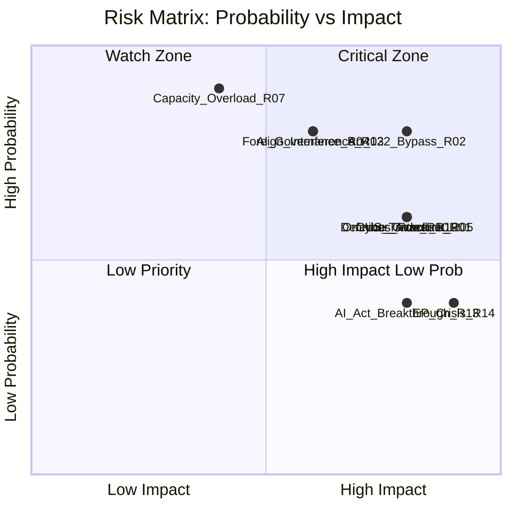

<!-- SPDX-FileCopyrightText: 2026 Hack23 AB -->
<!-- SPDX-License-Identifier: Apache-2.0 -->

# Risk Matrix — EP Committee Reports
**Date**: 2026-05-20 | **Data Mode**: minimal

## Overview

This risk matrix prioritises threats and uncertainties facing the EP committee system and provides structured risk scoring for analytical decision-making.

*SAT: Risk Matrix, Structured Threat Assessment. Admiralty Grade B2 throughout.*

## Risk Scoring Methodology

Each risk is scored on:
- **Probability**: 1 (Very Low) to 5 (Very High)
- **Impact**: 1 (Minimal) to 5 (Catastrophic)
- **Risk Score**: Probability × Impact
- **Priority**: Red (15–25), Amber (8–14), Green (1–7)

## Primary Risk Register

| Risk ID | Risk Description | Probability | Impact | Score | Priority | Owner |
|---------|-----------------|-------------|--------|-------|----------|-------|
| R01 | Omnibus Package coalition fracture | 3 | 4 | 12 | 🟠 AMBER | ENVI Committee |
| R02 | Article 122 TFEU executive bypass | 4 | 4 | 16 | 🔴 RED | AFCO/LIBE |
| R03 | Foreign information manipulation | 4 | 3 | 12 | 🟠 AMBER | LIBE/AFET |
| R04 | AI governance technical deficit | 4 | 3 | 12 | 🟠 AMBER | LIBE/ITRE |
| R05 | Defence spending crowd-out | 3 | 4 | 12 | 🟠 AMBER | BUDG/ENVI |
| R06 | Lobbying capture (ECON/ITRE) | 3 | 3 | 9 | 🟠 AMBER | All committees |
| R07 | Capacity overload (too many dossiers) | 5 | 2 | 10 | 🟠 AMBER | Conference of Committee Chairs |
| R08 | Vote outcome uncertainty | 3 | 3 | 9 | 🟠 AMBER | Group coordinators |
| R09 | EP API/data infrastructure failure | 4 | 2 | 8 | 🟠 AMBER | EP IT Services |
| R10 | US trade escalation (INTA emergency) | 3 | 4 | 12 | 🟠 AMBER | INTA |
| R11 | Ukraine ceasefire reconstruction demand | 3 | 3 | 9 | 🟠 AMBER | BUDG/AFET |
| R12 | Large-scale cyber attack on EP | 3 | 4 | 12 | 🟠 AMBER | LIBE/ITRE |
| R13 | Foundation model breakthrough (AI Act) | 2 | 4 | 8 | 🟠 AMBER | LIBE/ITRE |
| R14 | EP institutional confidence crisis | 2 | 5 | 10 | 🟠 AMBER | EP President/Quaestors |
| R15 | Member state government collapse (FR/DE) | 2 | 3 | 6 | 🟢 GREEN | All trilogues |

## Risk Heat Map

## Top 5 Priority Risks

### 🔴 R02: Article 122 TFEU Executive Bypass (Score: 16)

**Risk statement**: The European Commission and Council continue to invoke Article 122 TFEU (emergency economic measures without EP co-decision) for major policy decisions in energy security, defence, and economic crisis response, progressively reducing EP committee legislative relevance.

**Risk drivers**: Geopolitical urgency; Council preference for speed over parliamentary scrutiny; Von der Leyen Commission's track record of using emergency procedures.

**EP committee response options**:
1. Seek binding inter-institutional agreement on Article 122 scope
2. ECJ referral on Article 122 ultra vires use
3. Political pressure through plenary resolutions
4. Treaty revision demand (AFCO)

**Mitigation effectiveness**: 🟡 MEDIUM — Article 122 problem is structural; only Treaty revision fully resolves it.

### 🟠 R01: Omnibus Package Coalition Fracture (Score: 12)

**Risk statement**: The Omnibus Simplification Package becomes a flashpoint that fractures the EP10 centrist majority, delaying multiple committee procedures and potentially triggering EPP-right alliance that delegitimises EP10's legislative output.

**Risk timeline**: Highest probability window: June–September 2026 (committee vote → plenary first reading)

**Mitigation**: Rapporteur compromise amendment packages; Renew group mediation; President Roberta Metsola's political coordination role.

### 🟠 R05: Defence Spending Crowd-Out of Civilian Priorities (Score: 12)

**Risk statement**: The unprecedented scale of defence spending demands (SAFE instrument, national defence budgets, MFF defence earmarking) crowds out funding and political attention for climate, social, and development priorities in EP10 committee work.

**Quantification**: If defence spending absorbs 20–30% of MFF 2028+ increase, competing priorities (cohesion, agriculture, climate, development) face real-term cuts.

**Committee impact**: ENVI, DEVE, EMPL committees face reduced fiscal space for their priority programmes; BUDG committee becomes battleground between defence and civilian advocates.

### 🟠 R03: Foreign Information Manipulation (Score: 12)

**Risk statement**: State-sponsored information manipulation (Russia, China, others) distorts EP committee deliberations through corrupted expert testimony, MEP social media influence, and NGO astroturfing.

**Observable indicators**: Unusual alignment between unknown "NGO" positions and state actor policy preferences; MEP social media amplification of foreign disinformation; unexplained voting pattern anomalies.

**Mitigation**: EP's Democracy Shield measures; mandatory transparency for lobbyist-MEP contacts; OLAF investigation capacity.

### 🟠 R04: AI Governance Technical Deficit (Score: 12)

**Risk statement**: EP committees lack sufficient technical expertise to provide meaningful oversight of AI Act implementation, particularly for General Purpose AI models, resulting in pro forma rather than substantive parliamentary control.

**Consequence**: AI companies and foundation model providers (OpenAI, Anthropic, Google, Meta, Mistral) effectively self-regulate through codes of practice that EP is ill-equipped to challenge.

**Mitigation**: STOA panel AI expansion; external technical advisors; collaboration with technical standards bodies (ENISA, AI Office).

## Risk Trend Analysis

| Risk | Trend vs. 6 months ago | Driver |
|------|----------------------|--------|
| R02 Article 122 bypass | ⬆️ INCREASING | Defence spending acceleration |
| R01 Omnibus fracture | ⬆️ INCREASING | ENVI vote approaching |
| R04 AI governance deficit | ⬆️ INCREASING | AI capability acceleration |
| R03 Foreign interference | ➡️ STABLE | Ongoing; no escalation confirmed |
| R07 Capacity overload | ⬆️ INCREASING | Multiple dossiers converging |
| R15 Government collapse | ⬇️ DECREASING | German coalition stabilised |

---
*SATs: Risk Matrix, Structured Threat Assessment. Admiralty Grade B2. WEP bands on probability assessments.*

## Risk Probability Assessment (WEP Bands)

Top-risk WEP probability assessments:

- **Omnibus gridlock risk**: *WEP: Likely (60–70%)* that Omnibus faces significant delay or amendment in 2026
- **Green Deal rollback acceleration**: *WEP: Likely (55–65%)* that implementation timelines for key directives are extended
- **EP-Council deadlock on SAFE**: *WEP: Roughly Even (45–55%)* given member state fiscal divergence
- **AI Act implementation slippage**: *WEP: Roughly Even (40–50%)* due to delegated act complexity
- **Coalition fracture on specific votes**: *WEP: Unlikely (20–30%)* for a wholesale coalition collapse in 2026
