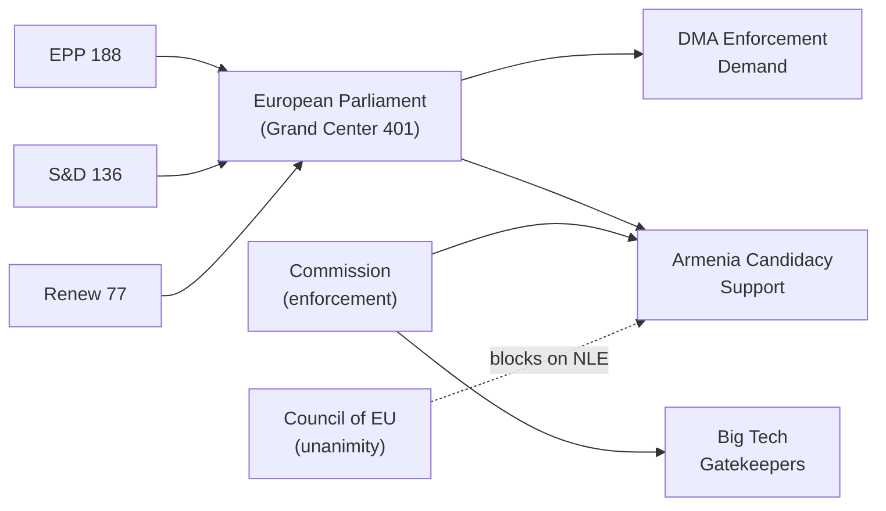

# Actor Mapping — EP Propositions | 2026-05-20

**Classification:** ACTOR-MAPPING | **Admiralty Grade:** B2

## Actor Roster

| Actor | Category | Mandate | EP10 Alignment |
|-------|----------|---------|----------------|
| European Parliament (plenary) | Institution | Co-legislator + oversight | N/A |
| European Commission | Institution | Legislative initiative + enforcement | Majority supportive |
| EPP Group (188 seats) | Political group | Centre-right; majority anchor | Pro-DMA, pro-enlargement |
| S&D Group (136 seats) | Political group | Social-democratic | Pro-enforcement, pro-Armenia |
| Renew Europe (77 seats) | Political group | Liberal-centrist | Pro-digital, pro-budget discipline |
| ECR Group (78 seats) | Political group | Right-conservative | Selective cooperation |
| Greens/EFA (53 seats) | Political group | Green-progressive | Pro-DMA, pro-Armenia |
| Big Tech Gatekeepers | Industry | Profit/market access | Against DMA enforcement |
| Armenian Government | Third party | Sovereignty + EU integration | Pro-candidacy |
| IMF | International org | Economic advisory | Neutral-positive on EU reforms |
| Civil society (animal welfare) | Advocacy | Dogs/Cats regulation | Pro-welfare directive |
| Council of EU | Institution | Co-legislator | Member state interests |

## Influence

**Power hierarchy:**
1. European Commission (enforcement + initiative monopoly)
2. Council of EU (co-decision + unanimity veto on NLE files)
3. EPP Group (188 seats — largest single bloc)
4. S&D Group (coalition pivotal on social files)
5. Big Tech Gatekeepers (regulatory capture risk on DMA)

**Influence modifiers:**
- DMA: Commission > Big Tech lobby > EP plenary (enforcement demand)
- Armenia: EP AFET + EPP + S&D > Council (foreign policy unanimity constraint)
- Budget: EPP + Council net contributors > Commission ambitions

## Alliance

**Stable alliances (EP10):**
- Grand Center: EPP + S&D + Renew = 401 seats (minimum 361 required) → reliable on most files
- Progressive majority: Grand Center + Greens = 454 seats → strong on DMA, Armenia
- Competitiveness axis: EPP + ECR (selective) = 266 seats → insufficient alone but signals direction

**Adversarial relationships:**
- EP plenary ↔ Big Tech (enforcement vs. compliance minimisation)
- EP plenary ↔ PfE/ESN (voting opposition on Ukraine/Armenia)
- Commission ↔ Council (budget expansion ambitions vs. net contributor discipline)

## Power Brokers

**Key MEP power brokers (April 2026):**
1. **Andreas Schwab (EPP, DE)** — IMCO committee rapporteur, DMA enforcement champion
2. **Roberta Metsola (EPP, MT)** — EP President; frames institutional communication
3. **Iratxe García Pérez (S&D, ES)** — S&D group president; budget coalition anchor
4. **Stéphane Séjourné (Renew, FR)** — Renew president; pivotal on France-sensitive files
5. **Sandro Gozi (Renew, IT/FR)** — enlargement committee; Armenia rapporteur lead

**Commission power brokers:**
- Margrethe Vestager (DG COMP, if retained) — DMA enforcement decision-maker
- Teresa Ribera (VP, Green Deal + Competition) — Clean Industrial Deal champion

## Information

**Key intelligence gaps:**
- Council COREPER II position on SAFE Regulation (classified negotiating brief)
- EPP-ECR backroom agreement on competitiveness exceptions to DMA (if any)
- Commission DMA enforcement timeline (not publicly confirmed)
- Armenian political stability assessment (OSCE SMM restricted)

**Reliable public sources:**
- EP voting records (official, Admiralty A1)
- EP AFET committee statements (official, B1)
- Commission Work Programme 2026 (official, B1)
- IMF WEO April 2026 (institutional, B1)

## Reader Briefing

**For Citizens:** The EP passed 8 major decisions in April 2026. The most significant: requiring the EU Commission to enforce digital market rules against Big Tech companies like Google and Apple (DMA enforcement), expressing support for Armenia's path toward EU membership, and setting out spending priorities for the 2027 EU budget. These decisions shape how Europe regulates its digital economy, engages with its eastern neighbourhood, and invests public money.

## Actor Network Visualization

