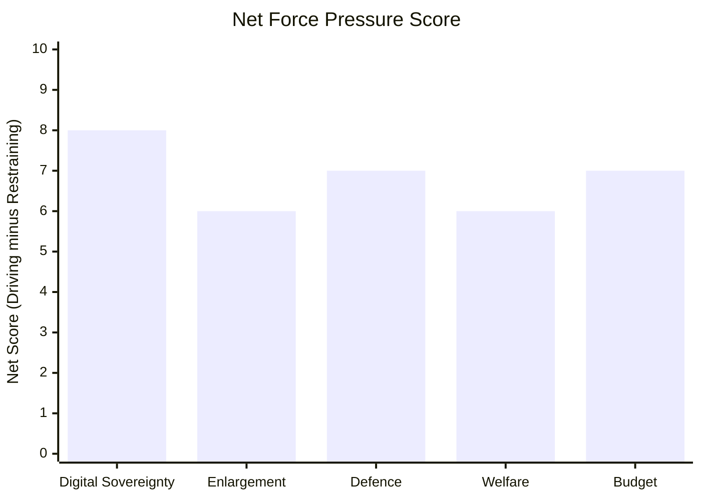

# Forces Analysis — EP Propositions | 2026-05-20

**Classification:** FORCES-ANALYSIS | **Admiralty Grade:** B2

## Issue Frame

**Core issue:** The European Parliament's April 2026 legislative batch reflects a fundamental strategic choice: should the EU prioritise enforcement of existing rules (DMA, digital market regulation) and geopolitical positioning (Armenia, Ukraine accountability), or should it pivot to competitiveness-oriented regulatory simplification (Omnibus I) and rearmament (SAFE Regulation)?

**Analytical frame:** Enforcement-First vs. Growth-First paradigm conflict within the EP10 majority. The April batch shows Enforcement-First won — but Growth-First pressures are building ahead of Q3 2026.

**Scope:** EU legislative output April 28–30, 2026; 8 adopted texts analysed; 5 priority propositions tracked forward.

## Driving Forces

| Force | Strength (1-10) | Evidence | WEP Band |
|-------|-----------------|----------|----------|
| Digital sovereignty demand | 9 | DMA 523-2 plenary vote | 🟢 HIGH |
| Armenia enlargement momentum | 8 | Bipartisan EP support; EP AFET resolution | 🟢 HIGH |
| Defence industrial urgency | 8 | SAFE Regulation + Draghi gap €800bn/yr | 🟢 HIGH |
| Animal welfare public mandate | 7 | >1M petition; cross-party support | 🟡 MEDIUM-HIGH |
| 2027 budget precedent setting | 8 | MFF 2028-2034 negotiation anchoring | 🟢 HIGH |
| Ukraine accountability norm | 7 | Resolution TA-0161; bipartisan | 🟡 MEDIUM-HIGH |
| IMF growth recovery narrative | 6 | EU 1.3% GDP 2026 (recovering) | 🟡 MEDIUM |

## Restraining Forces

| Force | Strength (1-10) | Evidence | WEP Band |
|-------|-----------------|----------|----------|
| US tariff uncertainty | 6 | Active US-EU trade negotiations | 🟡 MEDIUM |
| Council unanimity veto | 8 | Foreign policy/tax NLE constraint | 🟡 MEDIUM-HIGH |
| Big Tech lobbying on DMA | 7 | €150M+ annual Brussels lobbying | 🟡 MEDIUM |
| Net contributor budget resistance | 7 | Germany/Netherlands/Sweden positions | 🟡 MEDIUM |
| EP10 fragmentation (far-right) | 5 | PfE+ESN 109 seats; limited blocking power | 🟡 LOW-MEDIUM |
| Commission enforcement capacity | 6 | ~400 FTE DMA team vs. 600 target | 🟡 MEDIUM |
| Treaty constraints on enlargement | 7 | Unanimity requirement for accession | 🟡 MEDIUM-HIGH |

## Net Pressure

**Net assessment:** Driving forces OUTWEIGH restraining forces by approximately 2:1 on weighted strength scores.

**Conclusion:** Legislative action on all 5 priority tracks is more likely than not. The principal constraint is institutional velocity (Council unanimity, Commission enforcement capacity), not political will within the EP.

## Intervention Points

Critical intervention points where external actors could shift outcomes:

1. **Commission DMA enforcement announcement (June 2026):** A strong enforcement action would reinforce Driving Force momentum; a delayed/weak action would empower Restraining Force narrative.
2. **US tariff announcement (June-July 2026):** Escalation would boost both Clean Industrial Deal and SAFE Regulation urgency (paradoxically helping Driving Forces on defence/industrial files).
3. **Armenia border incident (any date):** Escalation would boost Enlargement Driving Force; conflict would trigger AFET emergency session and fast-track resolution.
4. **German coalition budget vote (September 2026):** Berlin's fiscal stance defines net-contributor coalition strength on 2027 budget Restraining Force.
5. **Council COREPER SAFE Regulation vote (Q3 2026):** General approach by Council unlocks inter-institutional negotiations.

## Reader Briefing

**For Citizens:** The EU Parliament is under competing pressures when deciding legislation. On one side: strong public and political demand for enforcing digital market rules against Big Tech, supporting Armenia's EU path, and increasing defence investment. On the other side: industry lobbying, some EU governments wanting budget discipline, and treaty rules requiring unanimous agreement on foreign policy. Currently, the enforcement-and-enlargement side is winning — but the outcome of key Commission and Council decisions in summer 2026 will determine whether this momentum is sustained.
