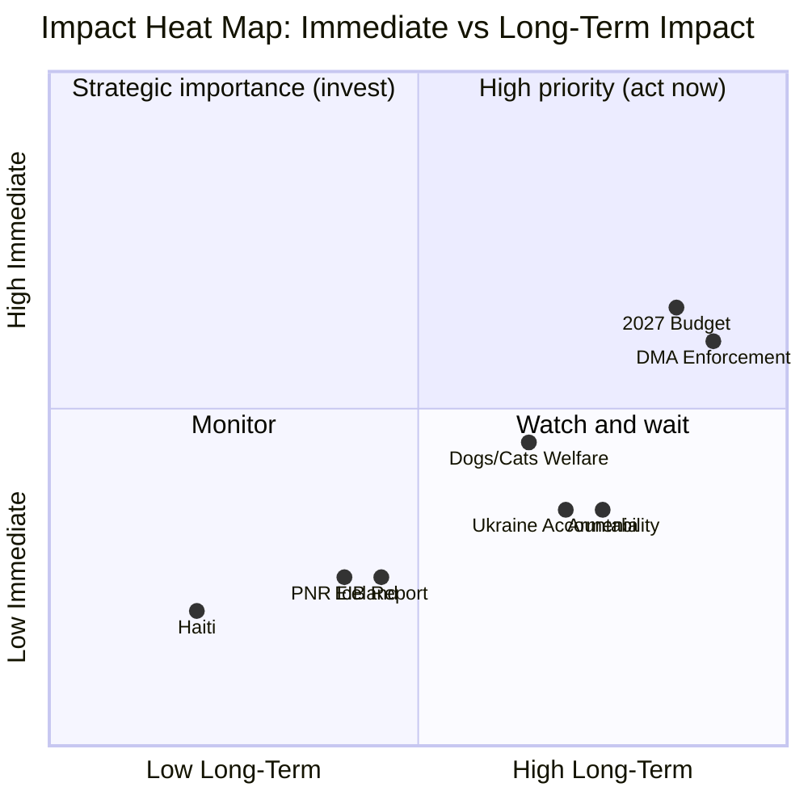
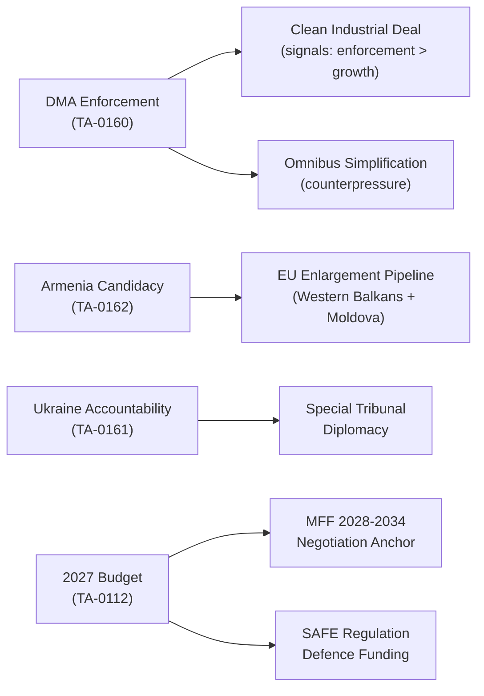

# Impact Matrix — EP Propositions | 2026-05-20

**Classification:** IMPACT-MATRIX | **Admiralty Grade:** B2

## Event List

April 28–30, 2026 EP Plenary — 8 adopted texts:

| Ref | Date | Title | Procedure |
|-----|------|-------|-----------|
| TA-10-2026-0160 | Apr 30 | DMA Enforcement Resolution | NLE |
| TA-10-2026-0162 | Apr 30 | Armenia Democratic Resilience | NLE |
| TA-10-2026-0161 | Apr 30 | Russia/Ukraine Accountability | NLE |
| TA-10-2026-0151 | Apr 30 | Haiti Trafficking | NLE |
| TA-10-2026-0142 | Apr 29 | EU-Iceland PNR | NLE |
| TA-10-2026-0115 | Apr 28 | Dogs/Cats Welfare | COD |
| TA-10-2026-0112 | Apr 28 | 2027 Budget Guidelines | BUD |
| TA-10-2026-0119 | Apr 28 | EIB Annual Report | NLE |

## Stakeholder

**Primary stakeholders affected:**
- **EU citizens (digital):** DMA enforcement + Dogs/Cats welfare → direct consumer protection benefits
- **Armenian citizens:** Armenia resolution → EU candidacy pathway signal
- **Ukrainian citizens:** Russia/Ukraine accountability → international justice signal
- **Big Tech companies:** DMA enforcement → compliance cost, potential fines
- **EU member state governments:** 2027 Budget → fiscal transfer negotiations
- **EIB project beneficiaries:** EIB report → investment priorities confirmed
- **Haitian trafficking victims:** Haiti resolution → EU diplomatic attention

## Impact Matrix

| Text | Immediate Impact | 6-Month Impact | 24-Month Impact | Citizens Score |
|------|-----------------|----------------|-----------------|----------------|
| DMA Enforcement | MEDIUM (demand) | HIGH (enforcement) | VERY HIGH (market change) | 4.2/5 |
| Armenia Candidacy | LOW (symbolic) | MEDIUM (diplomacy) | HIGH (candidacy pathway) | 3.5/5 |
| Russia/Ukraine Accountability | LOW (symbolic) | MEDIUM (tribunal) | HIGH (accountability norm) | 3.5/5 |
| Dogs/Cats Welfare | LOW (legislative) | MEDIUM (implementation) | HIGH (welfare standards) | 3.8/5 |
| 2027 Budget | MEDIUM (signal) | HIGH (negotiations) | VERY HIGH (MFF anchor) | 4.0/5 |
| EU-Iceland PNR | LOW | LOW | MEDIUM (security architecture) | 2.0/5 |
| Haiti Trafficking | LOW | LOW | LOW (bilateral attention) | 1.5/5 |
| EIB Annual Report | LOW | MEDIUM (mandate debate) | MEDIUM | 2.5/5 |

## Heat

**Priority heat map — Tier classification:**

**Heat tier summary:**
- 🔴 RED (act now): DMA Enforcement, 2027 Budget
- 🟠 AMBER (strategic): Armenia, Ukraine Accountability  
- 🟡 YELLOW (watch): Dogs/Cats, EIB
- 🟢 GREEN (monitor): Haiti, PNR Iceland

## Cascade

**Cascade effects — how these texts interact:**

**Key cascade risk:** If DMA enforcement is seen as prioritising enforcement over competitiveness, it could reduce EP support for Omnibus I simplification — creating a policy coherence contradiction.

## Reader Briefing

**For Citizens:** Eight EU Parliament decisions from late April 2026 matter at different levels. The two highest-priority ones are: demanding the EU Commission actually enforces the Digital Markets Act against companies like Google and Apple (this directly affects the apps and services you use), and setting out the spending framework for the EU's 2027 budget (this affects investment in infrastructure, research, defence, and social programmes across all EU countries). The decisions on Armenia and Ukraine accountability are significant for Europe's geopolitical direction but will take years to produce concrete results for citizens.
