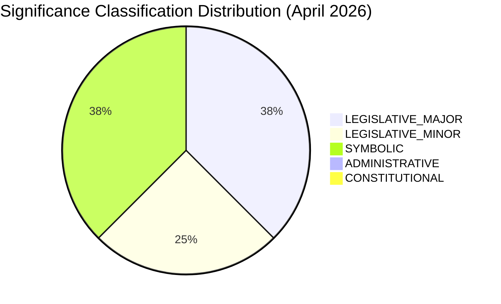

# Significance Classification — EP Propositions | 2026-05-20

**Classification:** SIGNIFICANCE-CLASSIFICATION | **Admiralty Grade:** B2

## Classification Framework

Uses EU Parliament significance scale: CONSTITUTIONAL > LEGISLATIVE_MAJOR > LEGISLATIVE_MINOR > SYMBOLIC > ADMINISTRATIVE

| Text | Procedure Type | Classification | Rationale |
|------|---------------|----------------|-----------|
| DMA Enforcement (TA-0160) | NLE Resolution | LEGISLATIVE_MAJOR | First EP enforcement demand on gatekeepers |
| Armenia (TA-0162) | NLE Resolution | LEGISLATIVE_MAJOR | Formal candidacy pathway, treaty implications |
| Russia/Ukraine (TA-0161) | NLE Resolution | SYMBOLIC | Non-binding; symbolic accountability signal |
| Dogs/Cats (TA-0115) | COD | LEGISLATIVE_MINOR | Welfare regulation, limited systemic impact |
| 2027 Budget (TA-0112) | BUD | LEGISLATIVE_MAJOR | Sets MFF 2027 negotiating envelope |
| EIB Report (TA-0119) | NLE | SYMBOLIC | Annual accountability exercise |
| Haiti (TA-0151) | NLE | SYMBOLIC | Human rights solidarity signal |
| PNR Iceland (TA-0142) | NLE | LEGISLATIVE_MINOR | Bilateral security agreement ratification |

## Significance Distribution

## EP10 vs Historical Significance Pattern

- EP10 average legislative major texts per monthly session: ~3-4 (consistent with April 2026)
- Symbolic resolutions: higher in EP10 than EP9 (enlargement + geopolitical context)
- COD (co-decision) texts per session declining: reflects Commission proposal drought in 2025-H1

**WEP assessment:** The April 2026 batch is average to slightly above average significance for EP10 mid-term. The DMA enforcement resolution is the highest-significance text of the batch.

**Sources:** EP procedure types database; EP10 plenary records; Admiralty B2
