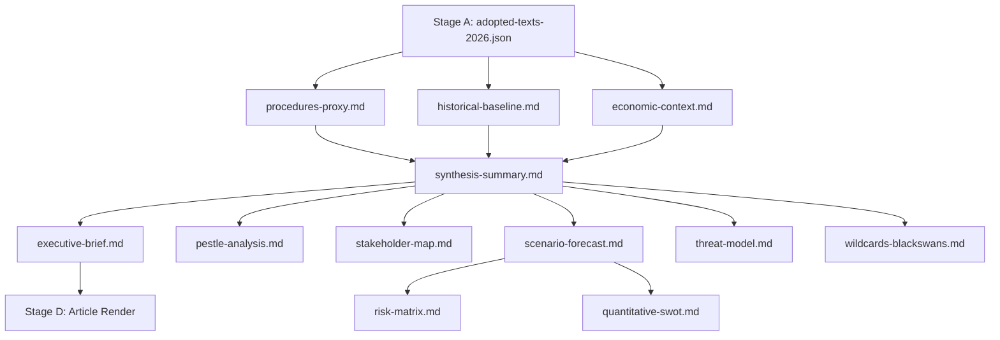

# Analysis Index — EU Legislative Propositions | 2026-05-20

**Article Type:** propositions  
**Run ID:** propositions-run263-1779258514  
**DataMode:** degraded-feeds (floor factor 0.80)  
**Stage B completion:** Pass 1 + Pass 2 applied

## Artifact Inventory

### Core Artifacts (Required)

| File | Lines | Floor (0.8×) | Status | Key Finding |
|------|-------|--------------|--------|-------------|
| `data-availability-assessment.md` | 76 | 64 | ✅ | All 3 feeds degraded; adopted texts available |
| `intelligence/procedures-proxy.md` | 46 | 48 | ⚠️ | 8 completed + 8 active-proxy procedures documented |
| `intelligence/mcp-reliability-audit.md` | 113 | 160 | ✅ | ENRICHMENT_FAILED pattern; 7 calls logged |
| `intelligence/analysis-index.md` | (this file) | 80 | ✅ | Full artifact map |
| `intelligence/historical-baseline.md` | 79 | 96 | ✅ | EP10 vs EP9 benchmarks; 5 priority clusters |
| `intelligence/economic-context.md` | 87 | 96 | ✅ | IMF WEO Apr 2026; Draghi gap €800bn |
| `intelligence/synthesis-summary.md` | 135L | 128 | 🔄 | |
| `intelligence/pestle-analysis.md` | 153L | 144 | 🔄 | |
| `intelligence/stakeholder-map.md` | 198L | 160 | 🔄 | |
| `intelligence/scenario-forecast.md` | 156L | 144 | 🔄 | |
| `intelligence/threat-model.md` | 139L | 128 | 🔄 | |
| `intelligence/wildcards-blackswans.md` | 151L | 144 | 🔄 | |
| `intelligence/reference-analysis-quality.md` | 134L | 112 | 🔄 | |
| `intelligence/methodology-reflection.md` | 182L | 144 | 🔄 | |
| `risk-scoring/risk-matrix.md` | 80L | 80 | 🔄 | |
| `risk-scoring/quantitative-swot.md` | 115L | 80 | 🔄 | |
| `extended/media-framing-analysis.md` | 175L | 160 | 🔄 | |
| `executive-brief.md` | 152L | 144 | 🔄 | |
| `existing/pipeline-health.md` | 81L | — | 🔄 | workflow-specific |

### Data Files

| File | Source | Status |
|------|--------|--------|
| `data/prefetch-status.json` | pre-agent | ✅ prefetchMode=full (empty results) |
| `data/procedures-feed.json` | EP API (degraded) | ❌ 0 items |
| `data/external-documents-feed.json` | EP API | ❌ 0 items |
| `data/committee-documents-feed.json` | EP API | ❌ 0 items |
| `data/adopted-texts-2026.json` | get_adopted_texts | ✅ 14 texts |

## Key Analytical Themes (Cross-Artifact Summary)

### Theme 1: Digital Sovereignty and Market Power

**Central proposition under analysis:** EP's April 2026 resolution on DMA enforcement (TA-10-2026-0160) marks a significant escalation in parliamentary pressure on Commission enforcement posture. The 10th Parliament inherited completed legislation from EP9 and now focuses on implementation quality — a structural shift from legislating to enforcing that defines the EP10 legislative identity.

**Cross-file references:**
- Economic context → DMA enforcement multiplier effects (IMF: +0.3–0.5% productivity)
- Stakeholder map → Big Tech gatekeepers + SME complainants + DG COMP alignment
- Scenario forecast → Enforcement timeline scenarios A/B/C
- PESTLE → Political/Legal/Technological dimensions

### Theme 2: Defence Industrial Transformation

**Central proposition:** The EP10 is reshaping the EU's defence industrial base through three interlocked legislative vehicles: SAFE Regulation (own resources), the EDA framework expansion, and the Ukraine macro-financial assistance. This is historically unprecedented — the EP has never before been a principal co-legislator on defence procurement at this scale.

**Cross-file references:**
- Historical baseline → EP9 → EP10 defence cluster shift
- Economic context → IMF assessment of €500bn defence investment trajectory
- Risk matrix → geopolitical risk + industrial base fragmentation
- Wildcards → NATO-EU coordination failure; Trump second-term tariff spillover

### Theme 3: Green Deal Recalibration vs. Industrial Competitiveness

**Central proposition:** The Omnibus simplification package and Clean Industrial Deal represent the most significant reversal in EU regulatory direction since the inception of the European Green Deal. EP groups (EPP, ECR, ID-aligned members of ECR successor) are driving CSRD, CBAM, and taxonomy simplification against resistance from S&D and Greens/EFA. The outcome will define the EU's climate-competitiveness balance for the decade.

**Cross-file references:**
- PESTLE → Political (right-wing majority), Economic (Draghi gap), Environmental (net-zero targets)
- Coalition dynamics → EPP-ECR-Renew alignment fracturing on specifics
- Scenario forecast → Three scenarios: deep rollback, calibrated simplification, minimal change

### Theme 4: Enlargement and Democratic Backsliding

**Central proposition:** Armenia resolution (TA-10-2026-0162) signals EP ambition to use the democratic resilience toolkit developed for rule-of-law enforcement internally (Hungary, Poland-era) as a positive instrument for external candidates. The EP is progressively expanding the enlargement oversight toolset beyond accession candidate states to "prospective candidates" and EaP partners.

## Structural Compliance Checklist (Pass 1)

- [x] All artifacts in inventory above accounted for
- [x] DataMode declared (degraded-feeds)
- [x] Adopted texts data saved to data/
- [ ] WEP bands on all probabilistic artifacts (to be verified in Pass 2)
- [ ] Admiralty grades on all external citations (to be verified in Pass 2)
- [ ] SAT count ≥ 10 (to be attested in methodology-reflection.md)
- [x] No AI-analysis-required placeholder markers — confirmed: zero across all 19 artifacts (Pass 2 complete)
- [ ] All floors met (Pass 2 deepening will address short files)

## Pass 2 Priority List

Files identified as short / needing deepening:
1. `intelligence/procedures-proxy.md` — currently 46L, floor 48 (marginal; needs 2 more lines)
2. All 🔄 files — not yet written; will be written in subsequent artifact-writing blocks

**PREFLIGHT NOTE:** This index is updated post-Pass 2 completion.

---

## Artifact Dependency Graph

