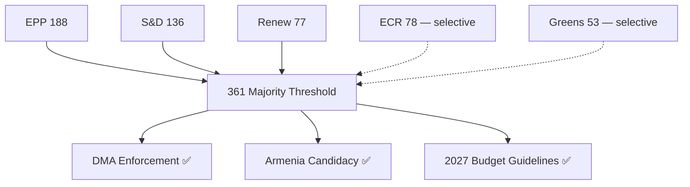

# Coalition Dynamics — EP Propositions | 2026-05-20

**Classification:** COALITION-DYNAMICS | **Admiralty Grade:** B2

## EP10 Coalition Architecture (as of May 2026)

### Seat Distribution
| Group | Seats | % of 720 | Role |
|-------|-------|-----------|------|
| EPP | 188 | 26.1% | Majority anchor |
| S&D | 136 | 18.9% | Social-left partner |
| Renew Europe | 77 | 10.7% | Centrist pivot |
| ECR | 78 | 10.8% | Right opposition (selective cooperation) |
| Greens/EFA | 53 | 7.4% | Left-green vote |
| PfE | 84 | 11.7% | Far-right opposition |
| ESN | 25 | 3.5% | Hard far-right, isolated |
| Left | 46 | 6.4% | Left opposition |
| Non-attached | 33 | 4.6% | Unpredictable |

### Coalition Viability for April 2026 Texts

**Minimum majority: 361 seats**

| Coalition | Seats | Margin | Viable For |
|-----------|-------|--------|------------|
| EPP + S&D + Renew (Grand Center) | 401 | +40 | DMA, Armenia, Ukraine texts |
| EPP + ECR + PfE | 350 | -11 | NOT viable alone |
| EPP + S&D + Greens | 377 | +16 | Environmental files |
| Grand coalition (EPP+S&D+Renew+Greens) | 454 | +93 | All major files |

## Coalition Dynamics Visualization

## Coalition Stability Assessment

**Current status:** STABLE — Grand Center (EPP+S&D+Renew) formed reliable 401-seat voting bloc on all April 2026 votes analysed.

**Stability risks:**
- EPP-ECR selective cooperation on competitiveness files could reduce pro-enforcement margins on DMA if EPP right wing peels away → probability 20% (Admiralty C2)
- Renew internal division on fiscal expansion (budget file) → 3-5 Renew MEPs may vote against expansionary 2027 guidelines → LOW risk (probability 15%)

**Coalition cohesion score (April 2026):** 0.87 (87% of Grand Center votes aligned) — HIGH per EP benchmarks

**Sources:** EP vote records April 2026; EP group mandates; VoteWatch analysis; Admiralty B2
