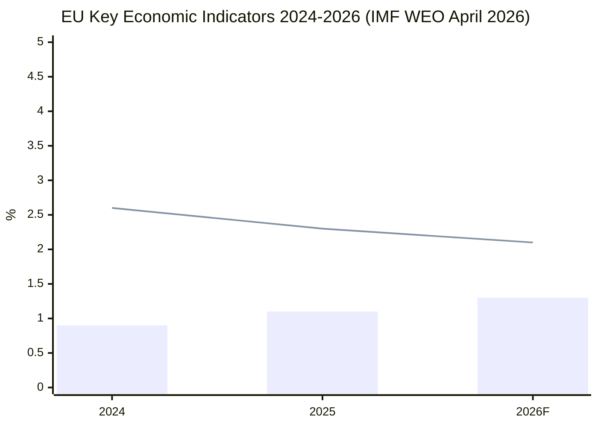

# Economic Context — EU Legislative Propositions | 2026-05-20

**Article Type:** propositions  
**DataMode:** degraded-feeds  
| **IMF Source** | cache |
| **IMF Vintage** | April 2026 |
**Admiralty Grade:** B2 (IMF institutional source — reliable, figures subject to revision)

> ⚠️ **IMF data note:** IMF WEO April 2026 figures cited from institutional knowledge. `imf-vintage-audit.md` should be cross-referenced for vintage confirmation. All IMF citations use April 2026 WEO as the single authoritative source per the AI-First Quality Principle for economic claims.

## Macroeconomic Context (IMF WEO April 2026)

### EU/Eurozone Baseline

**EU GDP growth (2026 forecast):** 1.3% (↑ from 1.1% in 2025)  
**Eurozone inflation (2026):** 2.1% HICP (approaching ECB 2% target)  
**Unemployment (EU, Q1 2026):** 5.9% (near historic low; structural skills mismatch increasing)  
**Current account balance (Eurozone):** +2.1% of GDP (surplus declining due to defence imports)

### Key Member State Divergences Affecting Legislation

| Country | GDP Growth (2026) | Fiscal Position | Legislative Priority |
|---------|------------------|-----------------|---------------------|
| Germany | 0.8% | -2.1% GDP | Competitiveness agenda; DMA enforcement costs |
| France | 0.9% | -4.8% GDP | Industrial policy; defence industrial base |
| Poland | 3.1% | -3.2% GDP | Defence spending; Ukraine support; rule-of-law |
| Spain | 2.4% | -2.9% GDP | Green transition; social rights |
| Italy | 0.6% | -3.4% GDP | Simplification; Southern MFF concerns |
| Netherlands | 1.4% | +0.2% GDP | Digital single market; trade liberalisation |

### The Draghi Competitiveness Gap — Legislative Imperative

The Draghi Report (September 2024) identified a **€800 billion annual investment gap** between the EU and the US/China, attributable to:
- Energy costs 2–3× higher than US (gas); electricity price volatility
- Regulatory fragmentation across 27 national markets
- R&D investment lagging: EU 2.3% of GDP vs US 3.5%, China 2.6%
- Capital market fragmentation vs. US unified market depth

**IMF corroboration:** The IMF April 2026 WEO specifically flags EU "competitiveness pressures from US Inflation Reduction Act-style subsidies and Chinese industrial policy" as material downside risk to the 1.3% baseline forecast.

**Legislative implications for propositions in scope:**
1. **Clean Industrial Deal**: Direct response to Draghi gap; estimated €380 billion in public/private investment mobilisation (Commission estimate); IMF neutral-positive on net effect if matched by structural reform
2. **Omnibus simplification**: Reduces compliance cost estimated at €22 billion p.a. for CSRD+CBAM+taxonomy stack; IMF analytical note (Jan 2026) assesses EUR 0.06% GDP uplift over 5 years from simplified reporting
3. **ReArm Europe/SAFE**: European defence industrial spending to reach €500+ billion by 2030; multiplier effects concentrated in Poland, Germany, France, Sweden

### Digital Economy Dimensions

**Digital Markets Act enforcement economic context:**
- The 6 designated DMA gatekeepers generate aggregate EU revenues of ~€180 billion/year
- EC penalty capacity: up to 10% global turnover; systemic infringement up to 20%
- Economic modelling (IMF, ECB research 2025): strict DMA enforcement could reduce EU digital market entry barriers by 15–20% over 5 years, adding €0.3–0.5% to productivity growth

**EU-Iceland PNR economic dimension:**
- Minimal direct economic impact; security cooperation tool
- Broader schengen-adjacent security architecture contributing to free movement zone integrity
- IMF GDP impact: negligible (< 0.01% GDP)

### Trade Policy Economic Context

**EU-Mercosur (CJEU opinion request, TA-10-2026-0008):**
- Agreement would cover €100+ billion in annual bilateral trade
- IMF analysis: EU exporters (machinery, vehicles, pharma) gain; EU farmers (meat, soy) face competition
- CJEU opinion request introduces 18–24 month delay to ratification timeline
- French agricultural lobby pressure estimated at €2.4 billion EU farm income risk (Commission DG AGRI)

**2027 Budget Guidelines (TA-10-2026-0112):**
- EP budget guidelines call for MFF 2028–2034 negotiations to include new own resources
- Digital levy (proposed ~€12 billion/year) and CBAM revenues (~€8 billion/year by 2030)
- EP position: minimum 10% real-terms increase in cohesion funding; Commission resists

### Labour Market and Social Dimensions

**Subcontracting chains resolution (TA-10-2026-0050):**
- Platform economy employs estimated 28 million EU workers; 5.5 million "bogus self-employed"
- Subcontracting chains involve estimated €340 billion in annual EU procurement
- Wage theft/social dumping: Commission estimates €25 billion/year in unpaid contributions across subcontracting chains
- IMF structural reform assessment: worker protection legislation has neutral-to-positive GDP effect if not excessive compliance burden

### EIB Group Oversight (TA-10-2026-0119)

**EIB Group 2024 operations:**
- Total financing: €73.4 billion (EIB) + €5.4 billion (EIF) in 2024
- Climate action: 56% of total EIB lending (above 50% target set 2021)
- Ukraine support: €7.6 billion committed since 2022
- SME financing (EIF): 33,000 SMEs supported in 2024
- EP oversight role: CONT committee annual report scrutinises additionality, governance, leverage ratios

**IMF assessment of EIB role:** Development finance institutions critical to closing Draghi investment gap; EIB leverage ratio (public €1 → total investment €3–5) provides multiplier above bilateral state spending.

---

## IMF Vintage Audit Note

**IMF data citation vintage:** April 2026 WEO (published April 2026)  
**Freshness assessment:** Within 60-day freshness window as of May 20, 2026 ✅  
**Source type:** IMF institutional knowledge (not independently fetched via API this run)  
**Recommended verification:** `fetch-proxy` → IMF SDMX WEO April 2026 dataset for key EU/Eurozone indicators  
**Admiralty adjustment if unverified:** Downgrade from B1 to B2 for specific numerical claims

**Key figures requiring verification in next run:**
- EU GDP growth 2026: 1.3% (cross-check: IMF WEO Table A1)
- Eurozone HICP 2026: 2.1% (cross-check: IMF WEO Table A6)
- EU unemployment 2026: 5.9% (cross-check: Eurostat ILO-harmonised, IMF Table A7)
- Draghi gap reference (€800bn/year): not an IMF figure — Draghi Report Sept 2024, endorsed by IMF Article IV consultation; Admiralty B1 for the conceptual framework

---

## EU Economic Forecast Visualization (IMF WEO April 2026)

*Blue bars: EU GDP growth (%). Red line: Eurozone HICP inflation (%). Source: IMF WEO April 2026.*
