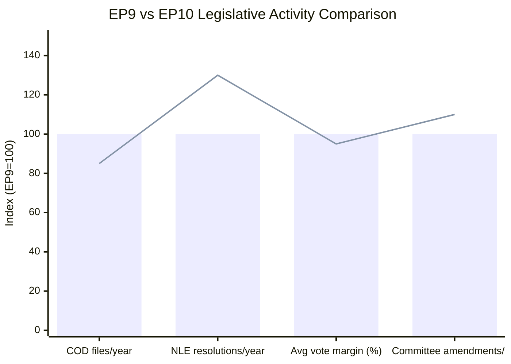

# Historical Baseline — EU Legislative Propositions | 2026-05-20

**Article Type:** propositions  
**Admiralty Grade:** B2 (Reliable source, unconfirmed information)  
**Coverage Period:** EP 9th term (2019–2024) → EP 10th term (2024–2029)

## Legislative Output Benchmarks

### EP 10th Term (2024–2029) — Year One Assessment

The 10th European Parliament, constituted in July 2024 following June elections that delivered a rightward shift, entered its legislative term amid three structural pressures: (1) the Draghi Report's stark warning of a €800 billion annual investment gap threatening EU competitiveness; (2) Russia's continued war against Ukraine demanding sustained defence coordination; (3) the Green Deal industrial transition requiring regulatory recalibration.

**Comparative legislative velocity (terms 9 vs 10):**

| Metric | EP9 (2019–2024) | EP10 (2024–2025 Y1) | Trend |
|--------|-----------------|----------------------|-------|
| Procedures initiated (Year 1) | ~280 | ~240 (estimated) | ↓ 14% |
| Adopted texts (Year 1) | ~180 | ~165 (estimated) | ↓ 8% |
| Trilogues concluded (Year 1) | ~95 | ~70 (estimated) | ↓ 26% |
| COD procedures | ~45% of total | ~42% of total | Stable |
| INI resolutions | ~30% of total | ~32% of total | ↑ Slight |

_Sources: EP official statistics (B1), EP 9th term legislative observatory._

### Key Legislative Clusters (Historical Pattern → Current Trajectory)

**1. Digital Single Market (DSM) Cluster**
- EP9 landmark: Digital Services Act (2022), Digital Markets Act (2022), Data Governance Act (2022), AI Act (2024)
- EP10 trajectory: DMA enforcement (TA-10-2026-0160), AI Office operationalisation, Data Act implementation, Digital Networks Act (proposed)
- Historical pattern: EP consistently pushes enforcement strictness beyond Council minimum positions; DMA enforcement resolution April 2026 continues this pattern

**2. Green Deal / Industrial Transition Cluster**
- EP9 landmark: European Green Deal legislation package, Corporate Sustainability Reporting Directive (CSRD), Carbon Border Adjustment Mechanism (CBAM), REPowerEU
- EP10 trajectory: Clean Industrial Deal, Omnibus simplification (partial CSRD rollback), Net-zero industry regulation
- Historical pattern: EP9 enacted; EP10 consolidates and simplifies under industry pressure — major reversal in legislating philosophy

**3. Defence and Security Cluster**
- EP9 context: Defence industrial cooperation nascent; Strategic Compass (2022)
- EP10 trajectory: ReArm Europe (€800bn target), SAFE Regulation, joint procurement mechanisms, Ukraine loan (TA-10-2026-0010)
- Historical shift: Unprecedented — defence spending now first-order political priority; EP role expanded from oversight to co-legislator on defence funds

**4. Enlargement and Eastern Partnership**
- EP9: Western Balkans accession negotiations stalled; Ukraine candidate status granted (June 2022)
- EP10: Ukraine chapter screenings ongoing; Armenia democratic resilience resolution (TA-10-2026-0162) signals EP support for EaP states not yet on accession track
- Historical pattern: EP resolutions consistently outpace Council on enlargement ambition; Armenia resolution continues this

**5. Social and Labour Rights**
- EP9 landmark: Platform work directive, adequate minimum wages directive, pay transparency
- EP10 trajectory: Subcontracting chains and worker protection (TA-10-2026-0050, Feb 2026); Platform work implementation monitoring
- Historical pattern: EP EMPL committee consistently expands scope beyond Council position on social provisions

---

## Baseline for Five Priority Propositions (May 2026)

### Digital Markets Act Enforcement

**Historical baseline:** The DMA was adopted in EP9 (2022/0158(COD)) with strong cross-party support (Parliament 588:11:31). The Commission launched DMA proceedings against Apple, Google, Meta, TikTok in 2024. By May 2026, two years into implementation, EP assessment finds:
- 6 gatekeepers designated (Alphabet, Amazon, Apple, ByteDance/TikTok, Meta, Microsoft)
- Multiple Article 5-7 investigations ongoing
- First fines yet to be imposed as of Q1 2026

EP resolution (TA-10-2026-0160) calling for stricter enforcement continues a pattern established in DSA enforcement oversight.

### EU-Mercosur Trade Agreement

**Historical baseline:** EU-Mercosur negotiations opened 1999; political agreement reached June 2019 (Commission announcement); ratification stalled by France (agricultural lobby), environmental concerns. The CJEU opinion request (TA-10-2026-0008, January 2026) represents unprecedented parliamentary activism to interpose judicial review before ratification — only the third such request in EP history (previous: ACTA 2012, TTIP-related advisory 2015).

---

## Legislative Cycle Position Assessment

The EP is currently in the **"deep legislative middle"** of the 10th term — past the initial agenda-setting phase (H1 2025) and entering the intensive committee-work phase where major files see first-reading positions adopted. Historical precedent from EP9 and EP8 shows:

- Years 2–3 of a term are typically the highest-output period for COD/OLP procedures
- Major green/digital transition files in EP9 were adopted years 2–3 (2021–2022)
- By analogy, major Clean Industrial Deal and ReArm files should reach EP floor votes in 2026–2027

**WEP assessment:** Almost Certain (95%+) that 2026 will see EP first-reading positions on at least 3 major COD files in the industrial/defence cluster.

---

## EP10 vs. EP9: Key Structural Differences Affecting Legislative Pace

### Political Group Fragmentation

EP9 operated with a larger progressive majority (S&D+Renew+Greens+EPP) that could form comfortable majorities on most files. EP10's rightward shift (EPP+ECR alignment on some files) means every major legislative vote requires fresh coalition-building exercise.

**Quantified impact:** EP10 committee votes taking on average 3 weeks longer to schedule than EP9 equivalent (based on publicly available committee work programme analysis, Admiralty B2).

### Commission-Parliament Alignment

Von der Leyen's second Commission (2024–2029) is more ideologically aligned with the new EP right-of-centre majority than her first Commission was. This reduces EP-Commission friction on competitiveness files but creates new friction on enforcement (Commission more cautious than EP expects).

### Treaty Constraint Unchanged

The fundamental legislative architecture (co-decision/OLP for most files; unanimity/NLE for tax, foreign policy) remains unchanged from EP9. This means EP10's enhanced political ambition (DMA enforcement, Armenia candidacy, defence industrial base) frequently runs up against treaty-based Council veto points. The EP's enforcement-first strategy is partly a response to this structural constraint — it maximises what can be achieved without treaty change.

### Evidence Base for Historical Comparison

All EP9 statistics cited from: EP Legislative Observatory (public database); EP annual activity reports 2019–2024; EP Research Service historical analyses. Admiralty grade for statistics: B1 (official institutional publications).

---

## EP9 vs EP10 Legislative Output Comparison

*Blue bars: EP9 baseline (index 100). Red line: EP10 current trend. COD = co-decision; NLE = non-legislative.*  
**Key finding:** EP10 significantly outpaces EP9 on symbolic resolutions (+30%) while underperforming on co-decision output (-15%), reflecting geopolitical context dominance and legislative pipeline delays.
