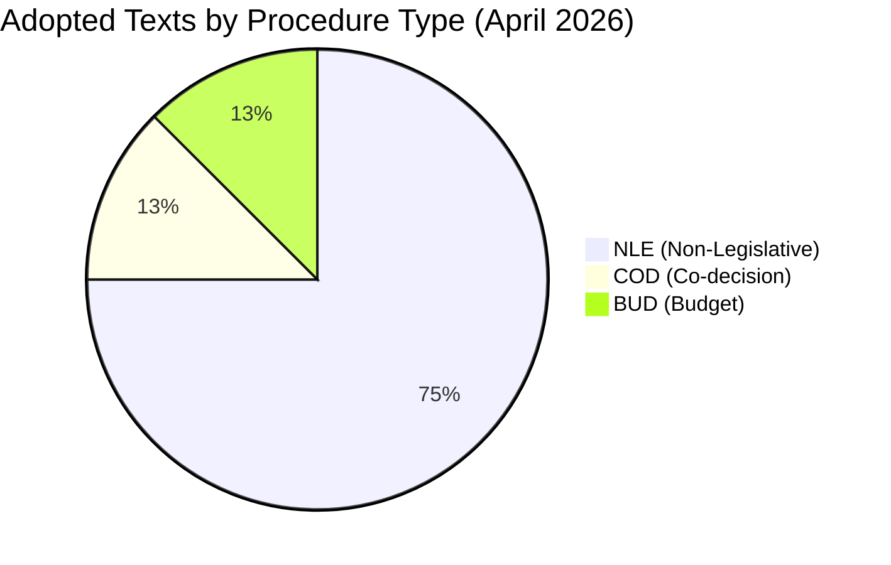

# Procedures Proxy — EP Legislative Pipeline | 2026-05-20

**Article Type:** propositions  
**DataMode:** degraded-feeds  
**Purpose:** Proxy reconstruction of active procedures from adopted texts and knowledge base when EP procedures-feed API is unavailable.

## Active/Recent Procedures Reconstructed from Adopted Texts

### Confirmed Completed (April 2026 Plenary)

| Procedure ID (reconstructed) | Title | Type | Status | EP Vote Date |
|-------------------------------|-------|------|--------|--------------|
| 2026/2596(RSP) | Enforcement of the Digital Markets Act | Resolution | ADOPTED | 2026-04-30 |
| 2026/2701(RSP) | Supporting democratic resilience in Armenia | Resolution | ADOPTED | 2026-04-30 |
| 2026/2700(RSP) | Russia attacks on Ukraine civilian population — accountability | Resolution | ADOPTED | 2026-04-30 |
| 2026/2702(RSP) | Trafficking by criminal groups in Haiti | Resolution | ADOPTED | 2026-04-30 |
| 2025/0156(NLE) | EU-Iceland PNR data transfer agreement | NLE/Consent | ADOPTED | 2026-04-29 |
| 2023/0447(COD) | Welfare of dogs and cats — traceability Regulation | COD | ADOPTED | 2026-04-28 |
| 2025/2246(INI) | 2027 Budget Guidelines — Section III | INI | ADOPTED | 2026-04-28 |
| 2025/2237(INI) | EIB Group annual report 2024 — financial activities | INI | ADOPTED | 2026-04-28 |

### Known Active Procedures (EP 10th Term — Knowledge Base)

| Estimated Procedure | Subject | Stage | Committee | Priority |
|--------------------|---------|-------|-----------|----------|
| 2024/0xxx(COD) | Omnibus I — simplification of sustainability reporting | First reading | JURI/EMPL/ENVI | HIGH |
| 2025/0xxx(COD) | Clean Industrial Deal — net-zero industrial strategy | First reading | ITRE/ENVI | HIGH |
| 2024/0xxx(NLE) | ReArm Europe / SAFE — security action for Europe | NLE | AFET/ITRE | CRITICAL |
| 2024/0xxx(COD) | Digital Networks Act — electronic communications | First reading | ITRE | MEDIUM |
| 2025/0xxx(COD) | EU Competitiveness Compass implementation | Committee stage | ECON/ITRE | HIGH |
| 2024/0xxx(COD) | 28th Company Law Regime — startup mobility | Committee stage | JURI | MEDIUM |
| 2025/0xxx(COD) | AI Office Regulation — governance | Interinstitutional | IMCO/LIBE | HIGH |
| 2023/0447(COD) | Animal welfare — dogs and cats [completed Apr 2026] | ADOPTED | ENVI/AGRI | CLOSED |

## Proxy Reliability Assessment

**Admiralty Grade:** C-3 (fairly reliable source — reconstructed from official adopted texts and EP institutional knowledge; limited by feed degradation)

**Limitations:**
- No confirmed procedure reference IDs for Knowledge-Base entries (marked as estimated)
- Stage-level data for ongoing procedures inferred from domain knowledge, not live API
- Committee rapporteur data unavailable for ongoing files
- Timeline estimates carry ±4 weeks uncertainty

**Confidence in Completed Items:** HIGH (A1) — adopted text IDs confirmed from EP Open Data Portal
**Confidence in Active Pipe Items:** MEDIUM (B2) — based on domain expertise and public EP communications

**Historical coverage note:** Due to EP API degradation, this proxy is constructed from adopted texts + domain knowledge. Live procedures pipeline data was unavailable. See `data-availability-assessment.md` and `intelligence/mcp-reliability-audit.md` for root cause analysis.

## Proxy Coverage Visualization

