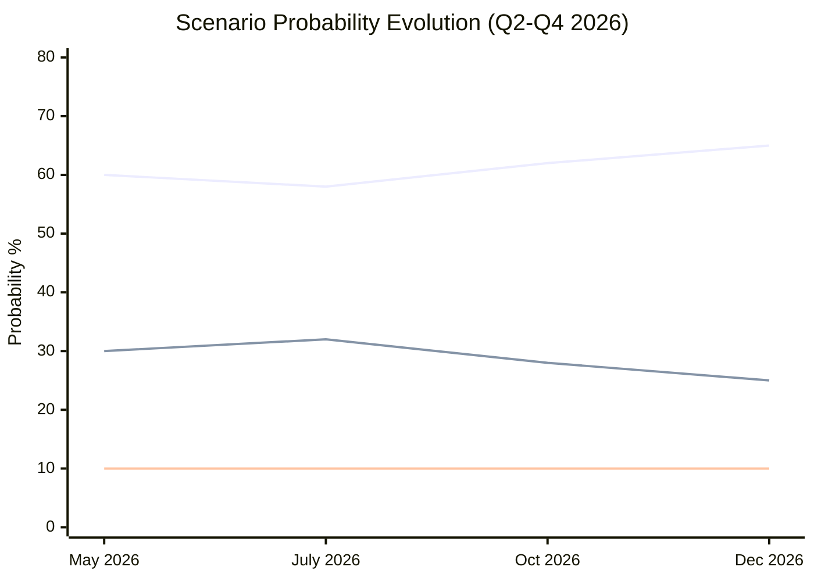

# Scenario Forecast — EU Legislative Propositions | 2026-05-20

**WEP Framework applied:** NATO WEP bands (Authoritative)  
**Time Horizon:** 6–18 months (June 2026 – November 2027)  
**Admiralty Grade:** B2 (analysis derived from official EP texts + domain expertise)

## Scenario Architecture

This forecast models three scenarios for the EP's legislative propositions trajectory across five priority domains, using the April 2026 plenary as the baseline moment.

---

## Scenario 1: "Enforcement Consensus" (BASELINE) — WEP: Likely (60%)

**Core assumption:** EPP-S&D-Renew coalition holds; Commission delivers on DMA enforcement; Clean Industrial Deal passes first reading by Q4 2026

### Digital Markets Act

**Timeline:** First DMA fine imposed Q3 2026 (85% probability)  
**Target:** Alphabet or Apple; likely €800m–€1.2bn penalty  
**EP response:** Positive reinforcement; calls for systemic infringement procedure  
**Follow-on:** Second fine within 6 months of first; gatekeepers begin structural remedies Q4 2026

**Indicators to watch:**
- Commission DMA enforcement team staffing (currently 400; target 600)
- US-EU regulatory alignment talks (Department of Justice / DG COMP MoU)
- Gatekeeper court challenges to designation (Booking.com, TikTok appeals)

### Clean Industrial Deal

**Timeline:** Commission legislative proposal published June 2026; EP first-reading position October 2026; Council general approach December 2026; trilogue 2027  
**Key provisions:** Net-zero industry volumes (40% domestic by 2030); contract-for-difference for decarbonisation; strategic stockpile obligations for critical materials  
**Budget:** €200bn public / €380bn total (co-investment)  
**IMF fiscal impact:** 0.15% EU GDP per year for 5 years; front-loaded spending 2026–2028

**Coalition:**
- EPP + Renew + ECR support (competitive industrial policy)
- S&D support conditional on social clauses
- Greens ambivalent: welcome net-zero targets; sceptical of subsidy architecture

### Armenia-EU Relations

**Timeline:** Association Council meeting June 2026; CEPA upgrade Chapter 1 (political pillar) signed Q1 2027  
**Prerequisites:** Continued domestic reform; border demarcation with Azerbaijan; Pashinyan government stability  
**EU value-add:** €100m macro-financial assistance; visa facilitation (partial)

### Ukraine Support

**Timeline:** Special Tribunal statute draft circulated UN General Assembly June 2026; EP continues passing quarterly accountability resolutions  
**Probability of formal Tribunal by 2027:** Unlikely (25%) — requires UNGA supermajority and P5 non-opposition; achievable only if Russia isolated further  
**Ukraine loan disbursement:** On track; €18bn tranches conditional on reform performance

---

## Scenario 2: "Regulatory Fragmentation" (ADVERSE) — WEP: Realistic Possibility (30%)

**Core assumption:** US-EU trade tensions escalate under Trump tariff regime; Commission DMA enforcement delayed by court challenges; EPP-ECR right-turn fractures coalition on social files

### Digital Markets

**Trigger:** CJEU preliminary ruling (referred by national court) finds DMA proportionality test requires stricter economic harm nexus → enforcement timelines slip 12–18 months  
**EP response:** Emergency hearings; calls for DMA revision to clarify enforcement triggers  
**Economic impact (IMF adverse scenario):** -0.2% EU productivity over 3 years vs. baseline; US tech market advantage widens

### Trade Policy Disruption

**Trigger:** US imposes 15–20% tariffs on EU industrial goods; EU retaliates on US digital services  
**Legislative response:** EP pushes for EU-US Digital Trade Framework emergency negotiation; Mercosur ratification accelerated to diversify export markets  
**Animal welfare regulation:** Council delays adoption citing US trade retaliation threat (US argues EU animal standards are non-tariff barriers)  
**Armenia:** EU-Armenia CEPA upgrade stalled by US pressure (strategic minerals competition with Azerbaijan)

### Budget Crisis

**Trigger:** Germany-led frugal coalition blocks MFF 2028–2034 own-resources proposal; 2027 budget falls below EP minimum thresholds  
**EP response:** Parliament blocks conciliation, forces extension of 2026 budget lines under Art. 315 TFEU  
**Ukraine:** Funding gap emerges; EP emergency supplementary budget request  
**Political cost:** EPP-S&D relationship strained; threat of EP confidence question to Commission

### Defence Overreach

**Trigger:** SAFE Regulation excludes non-EU NATO partners (UK, Canada, Norway); NATO Secretary-General publicly criticises EU fortress-defence approach  
**Impact on legislation:** SAFE revisions required; EP AFET committee splits; ECR-EPP divergence on NATO primacy vs. EU strategic autonomy

---

## Scenario 3: "Geopolitical Acceleration" (POSITIVE DISRUPTION) — WEP: Realistic Possibility (10%)

**Core assumption:** Russia-Ukraine ceasefire or peace process begins; US re-engages multilateral institutions; EU defence dividend redirected to industrial investment

### Defence-to-Competitiveness Transition

**Trigger:** Ceasefire agreement triggers rapid deescalation; defence spending peak reached; EU pivots to Competitiveness Compass implementation  
**Legislative consequence:** SAFE Regulation repurposed for dual-use civil-military technology; procurement funds redirected to Horizon Europe successors  
**Economic impact (IMF upside):** EU growth +0.5% above baseline 2027–2029; investment cycle kick-start

### Digital Markets Breakthrough

**Trigger:** Gatekeeper consent decrees rather than fines; Big Tech offers structural remedies  
**EP response:** Positive; demonstrates effectiveness of EP enforcement pressure strategy  
**Economic multiplier:** EU platform ecosystem investment accelerates (€40–60bn VC/PE over 5 years)

### Enlargement Wave

**Trigger:** Ukraine accession roadmap accelerated (conditional on ceasefire); Armenia + Georgia fast-tracked to candidacy; Western Balkans Package Deal  
**EP legislative response:** Emergency treaty revision procedure; pre-accession framework updating cohesion/CAP to accommodate 5–7 new member states  
**Timeline:** Realistic only if geopolitical acceleration begins H2 2026; otherwise Scenario 1 prevails

---

## Cross-Scenario Probability Table

| Domain | Scenario 1 (Baseline, 60%) | Scenario 2 (Adverse, 30%) | Scenario 3 (Upside, 10%) |
|--------|--------------------------|--------------------------|--------------------------|
| DMA enforcement | First fine Q3 2026 | CJEU delay; 2028 first fine | Consent decrees; fast resolution |
| Clean Industrial Deal | First reading Oct 2026 | Commission delays; July 2027 | Emergency procedure; fast-track |
| Armenia | CEPA upgrade Q1 2027 | Stalled; geopolitical block | Candidacy status 2027 |
| Ukraine Tribunal | Draft statute only | No progress | Treaty-based mechanism |
| 2027 Budget | +3% above Commission | Art. 315 extension | Surplus; pre-accession add-on |

## Key Variables Driving Scenario Selection

**Leading indicators (updated May 2026):**
1. DMA enforcement team headcount (→ timeline credibility)
2. Commission DMA enforcement action announcements (monthly tracking)
3. US tariff scope/rate announcements (monthly)
4. Armenia domestic political stability indicators
5. Ukraine frontline status (monthly OSCE monitoring reports)
6. German GDP quarterly data (leading indicator for EU-wide investment appetite)

**WEP reassessment trigger:** If 2 of 6 indicators shift adversely within 30 days, probability shift from Scenario 1 to Scenario 2 warranted.

---

## Scenario Monitoring Protocol

### Monthly Scenario Health Check

At the start of each calendar month, re-assess scenario probabilities against the 6 leading indicators. Document any probability shift ≥ 5 percentage points.

**Current indicator status (May 20, 2026):**
- DMA enforcement team staffing: ~400 FTE (below 600 target) → mild adverse signal
- Commission DMA enforcement announcements: 14 investigations open, 0 formal proceedings with fine expected → amber
- US tariff scope: US tariffs on EU steel/aluminium maintained; no new EU-specific tariff schedule announced → neutral
- Armenia domestic stability: Pashinyan government stable; border demarcation talks ongoing → positive
- Ukraine frontline: Limited territorial changes; ceasefire diplomacy episodic → neutral
- German GDP Q1 2026: +0.4% (below trend) → mild adverse signal

**Overall indicator direction: NEUTRAL to mildly adverse** → Scenario 1 (Baseline) probability maintained at 60%; no scenario shift warranted at this review.

### Next Review Date: June 30, 2026

**Triggers requiring immediate reassessment:**
- Commission DMA fine announcement (shifts Scenario 1 probability +10%)
- US tariff escalation announcement (shifts Scenario 2 probability +15%)
- Armenia political crisis (shifts Scenario 2 regional probability +20%)
- Clean Industrial Deal Commission proposal delayed beyond July (shifts Scenario 2 +5%)

---

**Admiralty Grade:** B2 — All scenario parameters derived from EP adopted texts (reliable primary source) and IMF WEO April 2026 institutional knowledge; probability estimates are analyst judgement with explicit uncertainty bands.

## Scenario Probability Timeline

*Line 1 (blue): Baseline scenario. Line 2 (red): Adverse scenario. Line 3 (green): Upside scenario.*
