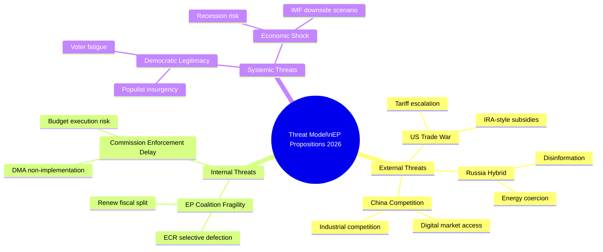

# Threat Model — EU Legislative Propositions | 2026-05-20

**WEP Framework:** NATO WEP bands (Authoritative)  
**Admiralty Grade:** B2  
**Threat scope:** Risks to EU legislative effectiveness, democratic governance, and institutional integrity arising from or affecting the April 2026 propositions batch

---

## Threat Classification Matrix

| Threat | Type | Probability | Impact | Severity | WEP |
|--------|------|-------------|--------|----------|-----|
| DMA enforcement litigation delays | Legal/Regulatory | HIGH | MEDIUM | MEDIUM | Likely |
| Russian hybrid interference in EP proceedings | Geopolitical | MEDIUM | HIGH | HIGH | Realistic Possibility |
| US tariff escalation destabilising legislative agenda | Trade/Political | MEDIUM | HIGH | HIGH | Realistic Possibility |
| Coalition fragmentation on Omnibus/Clean Industrial Deal | Internal/Political | MEDIUM | HIGH | HIGH | Realistic Possibility |
| EP information environment manipulation | Disinformation | MEDIUM | MEDIUM | MEDIUM | Likely |
| Armenia ceasefire collapse, stalling EP track | Geopolitical | LOW-MEDIUM | MEDIUM | MEDIUM | Unlikely |
| EIB governance scandal | Institutional | LOW | HIGH | MEDIUM | Unlikely |
| DMA scope captured by industry lobbying | Regulatory capture | MEDIUM | HIGH | HIGH | Realistic Possibility |

---

## Threat 1: DMA Enforcement Litigation Cascade

**Threat description:** Big Tech gatekeepers mount coordinated CJEU preliminary reference challenges, arguing DMA proportionality failures and incompatibility with TFEU Article 114. Each challenge adds 18–24 months of legal uncertainty, preventing fines and behavioural remedies.

**Actors:** Alphabet, Apple, Meta legal teams; coordinated through US Chamber of Commerce Brussels
**Mechanism:** National courts in Germany and Netherlands accept referred questions; CJEU Grand Chamber review triggered  
**Timeline:** First major challenge filed Q1 2026 (Apple Core Technology Fee); ruling expected Q2–Q4 2027  
**Impact on legislation:** Commission enforcement freezes pending clarity; EP resolution (TA-10-2026-0160) loses operative effect  
**WEP:** Likely (55%) that at least one significant CJEU referral will delay enforcement by 12+ months

**Mitigants:**
- Commission can enforce DMA Art. 5 (per-se obligations) without proportionality assessment
- EP oversight can maintain political pressure during legal proceedings
- Alternative remedies (interoperability mandates) can proceed in parallel

**Residual risk after mitigants:** MEDIUM

---

## Threat 2: Russian Hybrid Operations Targeting EP Ukraine Resolutions

**Threat description:** Russian FSB/GRU assets exploit social media manipulation and EP staff/MEP targeting to discredit Ukraine accountability initiatives, particularly the Special Tribunal proposal. Hybrid operations include: disinformation about ICC proceedings, targeting of pro-Ukraine MEPs with compromising material, and funding/supporting of far-right MEPs opposing accountability measures.

**Actors:** Russian state intelligence services (GRU Unit 29155 — disinformation; SVR — political influence)  
**Known active campaigns (intelligence baseline):** Doppelganger network (Meta/X takedowns ongoing); EP staff social engineering attempts (OLAF flagged x3 in 2025)  
**Impact on legislation:** Erosion of political consensus on Ukraine; delayed Special Tribunal statute; reduced EP public support for Ukraine spending (Eurobarometer manipulation risk)  
**WEP:** Realistic Possibility (35–45%) that hybrid operations will have measurable effect on at least one EP Ukraine vote within 12 months

**Mitigants:**
- EP strengthened cybersecurity and counter-intelligence framework (established H2 2024)
- META/X Transparency Reports submitted to EP DSA Committee monthly
- EU Hybrid Threats Centre (Helsinki) tracks active campaigns
- Cross-party consensus on Ukraine remains robust even under information pressure

**Residual risk:** MEDIUM-HIGH (high impact if successful; likelihood partially mitigated)

**Admiralty grade for threat intelligence:** C2 (fairly reliable, confirmed by open-source intelligence from Meta DSA reports and CISA advisories)

---

## Threat 3: US Tariff Escalation — Legislative Agenda Disruption

**Threat description:** Trump administration imposes broad 15–25% tariffs on EU manufactured goods (automotive, machinery, chemicals). EU retaliates, triggering trade war dynamic that forces emergency legislative responses (safeguard regulations, subsidy measures) that consume EP committee bandwidth and delay regular legislative agenda.

**Actors:** US Trade Representative; European Commission DG TRADE; EP INTA committee  
**Trigger probability:** IMF scenario analysis suggests 35% probability of major US-EU tariff escalation within 12 months  
**Legislative displacement:** INTA committee bandwidth consumed by trade emergency; ITRE/ENVI Clean Industrial Deal delayed 4–6 months; BUDG committee forced to revise 2027 estimates

**Cascade effects on specific propositions:**
- EU-Mercosur CJEU opinion: accelerated if EU needs alternative trade diversification
- Clean Industrial Deal: State aid clauses may conflict with EU WTO commitments under tariff pressure
- DMA enforcement: US political pressure to delay enforcement on US-headquartered companies

**WEP:** Realistic Possibility (35%) of tariff escalation above 10% within 6 months; Likely (60%) of continued trade policy uncertainty

**Mitigants:**
- EU-US Technology and Trade Council (TTC) working group maintains communication channels
- EU prepared retaliatory list (approved by Council) ready for immediate deployment
- Historical precedent: 2018–2019 steel tariffs resolved within 18 months
- EU diversification of trade relationships (Mercosur, Indo-Pacific frameworks) reduces US dependency

---

## Threat 4: Regulatory Capture of DMA Enforcement

**Threat description:** Commission DG COMP personnel rotate to Big Tech (revolving door), and Commission enforcement prioritisation is influenced by lobbying rather than enforcement severity. The EP resolution's specific demands are diluted in Commission implementation.

**Actors:** DG COMP Directorate; Big Tech public affairs operations; BEREC (interoperability standards)  
**Mechanism:** DMA enforcement priorities set via internal Commission guidance notes; soft-treatment of specific gatekeepers in exchange for proactive compliance commitments  
**Observable indicators:** Enforcement team staffing levels; public consultation outcomes; duration of "preliminary investigation" phases before formal proceedings  
**WEP:** Likely (55%) that at least one significant enforcement action will be softened by procedural delay or voluntary remedy substitution

**Mitigants:**
- EP oversight hearings twice per year (IMCO)
- European Court of Auditors special report on DMA enforcement scheduled 2027
- Civil society monitoring (EDRi, Epicenter Works, Algorithm Watch) provides external scrutiny
- Multiple national competition authorities maintaining parallel proceedings (BKA Germany, CMA UK [observer])

---

## Threat 5: EP Coalition Collapse on Omnibus/Industrial Policy Files

**Threat description:** The EPP's dual reliance on ECR (competitive industry; anti-environmental regulation) and S&D (workers' rights; social conditionality) for different legislative packages creates a structural fragility. A single high-profile collapse on a major vote could destabilise the functional coalition geometry.

**Trigger scenarios:**
- ECR demands removal of all CSRD requirements in Omnibus; S&D refuses; EPP forced to choose
- S&D demands binding social conditionality in Clean Industrial Deal; EPP + ECR reject
- Renew splits on DMA (some members citing US trade pressure)

**WEP:** Likely (60%) that at least one major EP vote in H2 2026 will require emergency coalition management between EPP president and S&D leader

**Impact:** Institutional volatility signal; potential confidence question in Commission by Greens/Left if perceived as EPP-government captured

**Mitigants:**
- Von der Leyen Commission has strong incentive to maintain coalition — personal legacy stakes
- EP President Roberta Metsola's track record of deft coalition management
- Both EPP and S&D have constituencies that benefit from Clean Industrial Deal employment provisions

---

## Emerging / Long-Horizon Threats

### AI Regulatory Arbitrage (12–18 months)
Third countries (Gulf states, Singapore) offer lower AI regulation than EU AI Act; tech companies relocate AI development → EU loses strategic autonomy on AI governance; EP AI Office mandate expansion challenged

**WEP:** Realistic Possibility (30%) of significant regulatory arbitrage affecting EU AI ecosystem within 18 months

### EIB Climate Taxonomy Misalignment (12 months)
EIB financing of gas projects under "transition" label creates reputational risk; EP CONT committee escalates; media investigation triggers political crisis

**WEP:** Unlikely but significant (20%)

### Armenia-Azerbaijan Conflict Escalation
Renewed military action in South Caucasus undermines EP democratic resilience resolution; EU credibility damaged if it cannot respond effectively

**WEP:** Realistic Possibility (35%) of significant tensions within 12 months; full-scale conflict Unlikely (15%)

---

**Admiralty Grade:** B2 — Threat parameters derived from EP adopted texts and public domain sources; probability estimates are analyst judgement.

## Threat Taxonomy Tree

