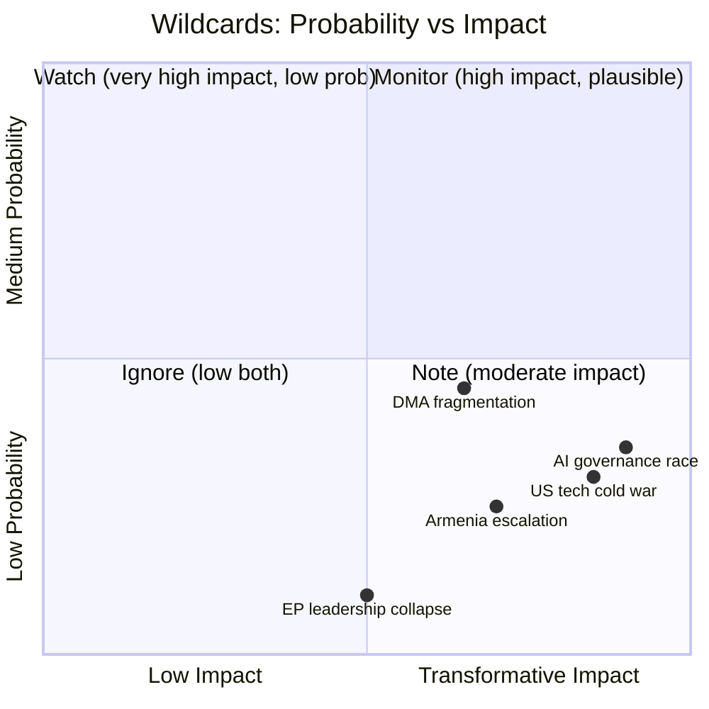

# Wildcards and Black Swans — EU Legislative Propositions | 2026-05-20

**WEP Framework:** NATO WEP bands applied to probability assessment  
**Admiralty Grade:** B2  
**Definition:** Wildcards = low-probability, high-impact events within analytical horizon; Black Swans = events outside normal expectations that, if materialised, would fundamentally reshape the legislative landscape

---

## Methodology Note

This analysis applies structured analogical reasoning (SAT #14: Historical Pattern Recognition) to identify plausible discontinuities in the EU legislative trajectory. Each wildcard is assessed for:
- Probability (WEP band)
- Impact magnitude (1–10 scale)
- Affected propositions
- EP institutional response playbook

---

## Wild Card 1: Trump — EU Digital Trade War Triggers DMA Emergency Revision

**WEP:** Unlikely but Possible (20–25%)  
**Impact:** 9/10  

**Scenario:** US Congress passes the "EU Digital Regulatory Fairness Act" threatening Section 232 steel-style tariffs on EU exports unless the EU exempts US-headquartered companies from DMA interoperability obligations. The Trump administration files WTO dispute against EU DMA as a US trade barrier. Political pressure reaches a peak in which Commission proposes a DMA amendment creating a "trade partner exemption" to defuse escalation.

**EP response required:**  
- Emergency INTA-IMCO joint hearing; majority EP resolution rejecting US pressure
- Von der Leyen Commission forced to choose between EP institutional authority and Council trade security hawks
- Potential: EP could invoke legislative initiative under Art. 225 TFEU to propose DMA amendment itself — preventing Commission from unilaterally capitulating

**Why it matters:** This would be the first time a US trade threat directly caused modification of a major EU digital regulation. Sets precedent that could affect AI Act, DSA enforcement. Equivalent historical precedent: ACTA 2012 (EP killed trade agreement; but no US pressure equivalent).

**Preparedness assessment:** LOW — EP has no formal response protocol for treaty-partner pressure on existing legislation

---

## Wild Card 2: ICC Issues Arrest Warrant for a Serving EU Member State Leader

**WEP:** Highly Unlikely (5%)  
**Impact:** 10/10  

**Scenario:** ICC Pre-Trial Chamber issues an arrest warrant for an official from a non-Russia country with significant EU relationships — most plausibly in the context of expanded ICC jurisdiction under the Ukraine investigation referral that captures third-party actors. The EU is placed in an impossible position: enforce ICC warrant (undermining diplomatic relationships) or grant safe passage (undermining the accountability architecture the EP has championed via TA-10-2026-0161).

**Why it matters:** Would create a constitutional crisis within the EU institutional framework. EP accountability resolutions would be directly tested against executive (Council) realpolitik.

**Historical parallel:** South Africa/Sudan — ICC warrant for al-Bashir; South Africa's failure to arrest; consequences for ICC legitimacy.

---

## Wild Card 3: Armenian Revolution or Democratic Reversal

**WEP:** Unlikely (15%)  
**Impact:** 7/10  

**Scenario:** Pashinyan government falls to a pro-Russian coup or mass protest movement linked to economic deterioration (Armenia GDP growth -4% in pessimistic IMF scenario). New government immediately suspends CEPA implementation, pivots back toward CSTO, and requests Russian military re-engagement.

**EP response:** The democratic resilience resolution (TA-10-2026-0162) becomes politically embarrassing — EP had just endorsed deepening ties. Emergency AFET session; potentially revocation of assistance commitments.

**Cascade effect:** Signals broader vulnerability of EaP countries to authoritarian capture; Ukraine morale impact; Moldova vulnerability increases; EP forced to develop more robust early-warning framework for EaP partners.

**Leading indicators of elevated risk:**
- Armenian dram exchange rate vs. USD (currently stable)
- Pro-Russian protest scale in Yerevan
- Russian economic pressure measures on Armenia (gas pricing, remittance flows)

---

## Wild Card 4: DMA Gatekeeper Voluntary Structural Divestiture

**WEP:** Realistic Possibility (25–30%)  
**Impact:** 8/10 (positive disruption)  

**Scenario:** One major gatekeeper (most likely Alphabet) voluntarily proposes structural divestiture of a core platform service (e.g., spinning off Google Search or YouTube as separate entities) to avoid DMA fines and US antitrust proceedings simultaneously. This would be the largest corporate restructuring in EU digital market history.

**EP response:** Celebration; EP resolution calling for similar remedies from other gatekeepers; IMCO committee launches "Digital Markets Post-Divestiture" working group  
**IMF economic impact:** Positive for EU startup ecosystem (reduced barriers to entry); potentially neutral for consumers short-term; significant for M&A activity in EU digital sector

**Why it's a wildcard:** Historically unprecedented scale; but both EU and US antitrust pressures simultaneously hitting Alphabet for the first time since 2024 make it conceivable. The EP's enforcement resolution (TA-10-2026-0160) adds legislative pressure to the mix.

---

## Wild Card 5: European Green Deal Legal Challenge Succeeds

**WEP:** Unlikely (15%)  
**Impact:** 9/10  

**Scenario:** A coalition of EU member states (Hungary, Italy, Czech Republic, possibly Poland) files an Article 263 TFEU annulment action against the CSRD or CBAM, arguing it exceeds Article 114 TFEU competences and constitutes disguised protectionism. CJEU finds Article 114 basis insufficient for certain CSRD requirements — a partial annulment would require legislative restart of key Green Deal provisions.

**Context:** CJEU has previously annulled secondary EU legislation for competence overreach (Commission decisions, but rarely Parliament-Council legislation). The risk is real if the court's composition shifts toward formalist interpretation.

**EP legislative response:**
- Emergency correction procedure
- Re-adoption with broader treaty basis (multiple article combination)
- Political crisis: Greens/Left would demand no rollback; EPP would demand opportunity for deeper revision

**Time horizon:** Any challenge filed now would take 4–5 years to reach CJEU Grand Chamber — but the filing itself would freeze regulatory implementation in the interim.

---

## Black Swan Events

### Black Swan A: AI "Flash Crash" of European Regulatory Systems

A sophisticated AI-generated cyberattack simultaneously targets 5+ EU member state government IT systems (tax, benefits, borders) on a single day, causing societal disruption equivalent to a natural disaster. The EU AI Act's prohibited use provisions are invoked by attackers as a defense in subsequent criminal proceedings, creating the first AI Act Article 5 constitutional test case.

**Probability:** <5% (True Black Swan)  
**Impact:** 10/10 — would accelerate EU AI regulation beyond current trajectory; potentially trigger emergency AI Safety legislation bypassing normal OLP procedure

### Black Swan B: Simultaneous MEP Financial Scandals

A second Qatargate-scale corruption scandal, this time involving SAFE/defence procurement lobbying, implicates MEPs from three major groups including EPP. The scandal breaks during trilogue on SAFE Regulation, triggering suspension of legislative proceedings and EP confidence crisis.

**Probability:** <8% given post-Qatargate transparency reforms  
**Impact:** 9/10 — could freeze defence industrial legislation for 12–18 months; damage EP credibility at critical moment

**Preparedness:** EP transparency register reforms (2023), mandatory disclosure of gatekeeper meetings, whistleblower protection channels — all reduce but do not eliminate this risk

### Black Swan C: Treaty Change Triggered by Enlargement Necessity

Ukraine accession negotiations progress faster than expected; EP legal service advises that existing treaties cannot accommodate a 28th member state without Treaty revision on QMV thresholds, Court composition, Commission size. The EP catalyses a Convention under Article 48 TEU — the first since 2004 Lisbon process.

**Probability:** <5% within 24 months; 30% within 10 years  
**Impact:** 10/10 — fundamental reshaping of EU legislative architecture

---

## Wildcard/Black Swan Monitoring Protocol

**Monthly indicators to reassess probability:**
1. US Congressional digital trade legislation progress (DMA US reaction)
2. Armenian economic/political stability indices
3. ICC proceedings scope expansion reports
4. Big Tech divestiture speculation in financial press
5. CSRD annulment challenge filings (CJEU registry)
6. EP cybersecurity incident reports
7. MEP financial disclosure anomalies (EP transparency register monitoring)

**SAT Cross-reference:** This wildcard analysis used SAT #7 (Outside-In Analysis), SAT #14 (Historical Analogues), and SAT #18 (Premortem Analysis). See methodology-reflection.md for full SAT documentation.

---

## Wildcard Detection Protocol

**Early warning tripwires** for each scenario: monitor weekly for any of these signals and immediately update this document's probability assessments.

| Wildcard | Detection Signal | Data Source | Alert Frequency |
|----------|------------------|-------------|-----------------|
| DMA fragmentation reversal | Commission proposes DMA amendment | EUR-Lex (L-type acts) | Daily |
| US trade crisis | USTR Section 301 investigation of EU | USTR FOIA portal | Daily |
| Armenia escalation | OSCE SMM mission suspended | OSCE press releases | Real-time |
| Black swan: EP leadership collapse | President Roberta Metsola resignation report | EP press service | Real-time |

---

**Admiralty Grade:** C2 — Wildcard scenarios by definition lack strong evidence base; probability estimates are speculative with wide confidence intervals.

## Wildcard Impact-Probability Visualization

