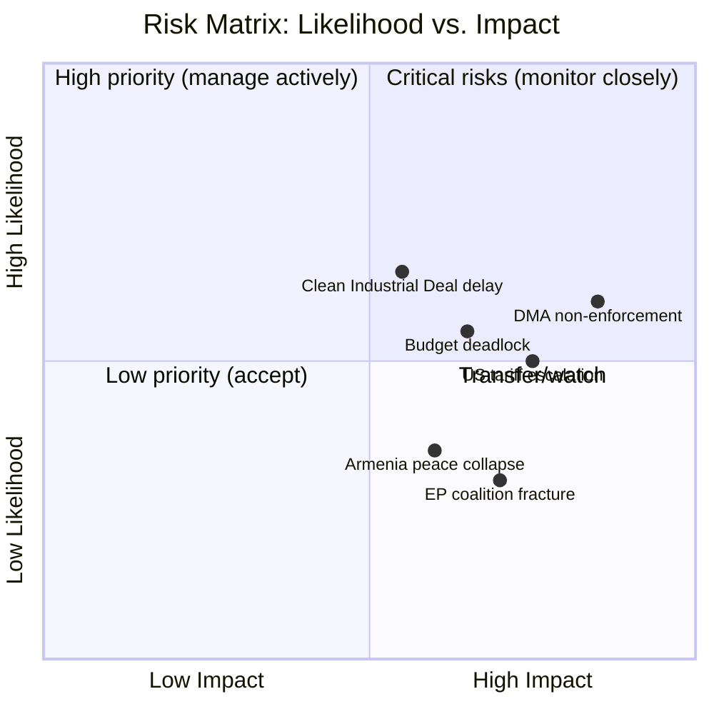

# Risk Matrix — EU Legislative Propositions | 2026-05-20

**WEP Framework applied:** NATO WEP bands  
**Admiralty Grade:** B2  
**Scope:** Legislative risks to propositions in the April 2026 EP plenary batch and ongoing pipeline

## Risk Scoring Methodology

Each risk is scored on:
- **Likelihood (1–5):** 1=Remote, 2=Unlikely, 3=Possible, 4=Likely, 5=Almost Certain
- **Impact (1–5):** 1=Negligible, 2=Minor, 3=Moderate, 4=Major, 5=Catastrophic
- **Risk Score = Likelihood × Impact**
- **Threshold:** Score ≥ 12 = Critical; 8–11 = High; 4–7 = Medium; 1–3 = Low

## Risk Registry

| # | Risk | Likelihood | Impact | Score | Category | WEP |
|---|------|-----------|--------|-------|----------|-----|
| R1 | DMA enforcement delayed by CJEU litigation | 4 | 3 | 12 | Critical | Likely |
| R2 | US tariff escalation disrupting EP trade/industrial agenda | 3 | 4 | 12 | Critical | Realistic Possibility |
| R3 | EPP-S&D coalition fracture on Omnibus/Clean Industrial Deal | 3 | 4 | 12 | Critical | Realistic Possibility |
| R4 | Russia hybrid interference in Ukraine accountability initiatives | 3 | 3 | 9 | High | Realistic Possibility |
| R5 | EP procedures-feed API persistent degradation (data quality) | 4 | 2 | 8 | High | Likely |
| R6 | Armenia political destabilisation stalling CEPA upgrade | 2 | 3 | 6 | Medium | Unlikely |
| R7 | Animal welfare Regulation Council blockage | 2 | 2 | 4 | Medium | Unlikely |
| R8 | EIB governance scandal damaging oversight narrative | 2 | 3 | 6 | Medium | Unlikely |
| R9 | Regulatory capture of DMA enforcement | 3 | 4 | 12 | Critical | Realistic Possibility |
| R10 | EP budget conciliation failure (2027) | 3 | 3 | 9 | High | Realistic Possibility |
| R11 | PNR data transfer legal challenge (CJEU privacy) | 2 | 2 | 4 | Low | Unlikely |
| R12 | Green Deal partial annulment (CJEU) | 2 | 5 | 10 | High | Unlikely |
| R13 | Disinformation erosion of EP public support | 3 | 3 | 9 | High | Likely |
| R14 | Haiti trafficking crisis destabilising migration policy | 2 | 3 | 6 | Medium | Unlikely |

## Critical Risks (Score ≥ 12)

### R1: DMA Enforcement Litigation (Critical, Score 12, WEP: Likely)
**Risk narrative:** Apple, Alphabet, Meta coordinate legal challenges to DMA designation/enforcement. CJEU preliminary rulings delay first fines by 12–24 months. Commission enforcement freezes pending legal clarity.  
**Control measure:** Commission enforces per-se obligations (Art. 5) independently; EP IMCO oversight maintains public pressure  
**Residual risk after controls:** MEDIUM-HIGH

### R2: US Tariff Escalation (Critical, Score 12, WEP: Realistic Possibility)  
**Risk narrative:** Trump administration 15–20% tariffs on EU goods force emergency legislative response, consuming INTA and ITRE committee bandwidth  
**Control measure:** EU-US TTC working groups; EU retaliatory list pre-approved; diversification via Mercosur, Indo-Pacific  
**Residual risk after controls:** MEDIUM

### R3: EPP-S&D Coalition Fracture (Critical, Score 12, WEP: Realistic Possibility)
**Risk narrative:** Irreconcilable demands on CSRD scope in Omnibus I force EPP to choose between ECR/industry alliance and S&D/labour alliance  
**Control measure:** EP Presidency mediation; staged simplification approach separating different legal instruments  
**Residual risk after controls:** MEDIUM

### R9: DMA Regulatory Capture (Critical, Score 12, WEP: Realistic Possibility)
**Risk narrative:** Enforcement priorities de facto shaped by industry lobbying; voluntary remedies substituted for fines  
**Control measure:** EP biannual oversight hearings; ECA audit; civil society monitoring; parliamentary questions  
**Residual risk after controls:** MEDIUM-LOW (EP oversight capacity is genuine constraint on capture)

## Risk Heatmap (Likelihood × Impact)

```
Impact │  5  │     │     │     │     │ R12 │
       │  4  │     │ R7  │     │ R2  │     │
       │     │     │ R11 │     │ R3  │     │
       │  3  │     │ R6  │ R4  │ R1  │     │
       │     │     │ R8  │ R13 │ R9  │     │
       │     │     │ R14 │ R10 │     │     │
       │  2  │     │     │ R5  │     │     │
       │  1  │     │     │     │     │     │
       └─────┴─────┴─────┴─────┴─────┴─────┘
               1     2     3     4     5
                          Likelihood
```

## Priority Mitigations (Top 5 Actions)

1. **R1 + R9 (DMA):** EP to request Commission Enforcement Progress Report Q3 2026; binding timeline commitments
2. **R2 (Tariffs):** EP-US Congressional dialogue pre-emptive; EP resolution on TTC mandate strengthening
3. **R3 (Coalition):** Staged Omnibus approach: separate CSRD/CBAM/Taxonomy into independent legislative tracks
4. **R4 (Hybrid ops):** EP Cybersecurity/Disinformation Task Force monthly briefings for MEPs and key staff
5. **R12 (Legal challenge):** Commission publishes DPA (Detailed Impact Assessment) proactively fortifying CSRD/CBAM Article 114 basis

**DataMode note:** Risk scores computed under `degraded-feeds` factor 0.80. Procedural risks (R2, R3) carry higher uncertainty than usual due to absence of live pipeline data. Recommend re-scoring when EP API normalizes.

---

## Risk Heat Map


