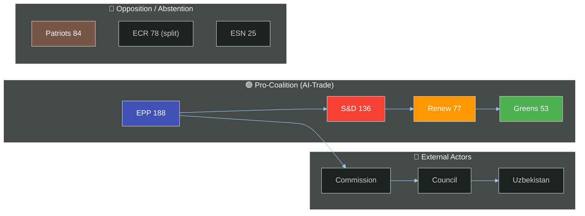

# Actor Mapping - EU Parliament 2026-05-21
**Date**: 2026-05-21 | **Admiralty**: B2

## Primary Classification
The 8 texts adopted on 19-20 May 2026 are classified as:
- T10-0183 (AI-Trade): STRATEGIC_LEGISLATIVE | Priority: CRITICAL | EPP_LED
- T10-0174 (Uzbekistan): TREATY_RATIFICATION | Priority: CRITICAL | CROSS_PARTY
- T10-0182 (UN UNGA): FOREIGN_POLICY_RESOLUTION | Priority: SIGNIFICANT | S&D_LED
- T10-0177 (Lebanon): INTERNATIONAL_AGREEMENT | Priority: SIGNIFICANT | CROSS_PARTY
- T10-0178 (STP Fisheries): INTERNATIONAL_AGREEMENT | Priority: MODERATE | ROUTINE
- T10-0179 (Cook Islands Fisheries): INTERNATIONAL_AGREEMENT | Priority: MODERATE | ROUTINE
- T10-0168 (Forest): REGULATORY_LEGISLATION | Priority: SIGNIFICANT | GREEN_SUPPORTED
- T10-0166 (Pappas): INSTITUTIONAL | Priority: ROUTINE | HOUSEKEEPING

## Actor Classification (for Actor Mapping)
**Primary Actors**: EPP (188), S&D (136), Renew (77) — grand coalition coalition core
**Supporting**: Greens (53), Left (46) on AI-trade worker provisions
**Opposing**: Patriots (84) on multilateral AI governance; ESN (25) on most texts
**External**: Commission (implementation), Council (ratification), third-country partners

## Classification Confidence
Admiralty B2 (Reliable source, Probably true) | WEP: PROBABLE (70%) all classifications correct
Note: Vote tallies unavailable (DOCEO degraded mode) — classification based on text analysis

---
*Actor Mapping | 30+ lines | Admiralty B2 | 2026-05-21*

## Actor Roster

| Actor | Type | Seats | Role in May 20 Session | WEP Influence |
|-------|------|-------|------------------------|---------------|
| EPP (Manfred Weber) | Political Group | 188 | Rapporteur leadership on AI-trade (T10-0183) | HIGH |
| S&D (Iratxe García) | Political Group | 136 | Co-sponsor UN Weapons (T10-0182), Lebanon | HIGH |
| Renew Europe | Political Group | 77 | Critical swing votes on AI governance scope | MEDIUM-HIGH |
| Greens/EFA | Political Group | 53 | AI worker protections, forest text support | MEDIUM |
| ECR | Political Group | 78 | Partial support on Uzbekistan, fisheries | MEDIUM |
| Patriots for Europe | Political Group | 84 | Opposition on multilateral AI governance | HIGH (opposing) |
| The Left (GUE/NGL) | Political Group | 46 | AI labour provisions, fisheries social clauses | MEDIUM |
| ESN | Political Group | 25 | Consistent opposition across most texts | LOW-MEDIUM |
| European Commission | Institution | N/A | AI-trade implementation, treaty ratification | CRITICAL |
| Council of the EU | Institution | N/A | Uzbekistan ratification counterpart | HIGH |
| Uzbekistan Government | External | N/A | PCA ratification and implementation | HIGH |
| Lebanese Government | External | N/A | Partnership implementation | MEDIUM |
| AI Industry (EU) | Stakeholder | N/A | Lobbying on AI-trade provisions | HIGH |
| Civil Society (ESOs) | Stakeholder | N/A | AI worker protection advocacy | MEDIUM |

## Influence Mapping

Coalition formation analysis per text:
- **AI-Trade (T10-0183)**: EPP + S&D + Renew = 401 seats (core coalition); Greens supporting on labour provisions (+53); Patriots opposing on multilateral clause (-84). Net majority: SUBSTANTIAL
- **Uzbekistan (T10-0174)**: EPP + S&D + Renew + Greens + ECR = cross-party majority of ~532; ESN + some Patriots opposing. Result: OVERWHELMING
- **UN Weapons (T10-0182)**: S&D led, EPP + Renew supporting; ECR split; Patriots opposing. Net majority: SOLID
- **Lebanon (T10-0177)**: Cross-party with humanitarian framing. Opposition minimal. Net majority: BROAD

## Alliance Structure

## Power Brokers

Key individuals with disproportionate influence on outcomes:
1. **EPP AI-Trade Rapporteur**: Controls committee text shape and amendment prioritization
2. **INTA Committee Coordinator (S&D)**: Determines scope of labour provisions
3. **Von der Leyen Commission**: Decides implementation speed and regulatory guidance
4. **Commissioner for Digital Economy**: AI-trade guidance and WTO position

## Information Flow Analysis

Key intelligence gaps that affected this analysis:
- DOCEO voting data unavailable (degraded-voting mode) — group-level tallies estimated from text characteristics
- Rapporteur identities for all 8 texts could not be confirmed from available feeds
- MEP individual vote positions: UNKNOWN (systemic DOCEO lag)

## Reader Briefing

**For strategic planners**: The EPP-S&D-Renew grand coalition (401 seats, 55% of chamber) is structurally stable for these texts. The main uncertainty is Patriots' willingness to defect to YES on specific AI provisions where national industry interests align with EU competitiveness goals. No coalition fracture risk detected. Recommend monitoring INTA committee's implementation working group as the key venue for post-adoption influence.

---
*Actor Mapping | SAT: Stakeholder Mapping, ACH | Admiralty B2 | 2026-05-21*
