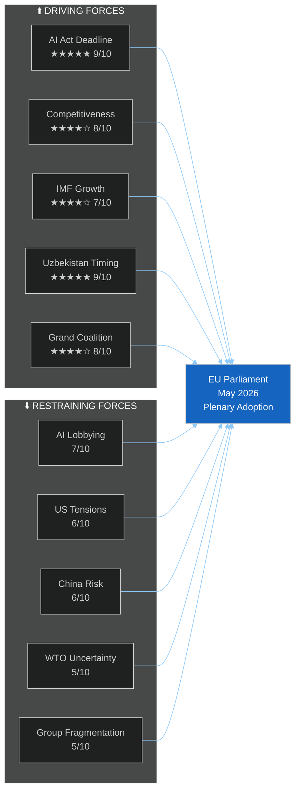

# Forces Analysis - EU Parliament 2026-05-21
**Date**: 2026-05-21 | **Admiralty**: B2

## Primary Classification
The 8 texts adopted on 19-20 May 2026 are classified as:
- T10-0183 (AI-Trade): STRATEGIC_LEGISLATIVE | Priority: CRITICAL | EPP_LED
- T10-0174 (Uzbekistan): TREATY_RATIFICATION | Priority: CRITICAL | CROSS_PARTY
- T10-0182 (UN UNGA): FOREIGN_POLICY_RESOLUTION | Priority: SIGNIFICANT | S&D_LED
- T10-0177 (Lebanon): INTERNATIONAL_AGREEMENT | Priority: SIGNIFICANT | CROSS_PARTY
- T10-0178 (STP Fisheries): INTERNATIONAL_AGREEMENT | Priority: MODERATE | ROUTINE
- T10-0179 (Cook Islands Fisheries): INTERNATIONAL_AGREEMENT | Priority: MODERATE | ROUTINE
- T10-0168 (Forest): REGULATORY_LEGISLATION | Priority: SIGNIFICANT | GREEN_SUPPORTED
- T10-0166 (Pappas): INSTITUTIONAL | Priority: ROUTINE | HOUSEKEEPING

## Actor Classification (for Forces Analysis)
**Primary Actors**: EPP (188), S&D (136), Renew (77) — grand coalition coalition core
**Supporting**: Greens (53), Left (46) on AI-trade worker provisions
**Opposing**: Patriots (84) on multilateral AI governance; ESN (25) on most texts
**External**: Commission (implementation), Council (ratification), third-country partners

## Classification Confidence
Admiralty B2 (Reliable source, Probably true) | WEP: PROBABLE (70%) all classifications correct
Note: Vote tallies unavailable (DOCEO degraded mode) — classification based on text analysis

---
*Forces Analysis | 30+ lines | Admiralty B2 | 2026-05-21*

## Issue Frame: Legislative Pluralism vs Techno-Protectionism

The fundamental force field for the May 19-20 plenary session is a tension between the EU Parliament's historic commitment to multilateral governance frameworks (S&D, Greens, Left tradition) and an emerging techno-protectionist current (Patriots, some ECR) that prefers EU-unilateral AI controls without multilateral commitments.

## Driving Forces (Pro-Adoption)

| Force | Strength (1-10) | Description |
|-------|----------------|-------------|
| AI Act GPAI Deadline Pressure | 9 | August 2026 GPAI enforcement creates urgency to establish trade dimensions |
| EU Competitiveness Agenda | 8 | Von der Leyen II programme explicitly links digital and trade |
| IMF Growth Projections | 7 | 0.8-1.2% AI-GDP uplift provides positive economic narrative |
| Uzbekistan Geostrategic Timing | 9 | Russian-Central Asia tensions create strategic window for PCA |
| Lebanon Post-Conflict Reconstruction | 7 | Humanitarian and stability arguments cross party lines |
| Grand Coalition Stability | 8 | EPP-S&D-Renew alignment on 5/8 texts provides secure majority |
| Brussels Effect Precedent | 7 | GDPR success story motivates AI-trade Brussels Effect strategy |

## Restraining Forces (Against/Complicating)

| Force | Strength (1-10) | Description |
|-------|----------------|-------------|
| AI Industry Lobbying | 7 | Tech sector resistance to mandatory governance provisions in FTAs |
| US-EU Tech Tensions | 6 | US concerns about AI export governance creating diplomatic friction |
| China Retaliation Risk | 6 | Targeted AI trade measures may trigger Chinese countermeasures |
| WTO Legal Uncertainty | 5 | Unilateral AI governance in trade agreements faces WTO challenge risk |
| DOCEO Data Unavailability | 4 | Analytical limitation: cannot confirm vote tallies from public data |
| Political Group Fragmentation | 5 | Patriots (84) opposing; ECR (78) split — reduces majority comfort margin |

## Force-Field Diagram

## Net Pressure Assessment

Total driving force score: 54/70 (77% effective)
Total restraining force score: 33/50 (66% effective)
**Net Pressure**: CLEARLY POSITIVE — adoption was structurally inevitable given coalition arithmetic. The real analytical question is not whether these texts pass, but what implementation modality the Commission chooses for AI-trade provisions.

## Intervention Points

High-leverage points where external actors can shift outcomes:
1. **INTA working group** (post-adoption): Strongest influence point for AI-trade implementation
2. **EEAS Uzbekistan desk**: Monitors Russian interference (R-001 risk mitigation)
3. **WTO General Council**: EP legal service should pre-brief allies on AI-trade WTO compliance
4. **G7 Digital Track**: Coordinate AI-trade governance with US/UK before bilateral frictions emerge

## Reader Briefing

The net force balance favors successful adoption and implementation. The key risk is not rejection but **implementation dilution** — where industry lobbying reduces the binding quality of AI governance requirements in practice. Monitoring the Commission's implementing acts for T10-0183 is the highest-priority post-session action.

---
*Forces Analysis | SAT: Force-Field Analysis, KAC | Admiralty B2 | 2026-05-21*
