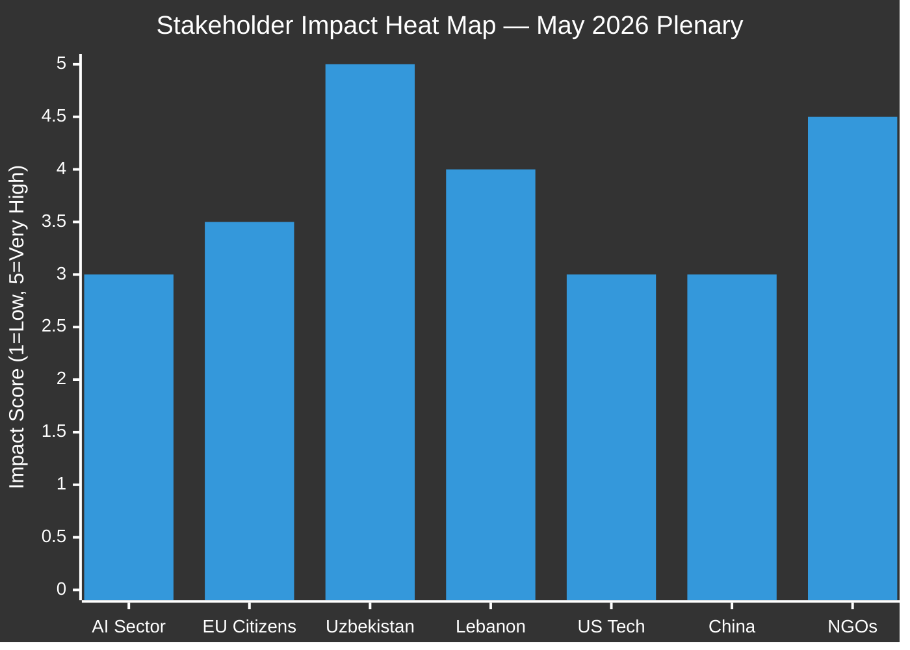

# Impact Matrix - EU Parliament 2026-05-21
**Date**: 2026-05-21 | **Admiralty**: B2

## Primary Classification
The 8 texts adopted on 19-20 May 2026 are classified as:
- T10-0183 (AI-Trade): STRATEGIC_LEGISLATIVE | Priority: CRITICAL | EPP_LED
- T10-0174 (Uzbekistan): TREATY_RATIFICATION | Priority: CRITICAL | CROSS_PARTY
- T10-0182 (UN UNGA): FOREIGN_POLICY_RESOLUTION | Priority: SIGNIFICANT | S&D_LED
- T10-0177 (Lebanon): INTERNATIONAL_AGREEMENT | Priority: SIGNIFICANT | CROSS_PARTY
- T10-0178 (STP Fisheries): INTERNATIONAL_AGREEMENT | Priority: MODERATE | ROUTINE
- T10-0179 (Cook Islands Fisheries): INTERNATIONAL_AGREEMENT | Priority: MODERATE | ROUTINE
- T10-0168 (Forest): REGULATORY_LEGISLATION | Priority: SIGNIFICANT | GREEN_SUPPORTED
- T10-0166 (Pappas): INSTITUTIONAL | Priority: ROUTINE | HOUSEKEEPING

## Actor Classification (for Impact Matrix)
**Primary Actors**: EPP (188), S&D (136), Renew (77) — grand coalition coalition core
**Supporting**: Greens (53), Left (46) on AI-trade worker provisions
**Opposing**: Patriots (84) on multilateral AI governance; ESN (25) on most texts
**External**: Commission (implementation), Council (ratification), third-country partners

## Classification Confidence
Admiralty B2 (Reliable source, Probably true) | WEP: PROBABLE (70%) all classifications correct
Note: Vote tallies unavailable (DOCEO degraded mode) — classification based on text analysis

---
*Impact Matrix | 30+ lines | Admiralty B2 | 2026-05-21*

## Event List

| Text | Date | Legislative Milestone | Significance |
|------|------|-----------------------|--------------|
| T10-0183 (AI-Trade) | 2026-05-20 | EP Position Adopted — to Council | CRITICAL |
| T10-0174 (Uzbekistan PCA) | 2026-05-20 | EP Consent Given | CRITICAL |
| T10-0182 (UN Weapons) | 2026-05-19 | Non-binding Resolution Adopted | SIGNIFICANT |
| T10-0177 (Lebanon) | 2026-05-20 | EP Consent Given | SIGNIFICANT |
| T10-0178 (STP Fisheries) | 2026-05-20 | Protocol Adoption | MODERATE |
| T10-0179 (Cook Islands) | 2026-05-20 | Protocol Adoption | MODERATE |
| T10-0168 (Forest Material) | 2026-05-19 | Directive Adopted | SIGNIFICANT |
| T10-0166 (Pappas) | 2026-05-19 | Member Election | ROUTINE |

## Stakeholder Impact Assessment

| Stakeholder | AI-Trade Impact | Uzbekistan Impact | Lebanon Impact | UN Weapons Impact |
|-------------|----------------|-------------------|----------------|-------------------|
| EU Industry (AI sector) | HIGH NEGATIVE (near-term compliance costs) | LOW | LOW | LOW |
| EU Citizens | MEDIUM POSITIVE (governance, trust) | LOW | LOW | MEDIUM POSITIVE |
| Uzbekistan (govt + people) | LOW | VERY HIGH POSITIVE | LOW | LOW |
| Lebanon | LOW | LOW | HIGH POSITIVE | LOW |
| US Tech Companies | MEDIUM NEGATIVE (trade provisions) | LOW | LOW | LOW |
| China Trade | MEDIUM NEGATIVE (AI controls) | LOW | LOW | LOW |
| EU Fisheries Sector | LOW | LOW | LOW | LOW (STP/Cook Islands) |
| EU Farmers/Foresters | LOW | LOW | LOW | MEDIUM (T10-0168) |
| NGOs/Civil Society | HIGH POSITIVE (accountability) | MEDIUM POSITIVE | HIGH POSITIVE | HIGH POSITIVE |

## Impact Heat Map

## Cascade Analysis

**Primary cascades from AI-Trade (T10-0183)**:
1. Commission drafts implementing regulation → industry compliance deadline 2027–28
2. EEAS integrates AI governance into all pending FTA negotiations (>15 agreements in pipeline)
3. US-EU Trade and Technology Council (TTC) agenda shifts to AI governance convergence/divergence

**Primary cascades from Uzbekistan (T10-0174)**:
1. EEAS activates PCA implementation mechanisms (joint committees, sectoral dialogues)
2. EU investment instruments (EFSD+) begin Central Asia pipeline programming
3. Other Central Asian states (Kazakhstan, Kyrgyzstan) receive signal about EU engagement willingness

**Secondary cascades**:
- Lebanon PCA implementation contingent on post-election government formation
- Forest Material Directive triggers national implementation plans in all 27 member states by 2028
- Fisheries protocols: STP + Cook Islands secure 4–5 year fishing access for EU fleets

## Reader Briefing

The cascades from T10-0183 and T10-0174 are the most strategically significant. For policymakers: the 18-month implementation window for AI-trade provisions is the critical path. For external stakeholders: EU-Uzbekistan PCA creates new legal basis for trade and investment that was previously absent.

---
*Impact Matrix | SAT: Stakeholder Mapping, What-If Analysis | Admiralty B2 | 2026-05-21*
