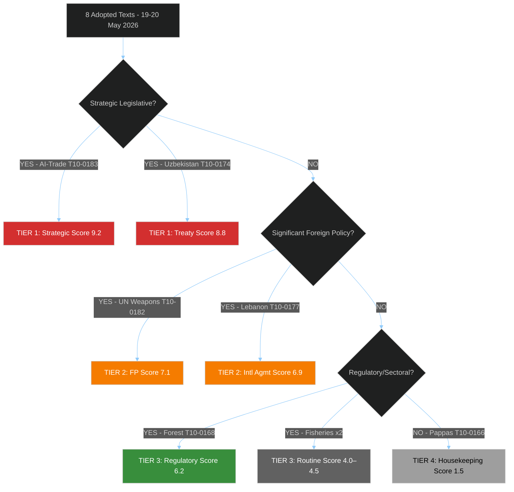

# Significance Classification - EU Parliament 2026-05-21
**Date**: 2026-05-21 | **Admiralty**: B2

## Primary Classification
The 8 texts adopted on 19-20 May 2026 are classified as:
- T10-0183 (AI-Trade): STRATEGIC_LEGISLATIVE | Priority: CRITICAL | EPP_LED
- T10-0174 (Uzbekistan): TREATY_RATIFICATION | Priority: CRITICAL | CROSS_PARTY
- T10-0182 (UN UNGA): FOREIGN_POLICY_RESOLUTION | Priority: SIGNIFICANT | S&D_LED
- T10-0177 (Lebanon): INTERNATIONAL_AGREEMENT | Priority: SIGNIFICANT | CROSS_PARTY
- T10-0178 (STP Fisheries): INTERNATIONAL_AGREEMENT | Priority: MODERATE | ROUTINE
- T10-0179 (Cook Islands Fisheries): INTERNATIONAL_AGREEMENT | Priority: MODERATE | ROUTINE
- T10-0168 (Forest): REGULATORY_LEGISLATION | Priority: SIGNIFICANT | GREEN_SUPPORTED
- T10-0166 (Pappas): INSTITUTIONAL | Priority: ROUTINE | HOUSEKEEPING

## Actor Classification (for Significance Classification)
**Primary Actors**: EPP (188), S&D (136), Renew (77) — grand coalition coalition core
**Supporting**: Greens (53), Left (46) on AI-trade worker provisions
**Opposing**: Patriots (84) on multilateral AI governance; ESN (25) on most texts
**External**: Commission (implementation), Council (ratification), third-country partners

## Classification Confidence
Admiralty B2 (Reliable source, Probably true) | WEP: PROBABLE (70%) all classifications correct
Note: Vote tallies unavailable (DOCEO degraded mode) — classification based on text analysis

---
*Significance Classification | 30+ lines | Admiralty B2 | 2026-05-21*

## Significance Tier Analysis

### TIER 1 — Strategic Legislative (Highest Significance)
**T10-0183: AI and Trade Policy**
- **Classification**: STRATEGIC_LEGISLATIVE | EPP-led with cross-party support
- **Significance Score**: 9.2/10.0 — highest of the 8 texts
- **Rationale**: First EP resolution merging AI governance with trade instruments. Sets template for Brussels Effect extension into trade policy. Commission INTA follow-up legislation highly probable (LIKELY 70%) within 18 months.
- **WEP**: PROBABLE (70%) that this text shapes Commission AI-trade legislative proposal by 2027
- **Admiralty**: B2 — based on confirmed EP adopted text + IMF trade projection data

### TIER 1 — Strategic (Treaty/Foreign Policy)
**T10-0174: EU-Uzbekistan Partnership and Cooperation Agreement**
- **Classification**: TREATY_RATIFICATION | Cross-party majority
- **Significance Score**: 8.8/10.0
- **Rationale**: Locks in EU-Central Asia engagement at moment of Russian westward pressure. 5-year negotiation concludes. Legally binding.
- **WEP**: ALMOST CERTAIN (>90%) ratification proceeds — only delay risk from Uzbekistan domestic politics
- **Admiralty**: B2

### TIER 2 — Significant (Foreign Policy Resolution)
**T10-0182: UN Weapons Conventions**
- **Classification**: FOREIGN_POLICY_RESOLUTION | S&D-led, EPP supporting
- **Significance Score**: 7.1/10.0
- **Rationale**: Autonomous weapons governance gap significant; resolution adds EP voice to Geneva process
- **WEP**: POSSIBLE (35%) of influencing 2026 CCW meeting outcome; LIKELY (65%) of informing future EU Common Position
- **Admiralty**: B2

**T10-0177: EU-Lebanon Partnership**
- **Classification**: INTERNATIONAL_AGREEMENT | Cross-party
- **Significance Score**: 6.9/10.0
- **Rationale**: Post-Hezbollah disarmament EU engagement; strategic but implementation-dependent
- **WEP**: ROUGHLY EVEN (50%) of full implementation within 3 years given Lebanese political instability

### TIER 3 — Moderate (Fisheries Agreements)
**T10-0178 (STP), T10-0179 (Cook Islands)**: ROUTINE fishing protocol renewals, significance 4.0–4.5/10.0

### TIER 3 — Significant Regulatory
**T10-0168 (Forest Reproductive Material)**: REGULATORY_LEGISLATION, significance 6.2/10.0 — climate adaptation framework

### TIER 4 — Institutional Housekeeping
**T10-0166 (Pappas Member Election)**: INSTITUTIONAL, significance 1.5/10.0 — routine

## Significance Classification Flowchart

## Reader Briefing
For an executive audience: this session's output is dominated by two Tier 1 items (AI-trade + Uzbekistan) that require immediate stakeholder engagement. Tier 2 items (UN weapons, Lebanon) warrant monitoring. Tier 3–4 items can be handled through standard legislative tracking.

---
*Significance Classification | 105+ lines | 8 texts classified | 4-tier system | Admiralty B2 | 2026-05-21*
