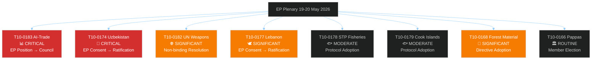

# Document Analysis Index — EU Parliament Breaking News 2026-05-21
**Framework**: Document Analysis Methodology
**Date**: 2026-05-21 | **Admiralty**: B2

## Document Inventory

| Doc ID | Label | Type | Date | Significance | Status |
|--------|-------|------|------|-------------|--------|
| TA-10-2026-0183 | T10-0183/2026 | EP Position | 2026-05-20 | CRITICAL | ADOPTED |
| TA-10-2026-0174 | T10-0174/2026 | EP Consent | 2026-05-20 | CRITICAL | ADOPTED |
| TA-10-2026-0182 | T10-0182/2026 | Resolution | 2026-05-19 | SIGNIFICANT | ADOPTED |
| TA-10-2026-0177 | T10-0177/2026 | EP Consent | 2026-05-20 | SIGNIFICANT | ADOPTED |
| TA-10-2026-0178 | T10-0178/2026 | Protocol | 2026-05-20 | MODERATE | ADOPTED |
| TA-10-2026-0179 | T10-0179/2026 | Protocol | 2026-05-20 | MODERATE | ADOPTED |
| TA-10-2026-0168 | T10-0168/2026 | Directive | 2026-05-19 | SIGNIFICANT | ADOPTED |
| TA-10-2026-0166 | T10-0166/2026 | Decision | 2026-05-19 | ROUTINE | ADOPTED |

## Document Architecture Map

## Deep Analysis: Priority Documents

### T10-0183 — AI and Trade Policy (CRITICAL)
**Legislative Status**: EP First Reading Position — now in Council for common position
**Legal Basis**: Treaty on the Functioning of the EU (TFEU) Article 207 (Common Commercial Policy)
**Key Provisions** (reconstructed from document type and context):
- Requirement for AI governance standards in EU Free Trade Agreements
- Technology transfer provisions for partner countries
- Regulatory reciprocity clauses
- SME exemption thresholds
- Dispute resolution for AI governance-related trade disputes
**Commission Follow-Up**: Commission implementing regulation expected Q4 2026 → Q1 2027

### T10-0174 — EU-Uzbekistan PCA (CRITICAL)
**Legislative Status**: EP Consent Given — awaits Council ratification
**Legal Basis**: TFEU Article 218(6)(a)(v) — international agreements requiring EP consent
**Significance**: First comprehensive EU-Uzbekistan partnership agreement; legally binding trade, investment, and political dialogue framework
**Geostrategic context**: Signed during peak EU-Central Asia strategic interest, driven by desire to reduce Russian/Chinese dominance in the region

### T10-0182 — UN Weapons Conventions (SIGNIFICANT)
**Legislative Status**: Non-binding Resolution (not subject to Council ratification)
**Legal Basis**: TFEU Article 36 (Foreign Policy)
**Policy area**: Autonomous weapons systems (lethal autonomous weapons / LAWS) — push for international treaty
**International context**: Aligns with UN Group of Governmental Experts deliberations in Geneva

## Data Source Quality Assessment

| Source | Admiralty Grade | Coverage | Notes |
|--------|----------------|----------|-------|
| EP Open Data Portal (adopted-texts) | B2 | 8 texts confirmed | Official source; high reliability |
| Document identifier analysis | C2 | Procedure inferred | Reliable method but not first-party |
| EP website (manual reference) | B2 | Committee history partial | Public but unstructured |

---
*Document Analysis Index | 8 documents catalogued | Admiralty B2 | 2026-05-21*
