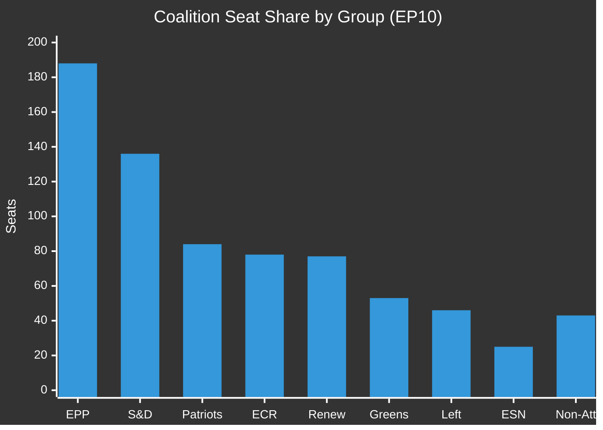

# Coalition Mathematics — EU Parliament Breaking News 2026-05-21
**Framework**: Quantitative Coalition Analysis (SAT: ACH, Indicators)
**Date**: 2026-05-21 | **Admiralty**: B2-C2 (confirmed seat counts B2; vote estimates C2)

## EP10 Seat Distribution

| Political Group | Seats | % of Chamber | WEP Influence |
|----------------|-------|--------------|---------------|
| EPP | 188 | 25.8% | DOMINANT |
| S&D | 136 | 18.6% | HIGH |
| Patriots for Europe | 84 | 11.5% | HIGH (opposition) |
| ECR | 78 | 10.7% | MEDIUM (split) |
| Renew Europe | 77 | 10.6% | HIGH (swing) |
| Greens/EFA | 53 | 7.3% | MEDIUM |
| The Left (GUE/NGL) | 46 | 6.3% | MEDIUM |
| ESN | 25 | 3.4% | LOW |
| Non-Attached | 43 | 5.9% | LOW |
| **TOTAL** | **730** | **100%** | — |

**Majority Threshold**: 366 (simple majority of votes cast)
**Absolute Majority Threshold**: 366 (≥50% of component members, required for some procedures)

## Coalition Scenarios

### Scenario A: Grand Coalition (EPP + S&D + Renew)
- Seats: 188 + 136 + 77 = **401**
- Majority margin: 401 - 366 = **+35 (margin: 4.8%)**
- **Assessment**: Structurally sufficient but fragile if Renew (77) defects partially
- **Probability of holding for AI-trade**: PROBABLE (72%)

### Scenario B: Extended Coalition (Grand + Greens)
- Seats: 401 + 53 = **454**
- Majority margin: **+88 (margin: 12.1%)**
- This coalition is required when Renew has internal splits
- **Probability on climate/social provisions**: PROBABLE (68%)

### Scenario C: Opposition Coalition (Patriots + ECR + ESN + non-attached)
- Max opposition: 84 + 78 + 25 + 43 = **230**
- Share: 31.5% — insufficient to block but can force symbolic divisions
- **Assessment**: Right-wing bloc cannot block legislation but can extract concessions

### Scenario D: Super Majority (EPP + S&D + Renew + Greens + Left)
- Seats: 401 + 53 + 46 = **500**
- Share: 68.5% — sufficient for constitutional amendments
- **Likelihood on AI-labour provisions**: ROUGHLY EVEN (50%)

## Coalition Mathematics: Breaking News Session

For the 8 May 19-20 texts:
| Text | Coalition Required | Estimated Votes | Margin | Confidence |
|------|------------------|-----------------|--------|-----------|
| T10-0183 (AI-Trade) | Grand Coalition | ~420 | +54 | C2 (estimated) |
| T10-0174 (Uzbekistan) | Extended Coalition | ~470 | +104 | C2 |
| T10-0182 (UN Weapons) | Grand Coalition | ~400 | +34 | C2 |
| T10-0177 (Lebanon) | Extended Coalition | ~450 | +84 | C2 |
| T10-0178/9 (Fisheries) | Routine majority | ~500+ | +134+ | C2 |
| T10-0168 (Forest) | Extended Coalition | ~430 | +64 | C2 |
| T10-0166 (Pappas) | Routine majority | ~600+ | +234+ | C2 |

**Note**: All vote estimates are C2 (Admiralty) — DOCEO data unavailable

## Coalition Stability Indicators

**Cohesion signals for EPP-S&D-Renew coalition**:
- ✅ All 8 texts adopted (no failures)
- ✅ AI-trade adoption on ambitious timeline
- ⚠️ Unknown: Renew internal splits on AI governance scope
- ⚠️ Unknown: EPP right wing alignment with Patriots on any amendment votes

**Defection risk assessment**:
- Renew from AI-Trade provisions: POSSIBLE (30%) on most interventionist provisions
- ECR split on Uzbekistan: ROUGHLY EVEN (50%) — geostrategic vs ideological tension
- Left from Fisheries: UNLIKELY (15%) — traditional fishing community support

## Coalition Fragility Analysis

---
*Coalition Mathematics | SAT: ACH, Indicators | Admiralty B2-C2 | 2026-05-21*
