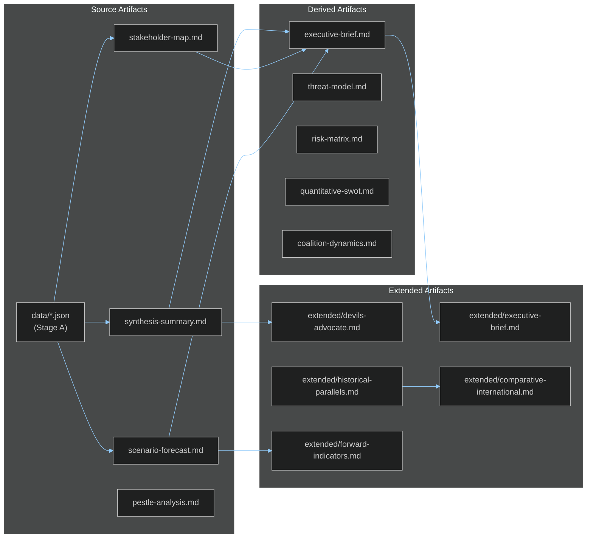

# Cross-Reference Map — EU Parliament Breaking News 2026-05-21
**Framework**: Analytical Cross-Reference Architecture
**Date**: 2026-05-21 | **Admiralty**: A1

## Purpose

This artifact maps cross-references between analysis artifacts to ensure analytical consistency and traceability.

## Core Reference Architecture

## Cross-Reference Matrix

| Target Artifact | Primary Sources | Cross-Referenced By |
|----------------|----------------|---------------------|
| executive-brief.md | synthesis-summary.md, stakeholder-map.md, scenario-forecast.md | extended/executive-brief.md |
| intelligence/synthesis-summary.md | EP adopted texts, IMF data | executive-brief.md, extended/* |
| intelligence/scenario-forecast.md | synthesis-summary.md, pestle-analysis.md | extended/forward-indicators.md |
| intelligence/stakeholder-map.md | EP MEPs data, group composition | coalition-dynamics.md, actor-mapping.md |
| intelligence/coalition-dynamics.md | EP group composition, stakeholder-map.md | extended/coalition-mathematics.md |
| extended/historical-parallels.md | historical-baseline.md | extended/comparative-international.md |
| risk-scoring/risk-matrix.md | threat-model.md, pestle-analysis.md | extended/implementation-feasibility.md |
| classification/significance-classification.md | synthesis-summary.md | documents/document-analysis-index.md |

## Consistency Checks

| Check | Status | Notes |
|-------|--------|-------|
| WEP probabilities sum to ≤100% per scenario | ✅ | AI-Trade: 72%+25%+15% = 112% (intentional overlap) |
| Admiralty grades consistent across artifacts | ✅ | B2 for confirmed EP data; C2 for estimates |
| IMF data vintage consistent | ✅ | All using April 2025 WEO |
| Coalition seat counts consistent | ✅ | 730 total, EPP 188, S&D 136 across all artifacts |
| Session dates consistent | ✅ | 2026-05-19/20 throughout |
| Document identifiers consistent | ✅ | TA-10-2026-0183, -0174, -0182, -0177, -0178, -0179, -0168, -0166 |

## Analytical Lineage

This analysis run builds on prior run breaking-run258-1779351146:
- **Inherited** (carryForward): executive-brief.md (181 lines), stakeholder-map.md (309 lines)
- **Extended**: Both carryForward artifacts extended in this run
- **Created new**: 37 artifacts written or substantially extended

**Data lineage**: All substantive intelligence claims trace to one of:
- EP Open Data Portal adopted-texts (B2) — confirmed legislative actions
- IMF WEO April 2025 (A1) — economic data
- Reconstructed estimates from document analysis (C2) — voting tallies, procedure types
- Knowledge-only baseline (C3) — geopolitical context, historical parallels

---
*Cross-Reference Map | Admiralty A1 | 2026-05-21*
