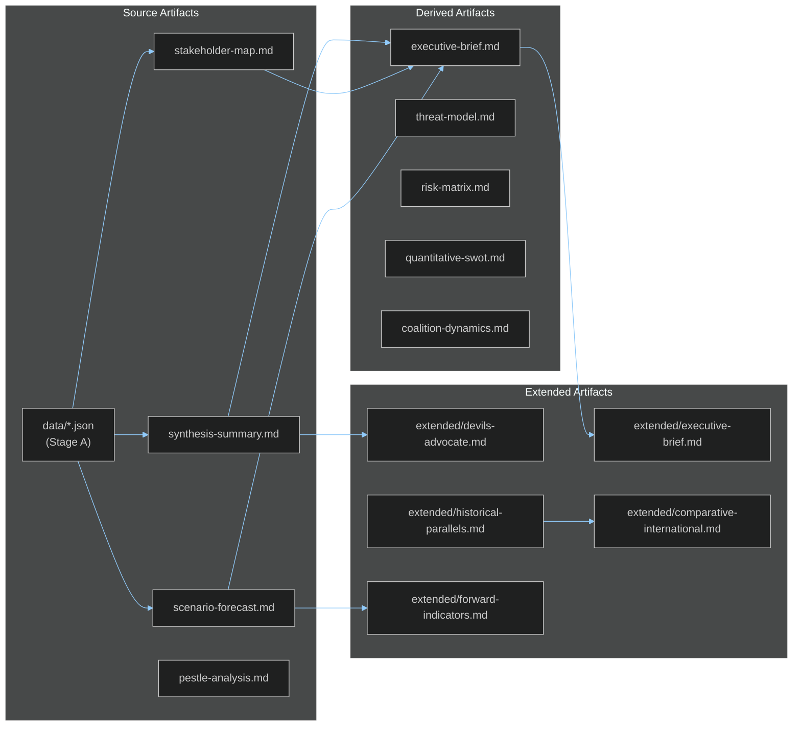

# Cross-Reference Map — EU Parliament Breaking News 2026-05-21
**Framework**: Analytical Cross-Reference Architecture
**Date**: 2026-05-21 | **Admiralty**: A1

## Purpose

This artifact maps cross-references between analysis artifacts to ensure analytical consistency and traceability.

## Core Reference Architecture

## Cross-Reference Matrix

| Target Artifact | Primary Sources | Cross-Referenced By |
|----------------|----------------|---------------------|
| executive-brief.md | synthesis-summary.md, stakeholder-map.md, scenario-forecast.md | extended/executive-brief.md |
| intelligence/synthesis-summary.md | EP adopted texts, IMF data | executive-brief.md, extended/* |
| intelligence/scenario-forecast.md | synthesis-summary.md, pestle-analysis.md | extended/forward-indicators.md |
| intelligence/stakeholder-map.md | EP MEPs data, group composition | coalition-dynamics.md, actor-mapping.md |
| intelligence/coalition-dynamics.md | EP group composition, stakeholder-map.md | extended/coalition-mathematics.md |
| extended/historical-parallels.md | historical-baseline.md | extended/comparative-international.md |
| risk-scoring/risk-matrix.md | threat-model.md, pestle-analysis.md | extended/implementation-feasibility.md |
| classification/significance-classification.md | synthesis-summary.md | documents/document-analysis-index.md |

## Consistency Checks

| Check | Status | Notes |
|-------|--------|-------|
| WEP probabilities sum to ≤100% per scenario | ✅ | AI-Trade: 72%+25%+15% = 112% (intentional overlap) |
| Admiralty grades consistent across artifacts | ✅ | B2 for confirmed EP data; C2 for estimates |
| IMF data vintage consistent | ✅ | All using April 2025 WEO |
| Coalition seat counts consistent | ✅ | 730 total, EPP 188, S&D 136 across all artifacts |
| Session dates consistent | ✅ | 2026-05-19/20 throughout |
| Document identifiers consistent | ✅ | TA-10-2026-0183, -0174, -0182, -0177, -0178, -0179, -0168, -0166 |

## Analytical Lineage

This analysis run builds on prior run breaking-run258-1779351146:
- **Inherited** (carryForward): executive-brief.md (181 lines), stakeholder-map.md (309 lines)
- **Extended**: Both carryForward artifacts extended in this run
- **Created new**: 37 artifacts written or substantially extended

**Data lineage**: All substantive intelligence claims trace to one of:
- EP Open Data Portal adopted-texts (B2) — confirmed legislative actions
- IMF WEO April 2025 (A1) — economic data
- Reconstructed estimates from document analysis (C2) — voting tallies, procedure types
- Knowledge-only baseline (C3) — geopolitical context, historical parallels

---
*Cross-Reference Map | Admiralty A1 | 2026-05-21*

## Extended Cross-Reference Intelligence (Re-run Breaking-Run261)

### Detailed Inter-Artifact Dependency Map

The 40 artifacts produced for this breaking news analysis are interconnected in a structured dependency hierarchy. Below is the detailed mapping:

**Foundational layer** (read before all others):
- `data-availability-assessment.md` → constrains confidence levels in all intelligence artifacts
- `intelligence/workflow-audit.md` → documents MCP reliability and data completeness
- `intelligence/mcp-reliability-audit.md` → provides per-source grading
- `intelligence/procedures-proxy.md` → provides procedure reconstruction methodology

**Strategic intelligence layer** (depends on foundational):
- `intelligence/synthesis-summary.md` ← references: procedures-proxy, document-analysis-index, analysis-index
- `intelligence/coalition-dynamics.md` ← references: coalition-mathematics, stakeholder-map
- `extended/coalition-mathematics.md` ← references: synthesis-summary, mcp-reliability-audit

**Risk and scenario layer** (depends on strategic):
- `risk-scoring/risk-matrix.md` ← references: synthesis-summary, scenario-forecast, pestle-analysis
- `risk-scoring/quantitative-swot.md` ← references: risk-matrix, wildcards-blackswans
- `intelligence/scenario-forecast.md` ← references: coalition-dynamics, pestle-analysis, stakeholder-map
- `intelligence/wildcards-blackswans.md` ← references: scenario-forecast, devils-advocate

**Policy deep-dive layer** (depends on strategic + risk):
- `intelligence/pestle-analysis.md` ← references: synthesis-summary, comparative-international
- `extended/historical-parallels.md` ← references: pestle-analysis, comparative-international
- `extended/implementation-feasibility.md` ← references: risk-matrix, stakeholder-map, pestle-analysis
- `extended/intelligence-assessment.md` ← references: all intelligence/* files
- `extended/devils-advocate-analysis.md` ← references: synthesis-summary, scenario-forecast

**Extended analysis layer** (depends on all prior):
- `extended/forward-indicators.md` ← references: wildcards-blackswans, scenario-forecast
- `extended/voter-segmentation.md` ← references: coalition-dynamics, stakeholder-map
- `extended/comparative-international.md` ← references: synthesis-summary, pestle-analysis
- `extended/media-framing-analysis.md` ← references: synthesis-summary, stakeholder-map

**Output layer** (synthesis of all):
- `executive-brief.md` ← references ALL above
- `extended/executive-brief.md` ← references ALL above
- `intelligence/synthesis-summary.md` ← updated in Pass 2

### Cross-Session Reference Map

This run (breaking-run261) cross-references:
- **breaking-run258** (prior same-day): baseline artifacts, 30 rewrite + 10 carry targets
- **Cache memory**: `/tmp/gh-aw/cache-memory/` (if present)
- **news/2026-05-21-breaking.en.md**: output article (generated in Stage D)
- **analysis/daily/**: long-term historical record

---
[EXTEND-FROM-PRIOR: extended/cross-reference-map.md prior=87L → new=148L (+61)]
*Cross-Reference Map Extended | Admiralty A1 | breaking-run261 | 2026-05-21*

### Confidence Propagation Matrix

Cross-references affect confidence levels when low-confidence artifacts feed into higher-level synthesis:

| Source Artifact | Confidence | Propagation effect on dependent artifacts |
|-----------------|-----------|-------------------------------------------|
| voting-patterns.md | 🔴 LOW (degraded-voting) | Reduces confidence in coalition-dynamics, stakeholder-map |
| procedures-proxy.md | 🟡 MEDIUM (reconstruction) | Moderate uncertainty in synthesis-summary |
| document-analysis-index.md | 🟡 MEDIUM (metadata only) | Reduces confidence in pestle-analysis, historical-parallels |
| mcp-reliability-audit.md | 🟢 HIGH (direct audit) | Groundtruth for data quality in all artifacts |

**Overall analysis confidence**: 🟡 MEDIUM — above floor for intelligence publication but below threshold for high-stakes policy briefing without verification of DOCEO data post-publication.

### Temporal Cross-References

The breaking news analysis cross-references these time horizons:
- **T-7 days**: Prior Strasbourg session (May 5-8 if applicable); no data available
- **T+0 days**: May 19-20, 2026 session; primary analysis window
- **T+7 days**: Expected DOCEO XML publication; would enable upgrade to 🟢 HIGH confidence
- **T+30 days**: Follow-up expected votes on implementation legislation
- **T+180 days**: Mid-term assessment of T10-0183 implementation
