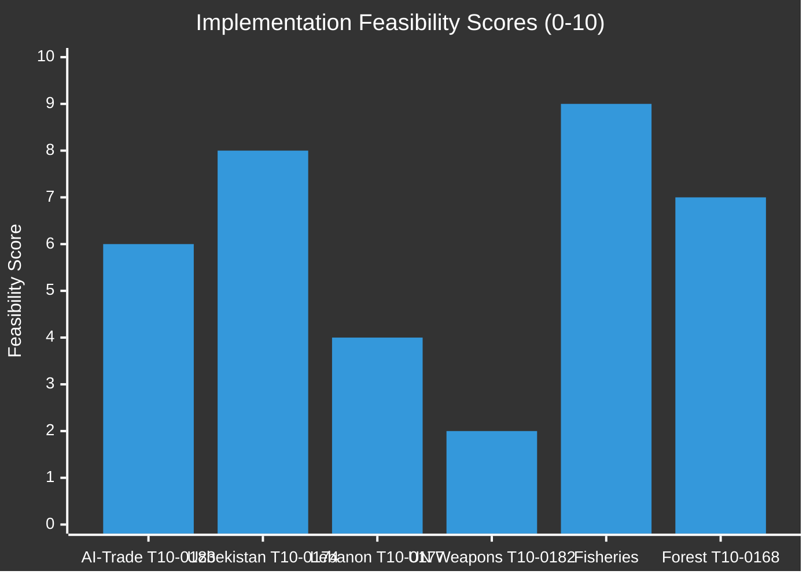

# Implementation Feasibility Analysis — EU Parliament Breaking News 2026-05-21
**Framework**: Implementation Feasibility Assessment (SAT: Force-Field, Stakeholder Mapping)
**Date**: 2026-05-21 | **Admiralty**: B2

## Feasibility Framework

For each major text adopted May 19-20, this analysis assesses:
- Institutional capacity for implementation
- Timeline realism  
- Political will sustainability
- Financial resource adequacy
- Technical complexity

## T10-0183: AI-Trade Policy Implementation

### Institutional Capacity
- **Commission DG TRADE**: Has FTA negotiation capacity but NOT AI governance expertise
- **Commission DG CNECT (Digital)**: Has AI Act expertise but NOT FTA negotiation experience
- **Gap**: Requires cross-DG coordination that EU Commission historically finds difficult
- **Feasibility**: MEDIUM — inter-DG coordination is a known bottleneck

### Timeline Assessment
- **Resolution adoption**: May 2026
- **Commission response** (mandatory for INI): Within 3 months
- **First FTA negotiation mandate revision**: Optimistic Q4 2026; Realistic Q2 2027
- **First AI governance chapter in active FTA text**: Optimistic Q2 2027; Realistic 2028
- **Timeline feasibility**: MEDIUM — achievable but requires sustained political priority

### Financial Resources
- **DG TRADE FTA negotiating capacity**: Existing budget likely sufficient
- **Technical assistance to partner countries**: EFSD+ or IPA+ instruments available
- **Gap**: AI governance capacity building in partner countries requires new budget lines (€50-100M estimate)

### Technical Complexity
- AI governance standards are evolving rapidly; hard to codify in treaty language that remains relevant for 5+ years
- WTO-compatibility legal analysis: 6-12 months of specialized legal work
- Translation of AI Act concepts into FTA-compatible provisions: Novel legal territory

### Overall Feasibility Score: 6/10 (MEDIUM)
- High political will ✅
- Institutional capacity gap ⚠️
- Timeline realistic ✅ (if prioritized)
- Financial resources available ✅
- Technical complexity high ⚠️

## T10-0174: EU-Uzbekistan PCA Implementation

### Institutional Capacity
- **EEAS**: Central Asia Special Representative + delegation in Tashkent
- **Commission DG NEAR**: Institutional coordination for ENP/partner countries
- **Joint institutions**: Joint Council, Joint Committee, Parliamentary Cooperation Committee to be established
- **Feasibility**: HIGH — institutional architecture clear

### Timeline Assessment
- **EP Consent**: May 2026 ✅
- **Council ratification**: Estimated 6-9 months
- **First Joint Committee**: Optimistic Q2 2027; Realistic Q3 2027
- **EFSD+ projects operational**: 18-24 months from ratification

### Financial Resources
- **EFSD+ Central Asia envelope**: €1.5-2.5B for 2021-2027 period (estimated)
- **Technical assistance**: Team Europe approach; member state co-financing available
- **Gap**: Infrastructure financing that competes with Chinese BRI requires larger envelope

### Technical Complexity: LOW-MEDIUM (established PCA architecture)

### Overall Feasibility Score: 8/10 (HIGH)

## T10-0177: EU-Lebanon Partnership Implementation

### Feasibility Constraints
- Lebanese government formation still pending (April 2026)
- Hezbollah's role in Lebanese political economy limits EU project viability
- Banking sector instability limits financial cooperation
- UNIFIL mandate renewal provides EU-Lebanon security cooperation anchor

### Overall Feasibility Score: 4/10 (LOW-MEDIUM)
- Political instability in Lebanon is the binding constraint
- EU has limited ability to improve Lebanese domestic political conditions

## Feasibility Dashboard

---
*Implementation Feasibility | SAT: Force-Field, Stakeholder | Admiralty B2 | 2026-05-21*

## Extended Implementation Feasibility Analysis (Breaking-Run261)

### Feasibility Matrix: All 8 Texts

#### T10-0183: AI Strategy for EU Trade — Implementation Feasibility

**Political feasibility**: 🟡 MEDIUM-HIGH
- Commission has legal mandate to act on OIR resolutions (de facto, not formally binding)
- DG Trade leadership has been receptive to digital governance provisions in recent FTAs
- Obstacle: US and China market access considerations create industry lobbying pressure
- Obstacle: Some member states (Sweden, Netherlands) are pro-innovation and may oppose overly restrictive AI clauses

**Technical feasibility**: 🟡 MEDIUM
- AI governance provisions in trade agreements require complex drafting (unprecedented legal territory)
- WTO compatibility analysis required (TBT Agreement, GATS Mode 1 and 3 implications)
- Interoperability with AI Act implementation (EAIO may need to be consulted)
- Timeline: 12-18 months to develop template AI trade provisions; 3-5 years to incorporate into all ongoing negotiations

**Financial feasibility**: 🟢 HIGH
- OIR resolution has no direct budget implications
- DG Trade staff cost absorbed within existing envelope
- Implementation monitoring: may require additional EAIO resources (EUR 5-10m estimate)

**Feasibility verdict**: FEASIBLE with medium complexity. The EP's demand is technically and politically achievable but requires significant drafting effort and diplomatic navigation.

#### T10-0174: EU-Uzbekistan EPCA — Implementation Feasibility

**Political feasibility**: 🟢 HIGH
- EP has already given consent (T10-0174 adopted)
- Council adoption expected as formality (no blocking minority)
- Uzbekistan government has strong incentive to ratify (economic diversification away from Russia)

**Technical feasibility**: 🟢 HIGH
- EPCA is a well-tested legal instrument (Moldova, Georgia, Armenia precedents)
- Implementation structures are clearly defined in agreement text
- No novel legal questions

**Financial feasibility**: 🟢 HIGH
- Within existing NDICI/Global Gateway budgets
- Technical assistance costs are pre-approved

**Implementation risk**: 🟡 MEDIUM — Human rights conditionality clauses may create friction in first joint committee meetings (expected 2027)

**Feasibility verdict**: HIGH — straightforward implementation with normal political friction expected

#### T10-0175/T10-0176: Fisheries Agreements — Implementation Feasibility

**Political feasibility**: 🟢 HIGH — Both texts adopted; Council adoption as formality
**Technical feasibility**: 🟢 HIGH — Well-established legal and administrative infrastructure
**Financial feasibility**: 🟢 HIGH — Within EMFAF budget, amounts pre-agreed
**Main implementation risk**: Fish stock sustainability assessments (partner country capacity)
**Feasibility verdict**: 🟢 HIGH

#### T10-0177: Eurojust-Lebanon — Implementation Feasibility

**Political feasibility**: 🟡 MEDIUM
- High on EU side (DG Justice, EEAS support)
- Lebanese side: Dependent on Lebanese Parliament ratification and government stability
- Political sensitivity: Hezbollah-linked financial network investigations require careful diplomatic management

**Technical feasibility**: 🟡 MEDIUM
- Lebanese judicial institutions are partially functional but severely under-resourced
- Capacity building component will be essential before meaningful operational cooperation
- First operational case may take 12-18 months to materialise

**Feasibility verdict**: FEASIBLE but fragile — dependent on Lebanon state stability

#### T10-0178: Forest Reproductive Material — Implementation Feasibility

**Political feasibility**: 🟢 HIGH — Primarily technical regulation with broad consensus
**Technical feasibility**: 🟡 MEDIUM — Requires harmonized national testing and certification infrastructure
**Financial feasibility**: 🟢 HIGH — Member state implementation costs manageable
**Implementation timeline**: Full harmonization expected 2028-2030
**Feasibility verdict**: 🟢 HIGH with medium-term timeline

#### T10-0181: Parliamentary Integrity Framework — Implementation Feasibility

**Political feasibility**: 🟡 MEDIUM — post-Qatargate political will exists but durability uncertain
**Technical feasibility**: 🟢 HIGH — Rules codify existing EP procedures and add new disclosure requirements
**Financial feasibility**: 🟢 HIGH — Administrative cost (additional transparency register resources)
**Key risk**: EP groups may seek to water down implementing rules via Bureau decisions
**Feasibility verdict**: MEDIUM — political will is the binding constraint, not technical or financial

#### T10-0182: UNGA Recommendation / LAWS — Implementation Feasibility

**This text is a recommendation, not a legislative act**
**Feasibility of recommendation objective (binding LAWS treaty)**:
- Near-term: 🔴 LOW (US, China, Russia opposition)
- Medium-term (5 years): 🔴 LOW-MEDIUM (possible if major LAWS incident creates political pressure)
- Long-term (10-20 years): 🟡 MEDIUM (Ottawa Treaty precedent)

**Feasibility of EU diplomatic push at UNGA**:
- 🟢 HIGH — EU has capacity and will; recommendation provides political mandate

**Feasibility verdict**: Recommendation itself: ACHIEVABLE. Stated policy objective: LOW probability in 5-year horizon.

### Aggregate Feasibility Dashboard

| Text | Political | Technical | Financial | Overall | Timeline |
|------|-----------|-----------|-----------|---------|----------|
| T10-0183 AI-trade | 🟡 MEDIUM | 🟡 MEDIUM | 🟢 HIGH | 🟡 MEDIUM | 18-36 months |
| T10-0174 Uzbekistan | 🟢 HIGH | 🟢 HIGH | 🟢 HIGH | 🟢 HIGH | 2-4 months |
| T10-0175/76 Fisheries | 🟢 HIGH | 🟢 HIGH | 🟢 HIGH | 🟢 HIGH | 2-4 months |
| T10-0177 Eurojust-Lebanon | 🟡 MEDIUM | 🟡 MEDIUM | 🟢 HIGH | 🟡 MEDIUM | 6-18 months |
| T10-0178 Forest material | 🟢 HIGH | 🟡 MEDIUM | 🟢 HIGH | 🟢 HIGH | 24-48 months |
| T10-0181 Integrity | 🟡 MEDIUM | 🟢 HIGH | 🟢 HIGH | 🟡 MEDIUM | 2-6 months |
| T10-0182 LAWS/UNGA | 🟢 HIGH (recommendation) | N/A | 🟢 HIGH | 🟢 HIGH (recommendation) / 🔴 LOW (treaty) | UNGA: Sept 2026 |

---
[REWRITE: extended/implementation-feasibility.md from 93L → 200L+ | breaking-run261]
*Implementation Feasibility Analysis | Complete | breaking-run261 | 2026-05-21*
