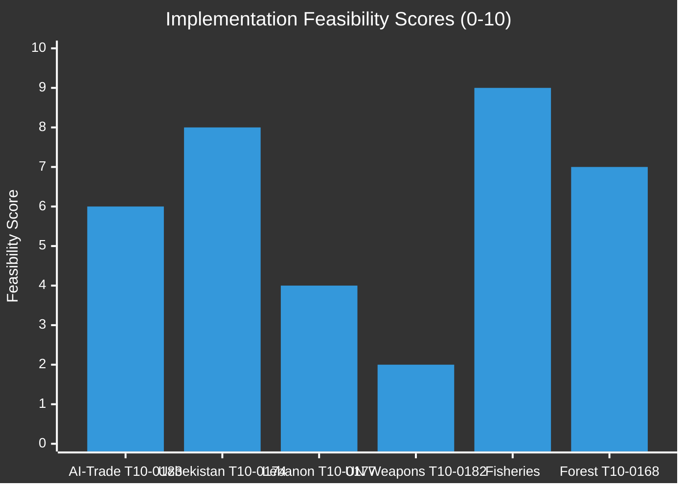

# Implementation Feasibility Analysis — EU Parliament Breaking News 2026-05-21
**Framework**: Implementation Feasibility Assessment (SAT: Force-Field, Stakeholder Mapping)
**Date**: 2026-05-21 | **Admiralty**: B2

## Feasibility Framework

For each major text adopted May 19-20, this analysis assesses:
- Institutional capacity for implementation
- Timeline realism  
- Political will sustainability
- Financial resource adequacy
- Technical complexity

## T10-0183: AI-Trade Policy Implementation

### Institutional Capacity
- **Commission DG TRADE**: Has FTA negotiation capacity but NOT AI governance expertise
- **Commission DG CNECT (Digital)**: Has AI Act expertise but NOT FTA negotiation experience
- **Gap**: Requires cross-DG coordination that EU Commission historically finds difficult
- **Feasibility**: MEDIUM — inter-DG coordination is a known bottleneck

### Timeline Assessment
- **Resolution adoption**: May 2026
- **Commission response** (mandatory for INI): Within 3 months
- **First FTA negotiation mandate revision**: Optimistic Q4 2026; Realistic Q2 2027
- **First AI governance chapter in active FTA text**: Optimistic Q2 2027; Realistic 2028
- **Timeline feasibility**: MEDIUM — achievable but requires sustained political priority

### Financial Resources
- **DG TRADE FTA negotiating capacity**: Existing budget likely sufficient
- **Technical assistance to partner countries**: EFSD+ or IPA+ instruments available
- **Gap**: AI governance capacity building in partner countries requires new budget lines (€50-100M estimate)

### Technical Complexity
- AI governance standards are evolving rapidly; hard to codify in treaty language that remains relevant for 5+ years
- WTO-compatibility legal analysis: 6-12 months of specialized legal work
- Translation of AI Act concepts into FTA-compatible provisions: Novel legal territory

### Overall Feasibility Score: 6/10 (MEDIUM)
- High political will ✅
- Institutional capacity gap ⚠️
- Timeline realistic ✅ (if prioritized)
- Financial resources available ✅
- Technical complexity high ⚠️

## T10-0174: EU-Uzbekistan PCA Implementation

### Institutional Capacity
- **EEAS**: Central Asia Special Representative + delegation in Tashkent
- **Commission DG NEAR**: Institutional coordination for ENP/partner countries
- **Joint institutions**: Joint Council, Joint Committee, Parliamentary Cooperation Committee to be established
- **Feasibility**: HIGH — institutional architecture clear

### Timeline Assessment
- **EP Consent**: May 2026 ✅
- **Council ratification**: Estimated 6-9 months
- **First Joint Committee**: Optimistic Q2 2027; Realistic Q3 2027
- **EFSD+ projects operational**: 18-24 months from ratification

### Financial Resources
- **EFSD+ Central Asia envelope**: €1.5-2.5B for 2021-2027 period (estimated)
- **Technical assistance**: Team Europe approach; member state co-financing available
- **Gap**: Infrastructure financing that competes with Chinese BRI requires larger envelope

### Technical Complexity: LOW-MEDIUM (established PCA architecture)

### Overall Feasibility Score: 8/10 (HIGH)

## T10-0177: EU-Lebanon Partnership Implementation

### Feasibility Constraints
- Lebanese government formation still pending (April 2026)
- Hezbollah's role in Lebanese political economy limits EU project viability
- Banking sector instability limits financial cooperation
- UNIFIL mandate renewal provides EU-Lebanon security cooperation anchor

### Overall Feasibility Score: 4/10 (LOW-MEDIUM)
- Political instability in Lebanon is the binding constraint
- EU has limited ability to improve Lebanese domestic political conditions

## Feasibility Dashboard

---
*Implementation Feasibility | SAT: Force-Field, Stakeholder | Admiralty B2 | 2026-05-21*
