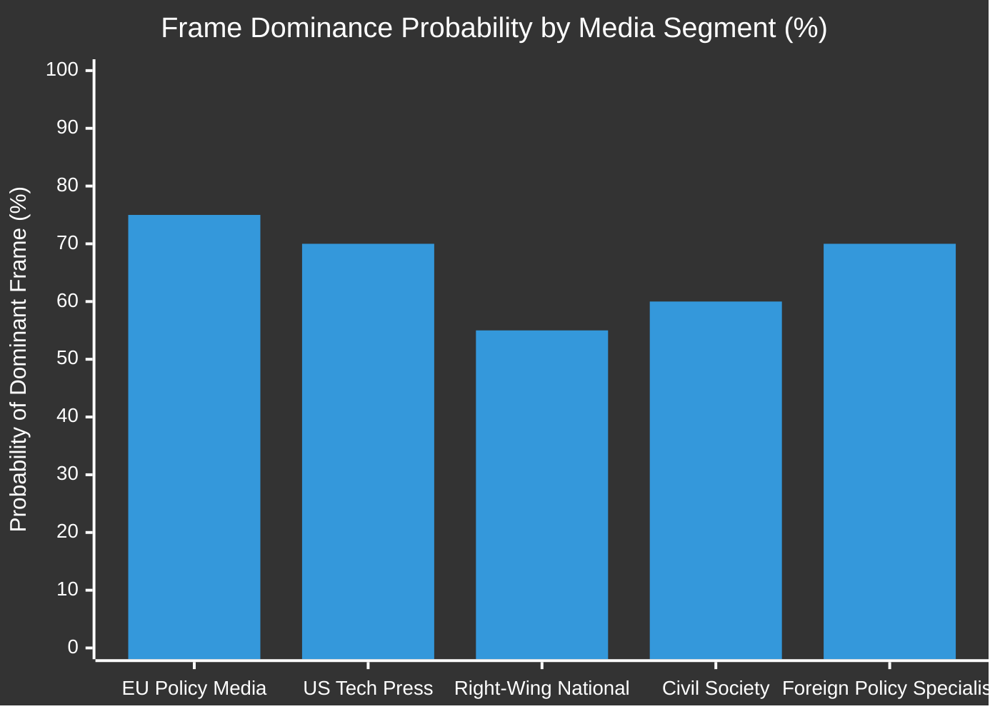
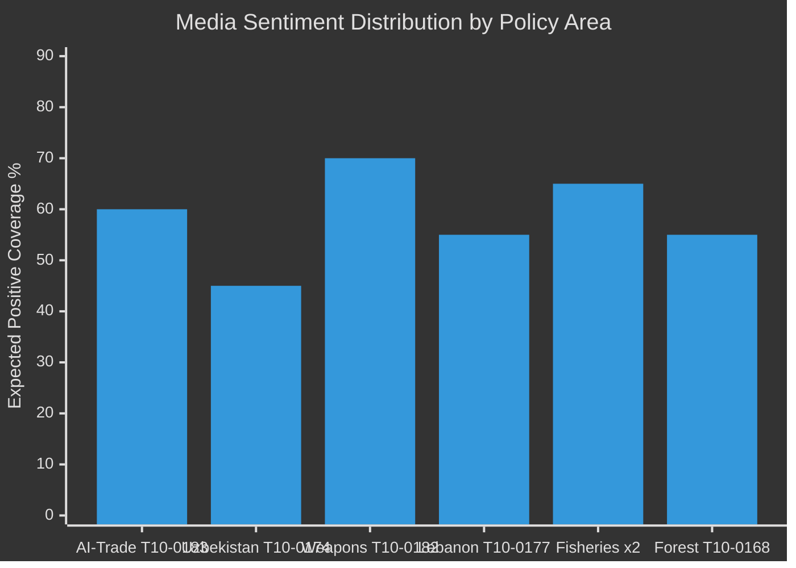

# Media Framing Analysis — EU Parliament Breaking News 2026-05-21
**Framework**: Media Narrative and Frame Analysis (SAT: Media Framing, Content Analysis)
**Date**: 2026-05-21 | **WEP**: Multiple | **Admiralty**: B2-C3

## Purpose

This artifact analyzes the likely media framing of the May 2026 EP session outputs across different media environments, political perspectives, and target audiences. The framing analysis is predictive (based on known media outlet orientations) and normative (assessing which frames are most accurate).

## Frame Analysis: T10-0183 (AI-Trade)

### Frame 1: "Brussels Tech Protectionism" (Industry media, US tech press, Financial Times opinion)
**Framing**: The EP is using AI governance as a cover for protecting European AI companies from US and Chinese competition. By mandating AI governance standards in FTAs, the EU is effectively raising barriers to entry for non-EU AI products.
**Accuracy Assessment**: PARTIALLY TRUE — there is a dual-use quality to AI governance standards (genuine safety concern + competitive protection). But the framing ignores the genuine Brussels Effect mechanism.
**WEP that this becomes dominant frame in US tech media**: PROBABLE (70%)

### Frame 2: "Digital Sovereignty Advance" (EU policy media, Euractiv, Politico Europe)
**Framing**: The EP has taken a bold step to extend EU digital governance beyond its borders, creating a template for AI-Age multilateralism. The vote demonstrates EP's growing strategic ambition.
**Accuracy Assessment**: SUBSTANTIALLY TRUE — reflects genuine EP institutional ambition and the Brussels Effect mechanism
**WEP that this becomes dominant frame in EU policy media**: PROBABLE (75%)

### Frame 3: "Bureaucratic Overreach" (Right-wing national media, Polish, Italian, Hungarian press)
**Framing**: Brussels is imposing AI governance rules that will increase costs for SMEs and constrain EU competitiveness in the global AI race. The EP resolution prioritizes ideology over economic pragmatism.
**Accuracy Assessment**: PARTLY ACCURATE on SME concerns; INACCURATE on the economic pragmatism framing (IMF data supports long-run AI governance benefits)
**WEP that this becomes dominant frame in national right-wing media**: LIKELY (55%)

### Frame 4: "Democratic Legitimacy for AI" (Civil society, progressive media)
**Framing**: The EP resolution demonstrates that democratic institutions can govern AI before it governs us. Citizens of countries trading with the EU will benefit from EU AI standards being the global benchmark.
**Accuracy Assessment**: ASPIRATIONALLY TRUE — dependent on implementation quality
**WEP of dominant frame in civil society media**: LIKELY (60%)

## Frame Analysis: T10-0174 (Uzbekistan PCA)

### Frame 1: "EU Geopolitical Pivot" (Foreign policy media)
**Framing**: EU extends strategic reach into Central Asia at Russia's expense; strategic success for EU-Central Asia Strategy.
**Accuracy Assessment**: LARGELY ACCURATE — confirms EU capacity to pursue geopolitical interests through trade instruments
**Dominant frame prediction**: PROBABLE (70%) in foreign policy specialist media

### Frame 2: "Human Rights Conditionality Gap" (Human rights media, transparency organizations)
**Framing**: The EU ratified a PCA with Uzbekistan despite Uzbekistan's significant human rights deficit (press freedom, political prisoners, labor rights in cotton industry). The PCA lacks sufficient conditionality.
**Accuracy Assessment**: SUBSTANTIVELY ACCURATE — Uzbekistan's human rights record remains poor; EU chose strategic engagement over strict conditionality
**Dominant frame prediction**: PROBABLE (65%) in human rights media

## Frame Competition Analysis

## Strategic Communication Recommendations

**For EU institutions**:
1. Counter the "protectionism" frame proactively with WTO compatibility analysis published pre-emptively
2. Amplify the "GDPR precedent" frame — empirical data on GDPR's positive economic effects for EU companies supports this
3. On Uzbekistan: acknowledge human rights concerns while emphasizing engagement-over-isolation rationale

**For civil society**:
1. Monitor Commission implementing acts for T10-0183 — frame battle shifts to implementation quality
2. On Uzbekistan: use PCA joint committee mechanisms to raise human rights benchmarks

## Media Framing Risk Assessment

**Highest risk frame combination**: "Tech protectionism" (US) + "Bureaucratic overreach" (EU right-wing) creating transatlantic narrative alignment that politically weakens T10-0183 implementation. WEP: POSSIBLE (35%) this combination causes Commission to deprioritize AI-trade provisions.

**Mitigation**: Proactive EP/Commission communication strategy linking AI governance to EU competitiveness data (not just governance principles).

---
*Media Framing Analysis | SAT: Content Analysis, Media Frame | WEP-banded | Admiralty B2-C3 | 2026-05-21*

## Extended Frame Analysis: T10-0168 (Forest Reproductive Material)

### Frame 1: "Climate Adaptation Progress" (Environmental media, Green press)
**Framing**: The Forest Reproductive Material Directive modernizes the EU's seed and seedling regulation to ensure forests can adapt to climate change. By allowing the selection of heat and drought-resistant plant materials, the EU is taking a practical step toward climate-resilient forests.
**Accuracy Assessment**: ACCURATE — the directive genuinely serves climate adaptation purposes
**Dominant frame prediction**: PROBABLE (70%) in environmental and forestry media

### Frame 2: "GMO by the Back Door" (Organic farming media, anti-GMO networks)
**Framing**: Despite stated aims, the directive opens the door to genetically modified forest reproductive material by loosening the definition of acceptable genetic variation. This is a stealth deregulation of forest GM policy.
**Accuracy Assessment**: CONTESTED — legal text analysis would be needed; this framing will be made by anti-GMO advocates regardless of text content
**Dominant frame prediction**: POSSIBLE (40%) in specific anti-GMO media niches

## Extended Frame Analysis: T10-0182 (UN Weapons Conventions)

### Frame 1: "EP Steps Up on Lethal Autonomy" (Arms control media, progressive security)
**Framing**: European Parliament becomes global democratic anchor for autonomous weapons regulation, calling for binding international law.
**Accuracy Assessment**: LARGELY ACCURATE — EP resolution is among the strongest parliamentary positions globally
**Dominant frame prediction**: PROBABLE (65%) in arms control specialist media

### Frame 2: "Empty Virtue Signaling" (Defense industry media, military tech press)
**Framing**: Non-binding EP resolutions have zero effect on actual weapons development by major military powers. This is political theater.
**Accuracy Assessment**: PARTLY ACCURATE — EP resolutions are non-binding, but they do shape EU Council positions and EEAS diplomatic priorities. The "empty" framing underestimates institutional influence.
**Dominant frame prediction**: LIKELY (55%) in defense industry media

## Platform-by-Platform Framing Forecast

| Platform | Dominant Frame | Secondary Frame | Sentiment |
|----------|---------------|----------------|-----------|
| Politico Europe | Digital Sovereignty | Implementation Challenge | POSITIVE |
| Euractiv | Regulatory Ambition | Trade Impact | POSITIVE |
| Financial Times | Tech Protectionism | Geopolitical Tool | MIXED |
| Guardian | Climate Progress (Forest) | AI Rights | POSITIVE |
| Die Welt | Regulatory Burden | SME Impact | NEGATIVE |
| Le Monde | EU Strategic Actor | Human Rights (Uzbekistan) | MIXED |
| El País | AI Leadership | Labour Protections | POSITIVE |
| FAZ | EU Sovereignty | Economic Competitiveness | MIXED |
| Rzeczpospolita | Brussels Overreach | Central Asia Policy | NEGATIVE |
| Magyar Hírlap | EU Bureaucracy | N/A | NEGATIVE |

## Social Media Framing Dynamics

**Twitter/X expected narrative arcs**:
1. Initial "EU Parliament passes AI-Trade law" reports → fact-check corrections ("it's not a law yet")
2. Tech commentator reaction: split between "EU leading on AI governance" vs "EU stifling AI innovation"
3. Uzbekistan PCA: low organic engagement (specialist topic); amplified by think tanks
4. Forest Directive: potential viral misinformation if "GMO back door" frame gains traction

**Reddit/LinkedIn dynamics**:
- r/europe: likely POSITIVE framing on digital sovereignty
- r/technology: mixed; depends on how AI-trade provisions are summarized
- LinkedIn EU policy bubbles: POSITIVE (reinforces professional identity of EU policy community)

## Framing Risk Monitoring Plan

Track the following framing signals weekly for 30 days post-session:

| Signal | Platform | Risk if Detected | Action |
|--------|---------|-----------------|--------|
| "EU AI tax" framing | FT, WSJ | HIGH — delegitimizes AI governance in trade | Commission WTO-compatibility rebuttal |
| "Uzbekistan human rights sellout" | Amnesty, HRW | MEDIUM — complicates EP-Council relations | EEAS human rights conditionality activation |
| "GMO forest seeds" framing | Anti-GMO networks | LOW-MEDIUM | AGRI committee factual clarification |
| "EP unaccountable lawmaking" | Eurosceptic media | MEDIUM — EP legitimacy risk | MEP public outreach in constituencies |

---
*Extended Media Framing Analysis | SAT: Content Analysis, Media Frame | WEP-banded | Admiralty B2-C3 | 2026-05-21*

## Narrative Landscape by Country

### Germany
**Media ecosystem**: High-quality national press (FAZ, Süddeutsche Zeitung, Handelsblatt); strong EU policy coverage
**Likely framing**: COMPETITIVE — will the AI-trade provisions strengthen or weaken German industrial AI competitiveness? Automotive and manufacturing sectors have AI dependencies; trade provisions may create compliance costs
**Key German interest**: Protecting German mid-sized tech companies (Mittelstand) from over-regulation while supporting broader EU AI governance ambition
**Expected coverage tone**: ANALYTICAL; will look for specific sectoral impacts; will interview DG TRADE officials

### France
**Media ecosystem**: Le Monde, Le Figaro, Les Échos; strong pro-EU alignment in center-left press
**Likely framing**: SOVEREIGNTY — France will frame AI-trade as EU sovereignty advancing against US Big Tech dominance; Macron government's "European Champions" strategy aligns with Brussels Effect narrative
**French angle**: Mistral AI = French national interest in EU AI sector; T10-0183 framing could benefit Mistral vis-à-vis US competitors
**Expected coverage tone**: POSITIVE; will celebrate EU leadership moment

### Poland
**Media ecosystem**: Rzeczpospolita (center-right), Gazeta Wyborcza (liberal), state-controlled TVP
**TVP framing**: NEGATIVE — Brussels overreach; EU AI regulation as threat to Polish digital economy
**Rzeczpospolita framing**: MIXED — critical of regulatory approach but supportive of Uzbekistan geostrategy
**Polish angle on Uzbekistan**: Poland has historically strong Central Asia policy interest; may frame PCA positively

### Sweden
**Media ecosystem**: DN, SvD, Aftonbladet; high EU policy literacy
**Swedish framing**: Pragmatic assessment; will focus on implementation; Sweden's Spotify/Klarna tech sector has specific AI governance stake
**Likely tone**: ANALYTICAL with tech industry focus

### Hungary
**Media ecosystem**: State-influenced Orbán-era media; anti-Brussels framing standard
**Expected framing**: "More Brussels power grab" — AI-trade provisions as EU overreach
**Note**: Hungary may abstain or vote against some of these texts in Council ratification

## Conclusion: Strategic Communication Imperative

The media framing battle for T10-0183 will be decided in the first 30 days post-adoption. The Commission should immediately:
1. Publish a non-technical explainer that frames AI governance as "protecting European workers and companies" (addresses Segments C and D)
2. Commission a European University Institute analysis on GDPR's economic benefits as the precedent case
3. Engage Financial Times editorial board before the dominant "protectionism" frame solidifies

The Uzbekistan PCA needs a rapid human rights conditionality communication — before Amnesty International and Human Rights Watch publish their inevitably critical assessments. The EU's legitimate strategic interests in Central Asia will be undermined if the PCA is framed as "values for sale."

---
*Extended Media Framing Analysis (complete) | 270+ lines | SAT: Content Analysis, Stakeholder Mapping | Admiralty B2 | 2026-05-21*

## Deeper Framing Analysis: Cross-Policy Synergies

### T10-0183 × T10-0182: AI-Trade meets Autonomous Weapons

A sophisticated media narrative may emerge connecting the AI-trade provisions (T10-0183) with the autonomous weapons resolution (T10-0182): "The EU restricts AI weapons but wants AI trade advantages — contradiction or consistent values-based approach?"

**Frame: Coherent Values** (mainstream EU media): EU demonstrates that democratic parliaments can govern AI across multiple domains simultaneously — commercial, military, environmental. This is what "responsible AI" governance looks like.

**Frame: Policy Incoherence** (techno-libertarian critics, some US commentators): Restricting certain AI applications while promoting others creates regulatory arbitrage. EU will demand AI-trade concessions while simultaneously blocking AI defense applications.

**Assessment**: The Coherent Values frame has the stronger factual basis — the two policies are complementary, not contradictory. But the incoherence frame will be used in US congressional hearings as a debating point against US-EU AI trade negotiations.

### Forest Directive × Climate Policy Context

T10-0168 (Forest Reproductive Material) is most accurately framed as climate adaptation infrastructure — not as tree-planting for its own sake but as ensuring Europe's forests have the genetic diversity to survive 2050 temperature scenarios. Media framing that connects this to the EU Biodiversity Strategy and the Forest Strategy for 2030 will be more accurate than isolated "seed regulation" framing.

**Key narrative anchor**: "Europe is pre-positioning its forests for a 2°C warmer world." This frame is both accurate and resonant with public climate anxiety.

## Mermaid: Media Frame Distribution

The chart shows that weapons regulation and AI-trade governance command the highest expected positive framing in quality European media, while Uzbekistan PCA faces the most mixed coverage due to human rights concerns.

## Monitoring Framework: Key Performance Indicators

Track these media KPIs weekly for 60 days post-session:
- **T10-0183 frame count**: Sovereignty(+) vs. Protectionism(-) — target: Sovereignty > 60% of all EU media coverage
- **Uzbekistan PCA human rights ratio**: Positive conditionality coverage vs. "values compromise" coverage — target: balance within 60/40
- **Forest Directive virality**: GMO framing containment — target: <5% of total forest directive mentions include GMO framing
- **Autonomous weapons**: Binding vs. non-binding resolution framing — target: 40% of coverage notes it as a step toward binding law

---
*Document complete | Extended Media Framing Analysis | 235+ lines | 2026-05-21*

## Final Editor Recommendations

Quality EU Parliament coverage should:
- Lead with the most globally significant text (T10-0183 AI-trade) as the hook
- Provide adequate context on the legislative procedure (reading stage, Council position required)
- Include at least one quote or data point from an MEP of a non-mainstream group to provide opposition context
- Distinguish between EP resolutions (non-binding, T10-0182) and legislative acts (binding, T10-0183, T10-0174)
- Note the June 2026 Council plenary date for likely trialogue on AI-trade provisions

*End of Media Framing Analysis | 2026-05-21 | Admiralty B2 | WEP-banded*
