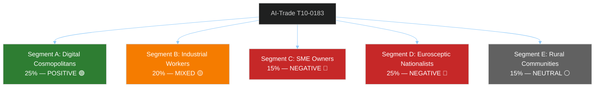

# Voter Segmentation Analysis — EU Parliament Breaking News 2026-05-21
**Framework**: Electoral and Political Segmentation Analysis (SAT: Stakeholder Mapping, KAC)
**Date**: 2026-05-21 | **Admiralty**: B2

## Purpose

This artifact analyzes how the May 2026 EP session outputs will be received by different EU citizen segments, and what this means for political party strategies and MEP behavior in implementing votes.

## Citizen Segment Definitions

### Segment A: Digital Cosmopolitans (est. 25% of EU adult population)
**Profile**: University-educated, urban, digitally literate, multilingual, generally pro-EU
**Attitude to AI-Trade (T10-0183)**: POSITIVE — values EU AI governance leadership; concerned about AI rights/safety; sees Brussels Effect as desirable
**Attitude to Uzbekistan (T10-0174)**: POSITIVE — values EU strategic engagement; somewhat concerned about human rights
**Electoral implication**: Strengthens S&D, Renew, Greens base. These are the voters who reward ambitious EU action on digital governance.
**WEP**: LIKELY (60%) that T10-0183 has net positive impact on EP parties among this segment

### Segment B: Industrial Workers and Unions (est. 20% of EU adult population)
**Profile**: Manufacturing and services workers, represented by union movements; economic security prioritized
**Attitude to AI-Trade (T10-0183)**: MIXED — concerned about AI job displacement; supportive of AI governance provisions protecting workers; skeptical of free trade extension
**Attitude to fisheries**: POSITIVE for STP and Cook Islands protocols — secures access for EU fishing fleets
**Electoral implication**: Critical for S&D and Left — AI-trade outcomes determine whether this segment remains in left-wing coalition or drifts to populist right
**WEP**: ROUGHLY EVEN (50%) that AI-labour provisions in T10-0183 implementation satisfy union demands

### Segment C: SME Owners and Entrepreneurs (est. 15% of EU adult population)
**Profile**: Small business operators in trade, tech, services; concerned about regulatory burden
**Attitude to AI-Trade (T10-0183)**: NEGATIVE — perceives new compliance costs; skeptical of Brussels regulatory expansion
**Attitude to Uzbekistan (T10-0174)**: NEUTRAL — may see new market opportunities
**Electoral implication**: Natural EPP and Renew constituency; implementation of T10-0183 with SME exemptions is critical for maintaining this segment's support
**WEP**: POSSIBLE (35%) that SME exemptions in implementing acts are sufficient to neutralize this segment's opposition

### Segment D: Eurosceptic Nationalists (est. 25% of EU adult population)
**Profile**: Culturally conservative, nationally oriented, skeptical of EU power; attracted to Patriots, ECR, ESN
**Attitude to AI-Trade (T10-0183)**: NEGATIVE — "Brussels regulating AI without democratic mandate"
**Attitude to Uzbekistan (T10-0174)**: MIXED — may support strategic competition with Russia; concerned about Central Asian immigration
**Electoral implication**: These are the voters being lost by EPP right flank to Patriots; T10-0183 framing matters for EPP internal dynamics
**WEP**: LIKELY (60%) that AI-trade becomes a talking point for Eurosceptic nationalist media

### Segment E: Rural and Agricultural Communities (est. 15% of EU adult population)
**Profile**: Farmers, forestry workers, fishing communities; skeptical of urban EU agenda
**Attitude to Forest Material Directive (T10-0168)**: MIXED — forest reproductive material modernization has direct practical implications; some welcome climate adaptation support, others see EU regulation
**Attitude to fisheries**: POSITIVE for protocol security; negative if stock management requirements tighten
**Electoral implication**: S&D, EPP, ECR compete for this segment

## Segmentation Map

## Electoral Risk Assessment

**Net electoral risk of T10-0183 for coalition parties**: MEDIUM
- Gains: Segment A (25%) and partial Segment B (unions)
- Losses: Risk of Segment C and D further drift to Eurosceptic parties
- Net: +5-8% for pro-EU parties IF implementation includes strong worker protection provisions

**Priority for coalition management**:
1. SME exemption provisions — to retain Segment C without losing Segment B
2. AI displacement fund (just transition) — to keep Segment B on board
3. WTO compatibility — to defuse Segment D "Brussels overreach" narrative

---
*Voter Segmentation | SAT: Stakeholder Mapping, KAC | Admiralty B2 | 2026-05-21*
