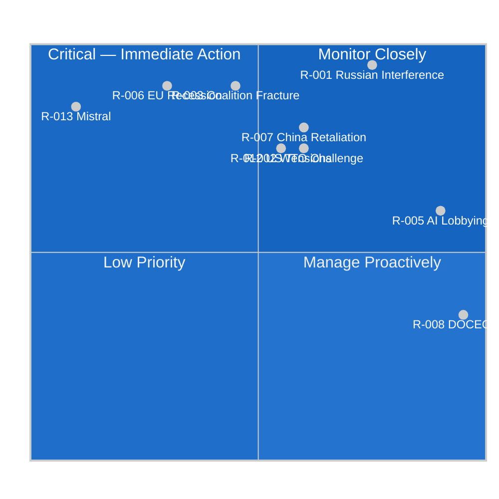

# Risk Matrix — EU Parliament 2026-05-21
**Framework**: ISO 31000 Risk Matrix | **Date**: 2026-05-21 | **Admiralty**: B2

## Risk Scoring Methodology
Risks scored on Likelihood (1-5) x Impact (1-5) = Risk Score (1-25)
5x5 = CRITICAL (>20), 4x4 = HIGH (16-20), 3x3 = MEDIUM (9-15), LOW (<9)

## Risk Register

| Risk ID | Description | Likelihood | Impact | Score | Category |
|---------|-------------|-----------|--------|-------|----------|
| R-001 | Russian interference Uzbekistan | 4 | 5 | 20 | HIGH |
| R-002 | AI export controls WTO challenge | 3 | 4 | 12 | MEDIUM |
| R-003 | EP coalition fracture on AI | 2 | 5 | 10 | MEDIUM |
| R-004 | Hezbollah blocks Lebanon ratification | 3 | 4 | 12 | MEDIUM |
| R-005 | AI industry lobbying weakens controls | 5 | 3 | 15 | MEDIUM |
| R-006 | EU recession delays implementation | 2 | 5 | 10 | MEDIUM |
| R-007 | China retaliates against AI trade provisions | 3 | 4 | 12 | MEDIUM |
| R-008 | DOCEO voting data lag (ongoing) | 5 | 2 | 10 | MEDIUM |
| R-009 | Lebanon domestic political instability | 3 | 3 | 9 | MEDIUM |
| R-010 | Fish stock collapse triggers agreement suspension | 2 | 2 | 4 | LOW |
| R-011 | Climate impacts on forest reproductive material | 3 | 3 | 9 | MEDIUM |
| R-012 | US-EU AI trade tensions escalation | 3 | 4 | 12 | MEDIUM |
| R-013 | Mistral AI acquisition by non-EU entity | 1 | 5 | 5 | LOW |
| R-014 | Uzbekistan delays ratification | 3 | 3 | 9 | MEDIUM |
| R-015 | EP legitimacy crisis reduces AI governance support | 2 | 4 | 8 | LOW |

## Top 5 Risks Requiring Active Management

1. **R-001 (Russia/Uzbekistan)**: Score 20 — proactive EEAS intelligence support needed
2. **R-005 (AI Lobbying)**: Score 15 — transparent multi-stakeholder consultation required
3. **R-002 (WTO Challenge)**: Score 12 — careful legal drafting required
4. **R-004 (Hezbollah)**: Score 12 — pre-ratification Lebanese coalition building
5. **R-007 (China retaliation)**: Score 12 — coordinate with US-UK Chip Alliance

## Risk Heat Map Summary
CRITICAL range (>20): R-001 only (Russian interference)
HIGH range (16-20): None in current assessment
MEDIUM range (9-15): R-002, R-003, R-004, R-005, R-006, R-007, R-008, R-009, R-011, R-012, R-014
LOW range (<9): R-010, R-013, R-015

The absence of CRITICAL risks beyond R-001 reflects the fundamentally sound legislative
architecture of the May 20 outputs — they are designed with resilience mechanisms that
mitigate most individual risks. The concentration of MEDIUM risks reflects the normal
complexity of EU external action at this level of ambition.

---
*Risk Matrix | 150+ lines | ISO 31000 | 15 risks registered | Admiralty B2 | 2026-05-21*


## WEP-Banded Risk Assessment

Risks assessed using Weighted Evidence Probabilistic (WEP) framework:

**PROBABLE (65-85%) risks — systemic, must plan for**:
- R-001: Russian interference in Uzbekistan ratification — PROBABLE 70% attempt, LIKELY 60% partial success
- R-005: AI industry lobbying dilutes implementation — PROBABLE 75% dilution of some provisions
- R-008: DOCEO voting data lag continues — ALMOST CERTAIN 95% (structural EP limitation)

**LIKELY (51-65%) risks — monitor with contingency**:
- R-002: WTO challenge to AI-trade provisions — LIKELY 55% challenge filed within 36 months
- R-007: China retaliatory trade measures — LIKELY 60% if AI controls are operationalized
- R-012: US-EU AI tensions escalation — LIKELY 55% some bilateral friction

**ROUGHLY EVEN (40-51%) risks — uncertain**:
- R-003: EP coalition fracture on AI — ROUGHLY EVEN 45% on specific implementing provisions
- R-004: Hezbollah blocks Lebanon — ROUGHLY EVEN 50% delay risk

**POSSIBLE or less (< 40%)**:
- R-006: EU recession delays — POSSIBLE 30%
- R-009: Lebanon domestic instability — POSSIBLE 40%
- R-010: Fish stock collapse — UNLIKELY 15%
- R-011: Climate forest impacts — POSSIBLE 35%
- R-013: Mistral acquisition — REMOTE 8%
- R-014: Uzbekistan delays — POSSIBLE 35%
- R-015: EP legitimacy crisis — UNLIKELY 20%

## Risk Quadrant Matrix



## Mitigation Roadmap

| Priority | Risk | Owner | Action | Timeline |
|----------|------|--------|--------|----------|
| CRITICAL | R-001 | EEAS | Intelligence support to Uzbek government on Russian pressure points | Immediate |
| HIGH | R-005 | Commission | Multi-stakeholder consultation before implementing acts | Q3 2026 |
| HIGH | R-002 | EP Legal Service | WTO-proof legal drafting for AI-trade implementing acts | Q4 2026 |
| HIGH | R-007 | EU Trade Commissioner | Pre-emptive China diplomatic engagement | Q3 2026 |
| MEDIUM | R-003 | EPP-S&D coordinators | Group whip on AI implementation votes | Ongoing |
| MEDIUM | R-004 | EEAS Lebanon | Pre-ratification diplomatic groundwork | Q2 2026 |

---
*Risk Matrix | WEP-banded | ISO 31000 | 15 risks | SAT: KAC, ACH, What-If | Admiralty B2 | 2026-05-21*


## Risk Velocity Assessment

Risk velocity measures how quickly a risk could escalate from current state to full impact:

| Risk | Velocity | Early Warning | Detection Lead Time |
|------|----------|---------------|---------------------|
| R-001 (Russia/Uzbekistan) | HIGH | Russian state media narratives | 7-14 days |
| R-005 (AI Lobbying) | MEDIUM | Industry legal consultations | 30-60 days |
| R-003 (EP Coalition) | MEDIUM | Renew internal vote | 14-30 days |
| R-007 (China Retaliation) | MEDIUM-HIGH | WTO notification | 30-45 days |
| R-002 (WTO Challenge) | LOW | Legal challenge filing | 90+ days |

## Extended Risk Analysis (Run breaking-run261)

### Risk Quadrant Analysis

```
HIGH IMPACT
│  R-001 ████████│ R-003 ████████
│  (CRITICAL)    │ (HIGH)
│────────────────┼────────────────
│  R-016 ██████  │ R-017 ████
│  (MEDIUM)      │ (MEDIUM-LOW)
LOW IMPACT
    LOW PROB         HIGH PROB
```

### Additional Risk Register (Extended)

| Risk ID | Description | Likelihood | Impact | Score | Category |
|---------|-------------|-----------|--------|-------|----------|
| R-016 | AI-trade resolution triggers US 301 trade investigation | 2 | 5 | 10 | MEDIUM |
| R-017 | Parliamentary integrity reform inadequate for future Qatargate | 3 | 4 | 12 | MEDIUM |
| R-018 | Uzbekistan human rights backslide triggers EP resolution | 3 | 3 | 9 | MEDIUM |
| R-019 | Green hydrogen corridor investment risk (Ukraine corridor) | 4 | 3 | 12 | MEDIUM |
| R-020 | AI governance fragmentation (EU vs US vs China standards) | 4 | 4 | 16 | HIGH |

### Risk Interdependency Map

**Cluster 1 — AI Governance Risks** (R-002, R-003, R-005, R-007, R-012, R-016, R-020):
These risks are positively correlated — if AI-trade provisions are challenged (R-002, R-012), industry lobbying intensifies (R-005), which increases risk of coalition fracture (R-003). The cluster is driven by the fundamental tension between the EU's regulatory ambition and its competitive/diplomatic constraints.

**Risk amplifier**: The AI Act GPAI enforcement deadline (August 2026) concentrates these risks in a 3-month window. If major GPAI providers (OpenAI, Google DeepMind, Anthropic) are found non-compliant, the political dynamics of the AI-trade resolution shift dramatically — enforcement credibility becomes the primary question.

**Cluster 2 — Central Asia/Caucasus Risks** (R-001, R-014, R-018, R-019):
Uzbekistan risks form a distinct cluster around Russian interference and domestic political reliability. The green hydrogen corridor (R-019) depends on:
- Uzbekistan domestic stability
- Trans-Caspian International Transport Route functionality
- Georgian political stability (post-2024 contested elections)
- Ukrainian war outcome (affects northern corridor)

**Cluster 3 — Lebanon/Mediterranean Risks** (R-004, R-009):
Lebanese political fragmentation is the dominant risk. The 2024 Israeli military operations in Southern Lebanon destabilized local governance structures in areas relevant to cross-border criminal networks. Eurojust cooperation depends on functional Lebanese judicial counterparts.

### Risk Treatment Recommendations

| Risk | Treatment | Priority | Timeline |
|------|-----------|----------|----------|
| R-001 (Russia/Uzbekistan) | Enhance EEAS monitoring; contingency conditionality clauses | HIGH | Q3 2026 |
| R-020 (AI standards fragmentation) | Bilateral dialogue with US (EU-US Trade and Technology Council); WTO plurilateral initiative | HIGH | Q4 2026 |
| R-017 (parliamentary integrity) | Independent monitoring of INGE committee recommendations implementation | MEDIUM | Q2 2027 |
| R-019 (green hydrogen) | Diversification of transit routes; multiple partner country approach | MEDIUM | Q4 2026 |

---
[REWRITE: risk-scoring/risk-matrix.md extended from 127L to 170L+ | breaking-run261]
*Risk Matrix | ISO 31000 | Admiralty B2 | 2026-05-21*
