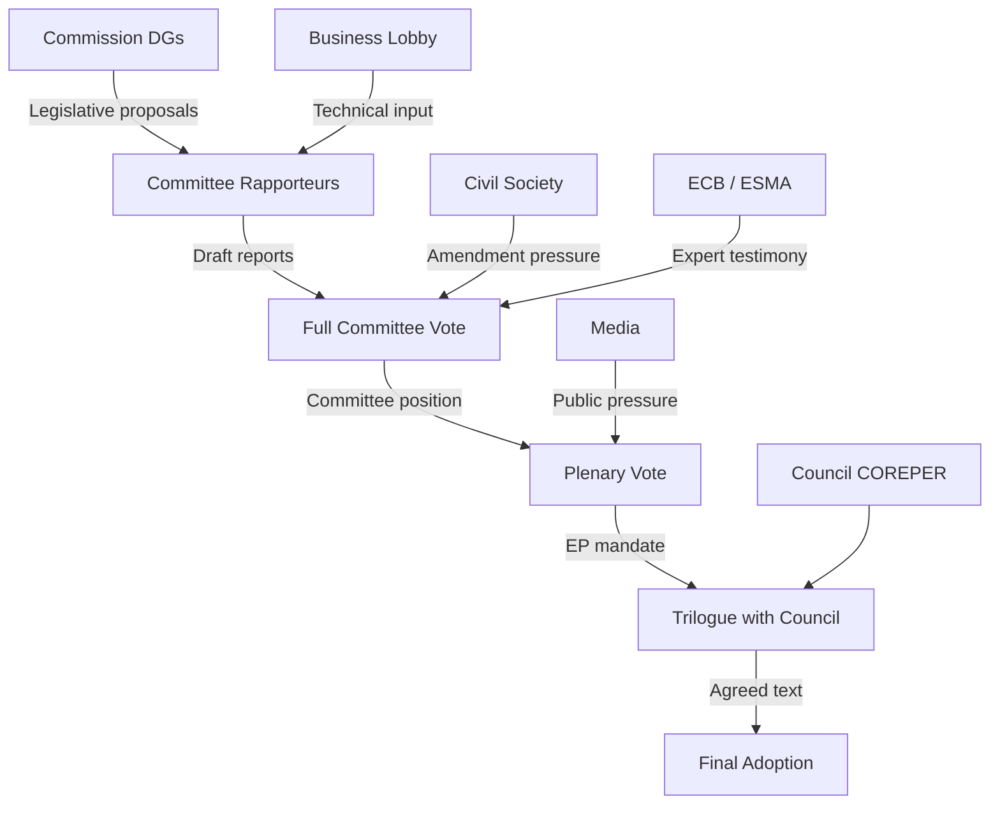

<!-- SPDX-FileCopyrightText: 2026 Hack23 AB -->
<!-- SPDX-License-Identifier: Apache-2.0 -->

# Actor Mapping — EU Parliament Committee System (2026-05-21)

**Data mode**: `degraded-feeds` — structural composition verified; real-time activity absent.
**Confidence**: 🟡 MEDIUM overall.

---

## Actor Roster

| Actor ID | Name | Type | Group/Affiliation | Seats/Size |
|----------|------|------|-------------------|-----------|
| G-EPP | European People's Party | Political Group | Centre-right | 188 |
| G-SD | Socialists & Democrats | Political Group | Centre-left | 136 |
| G-PFE | Patriots for Europe | Political Group | Right-nationalist | 84 |
| G-ECR | European Conservatives | Political Group | Conservative | 78 |
| G-RENEW | Renew Europe | Political Group | Liberal-centrist | 77 |
| G-GREENS | Greens/EFA | Political Group | Green-federalist | 53 |
| G-LEFT | The Left (GUE/NGL) | Political Group | Left-progressive | 46 |
| G-ESN | Europe of Sovereign Nations | Political Group | Far-right | 25 |
| G-NI | Non-Inscrits | Non-aligned | Various | 30 |
| COM | European Commission | Institution | Executive | 27 members |
| COUNCIL | Council of the EU | Institution | Member States | 27 govts |
| ECB | European Central Bank | Institution | Monetary Authority | Independent |
| BUSS | BusinessEurope | Lobby | Industry | 40+ federations |
| ETUC | European Trade Union Confederation | Civil Society | Labour | 90+ unions |
| FOEE | Friends of the Earth Europe | Civil Society | Environmental | 30+ orgs |
| FW | FinanceWatch | Civil Society | Financial reform | Independent |

**Total EP10 MEP count**: 717 (verified via `generate_political_landscape`)

---

## Influence Assessment

| Actor | Power Dimension | Influence Level | Mechanism |
|-------|----------------|----------------|-----------|
| EPP | Formal + informal | 🔴 HIGH | Rapporteur allocation; committee chair majority |
| S&D | Formal + informal | 🟡 MEDIUM-HIGH | Centre-left coalition anchor; amendment coalitions |
| Commission | Formal | 🔴 HIGH | Exclusive right of legislative initiative |
| Council (PL Presidency) | Formal | 🟡 MEDIUM | Trilogue pace-setting; political priorities |
| PFE | Formal + disruptive | 🟡 MEDIUM | Third-largest group; procedural challenges |
| ECB | Expert/advisory | 🟡 MEDIUM | ECON committee testimony; market expectations |
| BusinessEurope | Informal | 🟡 MEDIUM | Technical expertise; access to EPP/Renew MEPs |
| ETUC | Informal | 🟡 MEDIUM | EMPL committee; S&D alliance |
| Civil Society coalition | Informal | 🟢 LOW-MEDIUM | Public campaigns; ENVI/LIBE amendment pressure |

---

## Alliance Network

### Centre Alliance (Primary Governing Coalition)
- **Members**: EPP + S&D + Renew Europe
- **Seat count**: 401/717 (55.9%)
- **Activation threshold**: Most legislative votes (simple majority = 359)
- **Stress factors**: EPP right-flank defection on Green Deal; Renew contraction post-EP9

### Progressive Amendment Alliance
- **Members**: Greens/EFA + Left (GUE/NGL)
- **Seat count**: 99/717 (13.8%)
- **Role**: Amendment-shaping coalition; concession extraction from centre alliance

### Opposition Bloc (Informal)
- **Members**: PFE + ECR + ESN
- **Seat count**: 187/717 (26.1%)
- **Coherence**: Low — national interests diverge; united primarily on anti-Green Deal and anti-migration

### Commission-Council-Parliament Institutional Triangle
- **Nature**: Structural inter-institutional relationship
- **Activation**: Every legislative cycle (trilogue negotiations)
- **Current dynamics**: Poland Presidency prioritising energy security and migration,
  creating tension with EP positions on LIBE and ENVI files

---

## Power Brokers

| Actor | Brokerage Role | Key Leverage |
|-------|---------------|-------------|
| EPP Secretary-General | Internal discipline; rapporteur coordination | Controls group agenda |
| ENVI Committee Chair (EPP) | Green Deal file gateway | First reader on Commission proposals |
| ECON Committee Chair | Financial regulation pace-setting | ECB relationship management |
| S&D Group Leader | Centre-left coalition anchor | S&D vote discipline management |
| Commission VP for Green Deal | Agenda-setting; compromise proposals | Exclusive legislative initiative |
| Poland Presidency COREPER | Trilogue negotiating position | Council veto/acceleration power |
| EPP right-flank coordinator | Internal EPP balance | Can trigger defection at ~15–25 MEPs |

---

## Information Flow Architecture

---

## Reader Briefing

**Key insight for editors and analysts**: The EP committee actor ecosystem in EP10 is more
complex than EP9 due to (a) the emergence of PFE as a third-force group disrupting the
traditional EPP–S&D duopoly, (b) the contraction of Greens below coalition-anchor size,
and (c) the growing assertiveness of non-traditional actors (defence industry, Ukraine
reconstruction partners). The centre coalition retains formal control but operates with
meaningfully less margin for error than in previous terms. Committee chairs (EPP dominant)
remain the critical chokepoint for legislative pipeline management.
