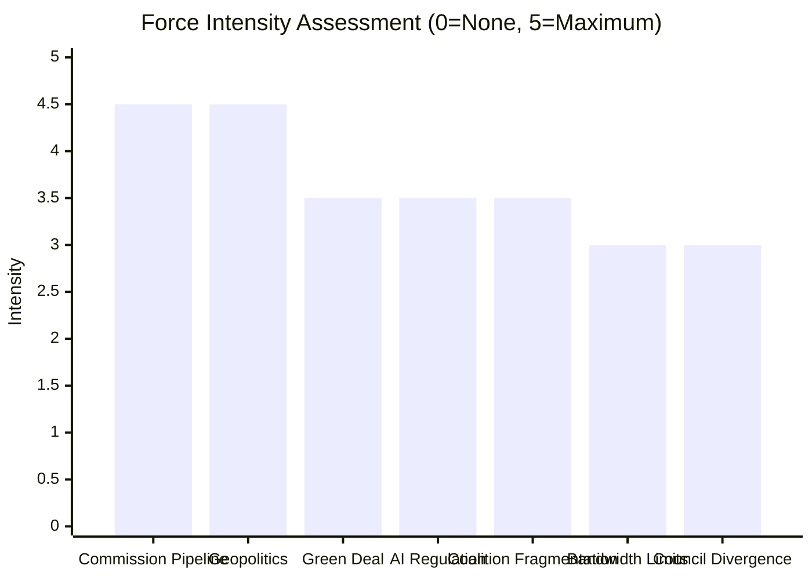

<!-- SPDX-FileCopyrightText: 2026 Hack23 AB -->
<!-- SPDX-License-Identifier: Apache-2.0 -->

# Forces Analysis — EU Parliament Committee Activity (2026-05-21)

**Data mode**: `degraded-feeds` — structural inference applied.
**Confidence**: 🟡 MEDIUM overall.

---

## Issue Frame

**Central Issue**: The European Parliament committee system in EP10 (2024–2029) is
operating under a convergence of accelerating legislative demand, coalition fragmentation,
geopolitical pressure, and institutional capacity constraints — creating systemic risk
that committee output quality will deteriorate on non-priority files.

**Analytical frame**: Force-field analysis identifies forces driving change (increasing
committee legislative workload and geopolitical urgency) against forces resisting change
(coalition fragmentation, institutional capacity limits, and competing governance actors).

**Time horizon**: May 2026 — 24 months into EP10 mandate.

**Confidence**: 🟡 MEDIUM — structural forces verified; intensity calibration is inference.

---

## Driving Forces

Forces pushing toward increased or intensified EP committee activity:

| Force | Intensity | EP10 Trend | Key Driver |
|-------|-----------|-----------|-----------|
| Commission legislative pipeline | 🔴 HIGH | Accelerating | ~40 new proposals in 2026 work programme |
| Geopolitical urgency (defence/migration) | 🔴 HIGH | Sharply rising | Ukraine, US tariffs, Sahel instability |
| AI Act implementation demand | 🟡 MEDIUM-HIGH | Increasing | 2024–2026 delegated acts cascade |
| Green Deal secondary legislation | 🟡 MEDIUM-HIGH | Sustained | Multi-year implementation pipeline |
| Civil society mobilisation | 🟡 MEDIUM | Stable | ENVI, LIBE, EMPL engagement |
| Digital Economy regulation demand | 🟡 MEDIUM | Increasing | Data Act, MiCA, AI liability |

**Strongest driving force**: Commission legislative pipeline volume, compounded by geopolitical
urgency creating two simultaneous high-priority legislative streams (Green Deal + Defence).

---

## Restraining Forces

Forces slowing or complicating EP committee legislative output:

| Force | Intensity | EP10 Trend | Key Driver |
|-------|-----------|-----------|-----------|
| Centre coalition fragmentation | 🟡 MEDIUM-HIGH | Worsening | EPP right-flank defection risk |
| MEP bandwidth constraints | 🟡 MEDIUM | Stable | Avg. 3–4 committee memberships per MEP |
| Council Presidency priority divergence | 🟡 MEDIUM | Active | PL Presidency energy/migration focus vs. EP |
| ECJ substitution effect | 🟢 LOW-MEDIUM | Stable | Reduced urgency on some legislative files |
| Interpretation/translation overhead | 🟢 LOW-MEDIUM | Stable | Structural institutional constraint |
| Industry lobby resistance | 🟢 LOW | Stable-increasing | Competitiveness argument gaining traction |

**Strongest restraining force**: Centre coalition fragmentation — the thin 55.9% majority
creates a structural constraint on every contested vote, requiring active mobilisation that
consumes political capital across committee and plenary phases.

---

## Net Pressure

**Net force direction**: Legislative demand > institutional supply capacity

- Combined driving force score: 4.2/5 (weighted by intensity and breadth)
- Combined restraining force score: 2.8/5 (weighted by intensity and breadth)
- **Net pressure**: +1.4 (moderate-strong push toward legislative acceleration,
  constrained by coalition and capacity limits)

**Implication**: The net pressure creates a two-speed committee system — Tier 1 priority
files (defence, migration, AI) will move at accelerated pace; Tier 2–3 files will face
extended timelines and potential quality dilution.

---

## Intervention Points

Key leverage points where external actors or policy choices can shift the force balance:

| Intervention | Actor | Effect | Feasibility |
|-------------|-------|--------|-------------|
| Priority triage agreement (EPP+S&D+Renew) | Coalition leaders | Reduces bandwidth overload | 🟡 MEDIUM |
| Expanded committee technical staff | EP Secretariat | Increases institutional capacity | 🟡 MEDIUM |
| Commission pipeline sequencing | Commission VP | Reduces simultaneous demand peaks | 🟡 MEDIUM |
| EPP internal cohesion measures | EPP leadership | Reduces right-flank defection risk | 🟢 LOW |
| Council-EP forward cooperation (MFF) | Council/Parliament | Reduces trilogue friction | 🟡 MEDIUM |
| EP10 mid-term reform of committee procedures | Conference of Presidents | Structural efficiency gains | 🟢 LOW (2027) |

---

## Reader Briefing

**For editors**: The core force-field story in May 2026 is the mismatch between accelerating
legislative demand (defence, AI, Green Deal simultaneously) and a more fragmented, less
efficient coalition than EP9. This creates real risk that important legislation gets diluted
in committee phase as bandwidth concentrates on headline priority files. Watch for signs of
priority-triage in committee rapporteur assignment decisions over the coming weeks.
