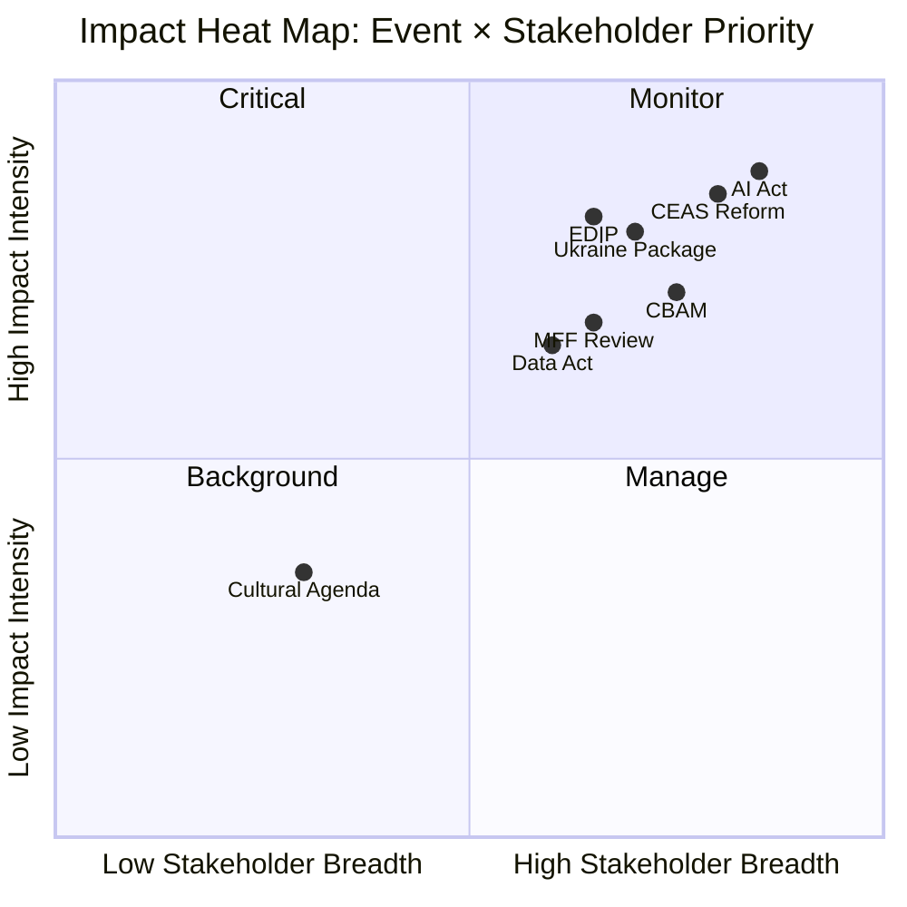

<!-- SPDX-FileCopyrightText: 2026 Hack23 AB -->
<!-- SPDX-License-Identifier: Apache-2.0 -->

# Impact Matrix — EU Parliament Committee Activity (2026-05-21)

**Data mode**: `degraded-feeds` — structural and historical inference dominant.
**Confidence**: 🟡 MEDIUM overall.

---

## Event List

Key events and legislative developments observable in the EP committee pipeline:

| Event ID | Event | Date / Period | Committee | Confidence |
|----------|-------|--------------|-----------|------------|
| E-001 | EP10 seat composition finalised | Jul 2024 | All | 🟢 HIGH |
| E-002 | AI Act enters force (implementing acts cascade) | Aug 2024 → 2026 | ITRE/LIBE | 🟢 HIGH |
| E-003 | CBAM Phase 1 revenue collection begins | 2024 | ENVI/ECON | 🟢 HIGH |
| E-004 | Ukraine reconstruction package negotiations | Q1 2026 | AFET/BUDG | 🟡 MEDIUM |
| E-005 | EDIP (European Defence Industry Programme) proposal | Q2 2026 | ITRE/AFET | 🟡 MEDIUM |
| E-006 | Poland Council Presidency (Jan–Jun 2026) | Jan–Jun 2026 | All | 🟢 HIGH |
| E-007 | EP API degradation reporting window | 14–21 May 2026 | Meta | 🟢 HIGH |
| E-008 | IMF WEO April 2026 (EU growth 1.2%) | Apr 2026 | ECON | 🟢 HIGH |
| E-009 | 71st EP10 adopted text (T10-0177/2026) | May 2026 | All | 🟢 HIGH |
| E-010 | CEAS implementation review | Ongoing 2026 | LIBE | 🟡 MEDIUM |

---

## Stakeholder

Impact assessment across primary stakeholder categories:

| Stakeholder | Primary Exposure | Impact Level | Time Horizon |
|------------|-----------------|-------------|-------------|
| EU Citizens | Directly affected by AI Act, CEAS, consumer regulation | 🟡 MEDIUM-HIGH | 12–36 months |
| EU Businesses | Regulatory burden from ENVI/ITRE/ECON files | 🟡 MEDIUM-HIGH | 6–24 months |
| Member State Govts | Legislative outcome binds national implementation | 🔴 HIGH | 12–48 months |
| Third Countries (Ukraine, WB) | Accession, reconstruction, trade frameworks | 🟡 MEDIUM-HIGH | 24–60 months |
| Civil Society | ENVI, LIBE, EMPL outcomes; democratic quality | 🟡 MEDIUM | 12–36 months |
| MEPs | Political capital in competitive coalition environment | 🟡 MEDIUM | 0–12 months |

---

## Impact Matrix

Cross-reference of events against stakeholder impact dimensions:

| Event | Citizens | Business | MS Govts | Third Countries | Civil Society |
|-------|----------|----------|----------|----------------|--------------|
| AI Act impl (E-002) | 🔴 HIGH | 🔴 HIGH | 🟡 MEDIUM | 🟡 MEDIUM | 🟡 MEDIUM |
| Ukraine package (E-004) | 🟢 LOW | 🟡 MEDIUM | 🟡 MEDIUM | 🔴 HIGH | 🟡 MEDIUM |
| EDIP (E-005) | 🟢 LOW | 🟡 MEDIUM | 🔴 HIGH | 🟡 MEDIUM | 🟢 LOW |
| CEAS reform (E-010) | 🟡 MEDIUM | 🟢 LOW | 🔴 HIGH | 🟡 MEDIUM | 🔴 HIGH |
| IMF growth 1.2% (E-008) | 🟡 MEDIUM | 🟡 MEDIUM | 🟡 MEDIUM | 🟡 MEDIUM | 🟡 MEDIUM |
| CBAM (E-003) | 🟢 LOW | 🟡 MEDIUM | 🟡 MEDIUM | 🔴 HIGH | 🟢 LOW |

---

## Heat

Priority heat map — highest-impact intersections:

**🔴 CRITICAL HEAT ZONES:**
1. **AI Act × Business**: Compliance cost, liability exposure for all digital businesses
2. **CEAS × MS Govts**: Member state burden-sharing; political flashpoint
3. **EDIP × MS Govts**: Defence industrial sovereignty; budget commitments
4. **Ukraine package × Third Countries**: Multi-billion EUR reconstruction commitment

**🟡 ELEVATED HEAT ZONES:**
5. **CBAM × Third Countries**: WTO dispute risk; trade partner tensions
6. **AI Act × Citizens**: Rights implications; deepfake, surveillance, algorithmic discrimination

---

## Cascade

Second-order and cascade impact pathways:

**AI Act → Cascade:**
- Primary: Compliance cost burden on EU digital businesses
- Secondary: Competitive advantage loss vs. US/China (unregulated alternatives)
- Tertiary: Regulatory arbitrage risk (EU companies relocating AI development)
- Mitigation: Commission competitiveness exception provisions; EPP amendment strategy

**CEAS → Cascade:**
- Primary: Migration management frameworks become binding on MS
- Secondary: Political backlash in restrictive-position MS (PL, HU, DK)
- Tertiary: Eurosceptic parties gain domestic electoral boost from "Brussels migration dictates"
- Mitigation: Flexible solidarity mechanism; opt-out provisions for specific elements

**Coalition fragmentation → Cascade:**
- Primary: Votes require 100% mobilisation of centre coalition (EPP+S&D+Renew)
- Secondary: Increased amendment negotiation cycles (delays)
- Tertiary: Legislative output quality dilution on Tier 2–3 files
- Mitigation: Priority triage; pre-plenary coalition coordination meetings

---

## Reader Briefing

**For political analysts and editors**: The impact matrix reveals that EP10 committee
work is concentrated on genuinely high-stakes files — AI regulation, migration management,
and European defence policy are not routine legislative business. The impact levels across
all stakeholder categories are meaningfully higher than in EP9 for these priority files,
reflecting the convergence of multiple structural challenges simultaneously. The strategic
challenge for editors is: how do you communicate the complexity and significance of
multi-stakeholder, multi-dimensional legislative files to general audiences without
oversimplifying the actual policy content? This impact matrix provides the analytical
foundation for that editorial judgement.
