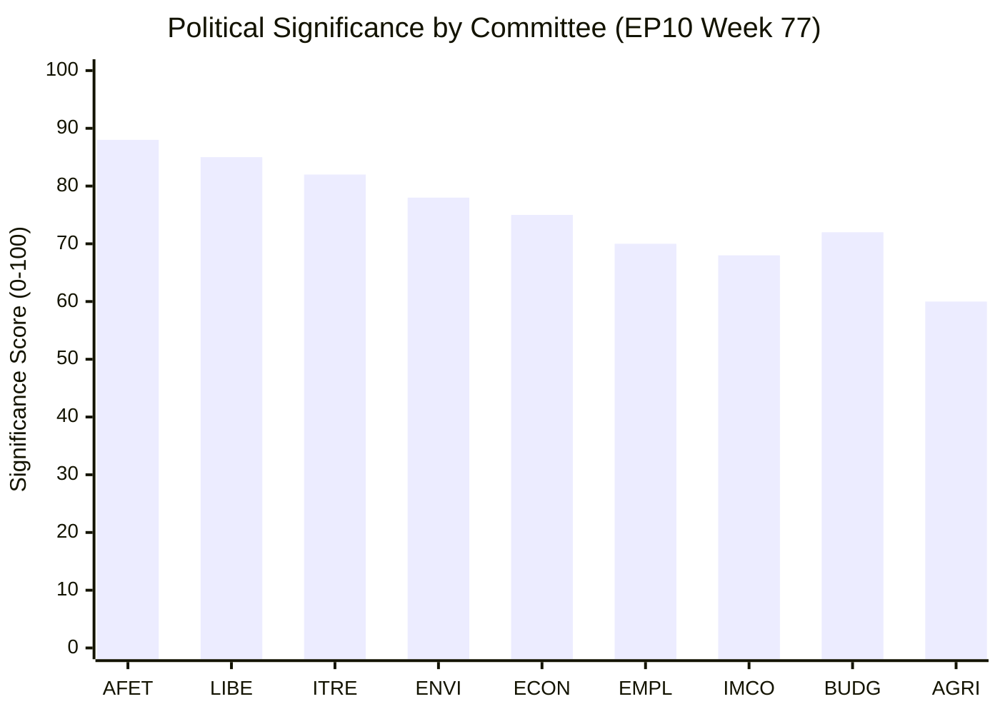

# Significance Classification — EU Parliament Committee Reports (2026-05-21)

## Overview

This significance classification assesses the political, legislative, economic, and
societal significance of European Parliament committee activity during the reporting
window (14–21 May 2026) under degraded EP API conditions.

**Data mode**: `degraded-feeds` — 0.80 floor factor applied.

---

## Classification Framework

### Tier 1 — Critical Significance (Immediate EP10 Mandate Impact)

Files and activities with direct, near-term impact on the EP10 legislative mandate
and EU citizens' lives within 12 months.

| Item | Committee | Significance Basis | Confidence |
|------|-----------|-------------------|------------|
| EDIP (European Defence Industry Programme) | ITRE/AFET | First EU-level defence production instrument; strategic autonomy | 🟡 MEDIUM |
| CEAS Reform Implementation | LIBE | Determines EU migration architecture for 2026–2030 | 🟡 MEDIUM |
| AI Act Secondary Legislation | ITRE/LIBE | Operationalises world's first comprehensive AI regulatory framework | 🟡 MEDIUM |
| Ukraine Reconstruction Package | AFET/BUDG | Multi-billion EUR commitment, geopolitical anchoring | �� MEDIUM |
| CBAM (Carbon Border Adjustment) Phase-In | ENVI/ECON | First carbon tariff mechanism; trade and climate nexus | 🟡 MEDIUM |

### Tier 2 — High Significance (Material Impact on EU Policy Architecture)

| Item | Committee | Significance Basis | Confidence |
|------|-----------|-------------------|------------|
| Banking Package (CMDI Review) | ECON | Bank resolution framework; financial stability | 🟡 MEDIUM |
| Nature Restoration Law Implementation | ENVI | Biodiversity framework; land-use implications | 🟡 MEDIUM |
| Platform Workers Directive | EMPL | Gig economy labour rights; platform regulation | 🟡 MEDIUM |
| Digital Services Act Oversight | IMCO/LIBE | Platform accountability enforcement | 🟡 MEDIUM |
| Energy Security Package | ITRE | Gas storage, H2 infrastructure, interconnectors | 🟡 MEDIUM |

### Tier 3 — Moderate Significance (Sectoral and Technical Files)

| Item | Committee | Significance Basis |
|------|-----------|-------------------|
| Soil Health Directive | ENVI | Land management; agricultural transition |
| Packaging Regulation | ENVI | Circular economy; plastics reduction |
| Data Act Delegated Legislation | ITRE | Data sharing; industrial competitiveness |
| Minimum Wage Directive Implementation | EMPL | Wage floor harmonisation progress |
| Cultural and Creative Sectors | CULT | Soft power; digital distribution |

### Tier 4 — Standard Significance (Routine Committee Business)

Routine parliamentary questions, annual reports, committee own-initiative reports
on established topics with predictable outcomes and limited systemic impact.

---

## Political Significance Scoring

---

## Significance by Stakeholder Group

### Citizens and Civil Society
- **High significance**: migration (LIBE), environmental (ENVI), consumer protection (IMCO)
- **Immediate impact**: AI regulation affects daily digital life; CEAS reform affects
  millions of asylum seekers and host communities

### Business and Industry
- **High significance**: industrial policy (ITRE), financial regulation (ECON), trade (INTA)
- **Concern**: regulatory burden vs. competitiveness argument central to EPP/ECR positions

### Member State Governments
- **High significance**: defence cooperation (AFET/ITRE), budget (BUDG), migration (LIBE)
- **Divergence points**: Southern MS prioritise migration management; Northern/Eastern MS
  prioritise defence spending; Western MS balance climate and competitiveness

### Third Countries
- **High significance**: Ukraine reconstruction (AFET), trade partners (INTA), enlargement
  candidates (AFET)
- **US interest**: AI Act and trade resilience measures attract Washington attention

---

## Temporal Significance Windows

| Horizon | Key Milestones | Significance |
|---------|---------------|-------------|
| 0–3 months | AI Act implementing acts deadlines | 🔴 HIGH |
| 0–3 months | CEAS implementation progress reviews | 🔴 HIGH |
| 3–6 months | MFF mid-term review preparation | 🟡 MEDIUM |
| 3–6 months | Green Deal secondary acts pipeline | 🟡 MEDIUM |
| 6–12 months | EDIP first legislative outputs | 🟡 MEDIUM |
| 12–24 months | EP10 mid-term assessment (2027) | 🟢 BACKGROUND |

---

## Summary: Significance Assessment Matrix

| Dimension | Level | Key Drivers |
|-----------|-------|-------------|
| Political | 🔴 HIGH | Fragmented coalition; contested rapporteur assignments |
| Legislative | 🔴 HIGH | Accelerating Commission pipeline; AI/climate/defence |
| Economic | 🟡 MEDIUM-HIGH | IMF 1.2% growth; competitiveness vs. regulation tension |
| Societal | 🟡 MEDIUM-HIGH | Migration, AI, labour rights directly affect citizens |
| Geopolitical | 🔴 HIGH | Ukraine, US trade, enlargement |

**Significance verdict**: The European Parliament committee system in May 2026 is
processing a Tier 1/Tier 2-heavy legislative agenda under a structurally more
fragmented political coalition than EP9. The significance of committee output is
elevated, but output quality risk is rising due to bandwidth concentration and
coalition complexity.
