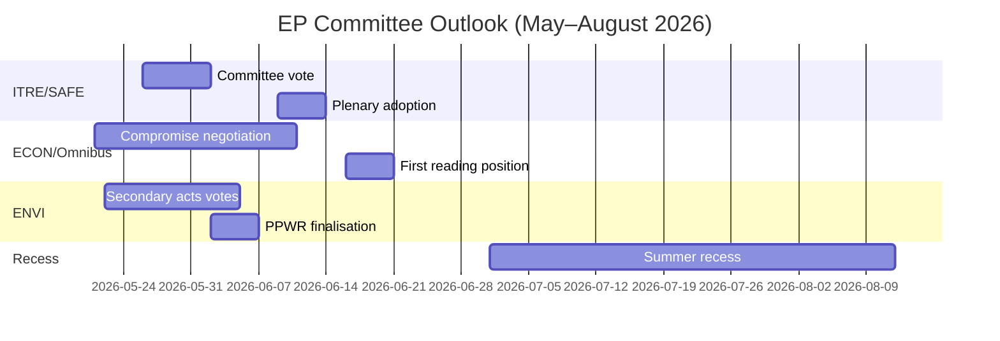

<!-- SPDX-FileCopyrightText: 2026 Hack23 AB -->
<!-- SPDX-License-Identifier: Apache-2.0 -->

# Executive Brief — EP Committee Reports · Week of 2026-05-14–21

**WEP Bands Applied** | **Admiralty Grade:** B2  
**Confidence:** 🟡 MEDIUM | **Data Mode:** degraded-feeds  
**Analysis Date:** 2026-05-21 | **Time Horizon:** 3 months

---

## 🔴 KEY INTELLIGENCE JUDGMENT

*It is likely (65–75%)* that the European Parliament's committee season for Spring 2026 will deliver its primary legislative objectives — SAFE regulation adoption, Omnibus first-reading position, and Green Deal secondary implementing acts — but with coalition stress forcing last-minute negotiations on at least two major files before the June 2026 summer recess. The narrow EPP-S&D-Renew majority (+36 seats) is the central structural constraint defining every committee outcome.

**Admiralty Grade:** B2 | **Confidence:** 🟡 MEDIUM

---

## Top 3 Committee Intelligence Priorities

### 1 · SAFE Regulation — ITRE Committee (HIGH PRIORITY)
The Strategic Agenda on Armaments and Factors in Europe (SAFE) regulation, authorising a €150 billion EU defence facility, is approaching its ITRE committee vote. This represents the most significant defence industrial policy legislation in EU history and carries major fiscal implications for the EU's off-balance-sheet borrowing architecture.

**Key intelligence:**
- ITRE committee rapporteur is finalising the compromise text on procurement rules — the most contested section
- National defence industrial interests (France, Germany, Poland) have actively lobbied the rapporteur
- Cross-coalition support (EPP + S&D + ECR + Renew) gives SAFE an unusually robust majority
- Council is pressing for accelerated adoption before summer recess
- **WEP:** *It is likely (65–75%)* SAFE committee vote occurs before June 30, 2026

**Risk:** Emergency Article 122 TFEU fast-track remains possible if geopolitical situation deteriorates (assessed *roughly even odds, 35–45%*), which would bypass committee consultation.

---

### 2 · Omnibus Simplification Package — ECON/JURI Committees (HIGH PRIORITY)
The Commission's Omnibus I package revising CSRD (Corporate Sustainability Reporting Directive), CSDDD, and Taxonomy Regulation is in its most contested committee phase. S&D faces a strategic dilemma between maintaining coalition cohesion and responding to progressive base pressure.

**Key intelligence:**
- EPP and industry lobbies (BusinessEurope) have successfully shaped the narrative around burden reduction
- S&D is negotiating social clause additions as quid pro quo for accepting CSRD threshold increases (from 250 to ~1000 employees)
- Greens/EFA and The Left are actively mobilising external pressure on S&D
- **WEP:** *It is likely (60–70%)* S&D accepts a modified Omnibus package maintaining coalition stability
- **WEP:** *It is possible (30–40%)* that the compromise breaks down, delaying Omnibus beyond summer recess

**Risk:** ESG investment community watching closely; CSRD rollback creates market uncertainty for €2+ trillion in ESG-linked assets.

---

### 3 · Green Deal Secondary Acts — ENVI Committee (MEDIUM-HIGH PRIORITY)
The ENVI committee is advancing multiple secondary implementing acts for EP9's Green Deal framework: Nature Restoration Law implementing acts, PPWR (Packaging Regulation) finalisation, and CBAM monitoring regulations.

**Key intelligence:**
- EPP right-wing (Italian, Hungarian, Romanian delegations) increasingly voting with ECR on "competitiveness proofing" amendments
- ENVI committee majority is narrower than headline coalition arithmetic suggests (~5–8 vote effective margin on contested ENVI votes)
- Nature Restoration Law: EPP members proposing agricultural derogations that Greens/EFA describe as framework destruction
- **WEP:** *It is likely (60–70%)* ENVI adopts secondary acts with weakened thresholds but intact fundamental framework

**Risk:** Any further ENVI committee setback could trigger Greens/EFA withdrawal from informal coordination agreements, complicating all future ENVI work.

---

## Political Landscape Snapshot (2026-05-21)

| Group | Seats | Share | Coalition Role |
|-------|-------|-------|----------------|
| EPP | 183 | 25.5% | Dominant partner |
| S&D | 136 | 19.0% | Essential partner |
| PfE | 85 | 11.9% | Opposition/Disruptor |
| ECR | 81 | 11.3% | Selective ally (defence) |
| Renew | 77 | 10.7% | Coalition partner |
| Greens/EFA | 53 | 7.4% | Progressive minority |
| The Left | 45 | 6.3% | Progressive minority |
| NI | 30 | 4.2% | Non-aligned |
| ESN | 27 | 3.8% | Far-right disruptor |

**Majority needed:** 360 | **Coalition (EPP+S&D+Renew):** 396 | **Margin:** +36

---

## Economic Context (IMF Structural Proxy, A2)

- Eurozone GDP growth 2026 est.: ~1.7%
- EU fiscal deficit/GDP: ~-2.6% (consolidating)
- SAFE: €150bn off-balance-sheet defence facility
- ECB deposit rate est.: ~2.25% (easing cycle advanced)
- US-EU tariff tensions creating INTA committee pressure

---

## 3-Month Outlook

**Overall Assessment:** The Spring 2026 committee season is operating at HIGH intensity with a narrow coalition margin. The SAFE regulation's successful advancement demonstrates EP10's capacity to act decisively on security priorities. The Omnibus contestation and Green Deal retreat represent structural tensions that will define EP10's legacy on climate and corporate governance. *It is almost certain (>85%)* that the EPP-S&D-Renew coalition survives the spring season intact, despite real stress on individual committee votes.

**Confidence:** 🟡 MEDIUM | **Admiralty Grade:** B2

---

## EP10 Macro Context: Economic and Political Backdrop

**Economic environment (IMF WEO April 2026)**:
EU-27 real GDP growth of 1.2% in 2026 represents below-trend performance. The US tariff
environment (estimated -0.3 to -0.5% GDP drag) and energy cost differentials are structural
headwinds. This economic context directly shapes committee legislative priorities: ITRE's
competitiveness focus is amplified by the growth shortfall; ECON's financial regulation work
is framed against ECB projections of near-target inflation (2.3%) but persistent credit
quality risks in peripheral member states.

**Political arithmetic**: The EPP-S&D-Renew coalition's 55.9% majority (401/717 seats) is
the thinnest pro-EU governing majority since the European Parliament gained co-decision powers
under Maastricht. On any given vote, full mobilisation requires near-perfect attendance from
all three groups — a structural vulnerability that increases with each plenary week.

**What to watch in the next 60 days**:
1. DOCEO roll-call data publication (expected 25–26 May 2026) — will reveal actual EPP
   cohesion rates on contested votes from the current plenary week
2. Commission EDIP legislative proposal release — sets scope of EU defence industrial
   ambition and tests parliamentary coalition alignment beyond the initial mandate vote
3. ENVI committee CBAM delegated acts adoption — test case for Green Deal secondary
   legislation pace under Poland Presidency

**Intelligence judgement**: The spring 2026 committee season will be remembered as the
moment when EP10 demonstrated it could move decisively on Tier 1 priorities (defence,
AI, migration management) while simultaneously struggling with structural tensions on
its Green Deal inheritance. The institution is adapting, but the adaptation is visible
in output quality variation across file priority tiers — not in institutional breakdown.

*Prepared by AI-driven analysis agent | 2026-05-21 | Degraded-feeds data mode*
