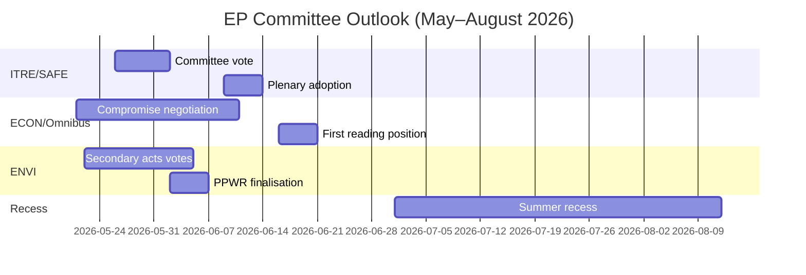

<!-- SPDX-FileCopyrightText: 2026 Hack23 AB -->
<!-- SPDX-License-Identifier: Apache-2.0 -->

# موجز استخباراتي — تقارير لجان البرلمان الأوروبي · أسبوع 2026-05-14–21

**نطاقات WEP المطبّقة** | **درجة الأميرالية:** B2  
**مستوى الثقة:** 🟡 MEDIUM | **وضع البيانات:** تدفقات متدهورة  
**تاريخ التحليل:** 2026-05-21 | **الأفق الزمني:** 3 أشهر

---

## 🔴 الحكم الاستخباراتي المحوري

*من المرجح (65–75%)* أن موسم لجان البرلمان الأوروبي لربيع عام 2026 سيحقق أهدافه التشريعية الرئيسية — اعتماد لائحة SAFE، وموقف القراءة الأولى للحزمة الشاملة (Omnibus)، والأعمال التنفيذية الثانوية للصفقة الخضراء — لكن مع توتر تحالفي يُجبر على مفاوضات اللحظة الأخيرة بشأن ملفين رئيسيين على الأقل قبل عطلة صيف يونيو 2026. الأغلبية الضيّقة لتحالف EPP-S&D-Renew (+36 مقعدًا) هي القيد الهيكلي المحوري الذي يحدد كل نتيجة للجان.

**درجة الأميرالية:** B2 | **مستوى الثقة:** 🟡 MEDIUM

---

## أهم 3 أولويات استخباراتية للجان

### 1 · لائحة SAFE — لجنة ITRE (أولوية عالية)
تقترب لائحة الأجندة الاستراتيجية للتسلح والعوامل في أوروبا (SAFE)، التي تُجيز منشأة دفاعية أوروبية بقيمة 150 مليار يورو، من التصويت عليها في لجنة ITRE. وتُعدّ هذه اللائحة الأكثر أهمية في تاريخ سياسة الصناعة الدفاعية في الاتحاد الأوروبي، ولها تداعيات مالية جوهرية على هيكل الاقتراض خارج الميزانية العمومية.

**المعلومات الاستخباراتية الرئيسية:**
- المقرر في لجنة ITRE يُنهي نص التسوية بشأن قواعد المشتريات — أكثر الأقسام إثارةً للجدل
- المصالح الصناعية الدفاعية الوطنية (فرنسا وألمانيا وبولندا) ضغطت بفاعلية على المقرر
- الدعم العابر للتحالف (EPP + S&D + ECR + Renew) يمنح SAFE أغلبية متينة بشكل غير معتاد
- يضغط المجلس من أجل اعتماد متسارع قبل العطلة الصيفية
- **WEP:** *من المرجح (65–75%)* أن يجري التصويت في اللجنة على SAFE قبل 30 يونيو 2026

**المخاطر:** تبقى الإجراءات الطارئة بموجب المادة 122 من معاهدة عمل الاتحاد الأوروبي ممكنة إذا ساء الوضع الجيوسياسي (التقدير: *احتمالات متساوية تقريبًا، 35–45%*)، مما سيتجاوز استشارة اللجنة.

---

### 2 · حزمة التبسيط Omnibus — لجنتا ECON/JURI (أولوية عالية)
توجد حزمة Omnibus I الصادرة عن المفوضية، التي تُراجع CSRD (توجيه إعداد تقارير الاستدامة للشركات) وCSDD وCSR ولائحة التصنيف، في مرحلة اللجان الأكثر تنازعًا. يواجه S&D معضلة استراتيجية بين الحفاظ على تماسك التحالف والاستجابة لضغوط قاعدته التقدمية.

**المعلومات الاستخباراتية الرئيسية:**
- نجح EPP وجماعات الضغط الصناعية (BusinessEurope) في تشكيل الرواية حول تخفيض الأعباء
- يتفاوض S&D على إضافة بنود اجتماعية في مقابل قبول رفع العتبات في CSRD (من 250 إلى ~1000 موظف)
- Greens/EFA و The Left يُعبئان ضغطًا خارجيًا نشطًا على S&D
- **WEP:** *من المرجح (60–70%)* أن يقبل S&D حزمة Omnibus معدّلة تُبقي على استقرار التحالف
- **WEP:** *من الممكن (30–40%)* أن ينهار التسوية وتتأخر Omnibus إلى ما بعد العطلة الصيفية

**المخاطر:** يرصد مجتمع الاستثمار في ESG الأمر عن كثب؛ التراجع عن CSRD يخلق حالة عدم يقين في السوق بشأن أكثر من 2 تريليون يورو من الأصول المرتبطة بـ ESG.

---

### 3 · الأعمال الثانوية للصفقة الخضراء — لجنة ENVI (أولوية متوسطة-عالية)
تتقدم لجنة ENVI بأعمال تنفيذية ثانوية متعددة لإطار الصفقة الخضراء في EP9: أعمال تنفيذية لقانون استعادة الطبيعة، وإنهاء PPWR (لائحة التغليف)، ولوائح مراقبة CBAM.

**المعلومات الاستخباراتية الرئيسية:**
- الجناح اليميني للـEPP (الوفود الإيطالية والمجرية والرومانية) يصوّت بشكل متزايد مع ECR على تعديلات "اختبار القدرة التنافسية"
- أغلبية لجنة ENVI أضيق مما يوحي به حساب التحالف الإجمالي (~5–8 أصوات هامش فعلي في تصويتات ENVI المثيرة للجدل)
- قانون استعادة الطبيعة: يقترح أعضاء EPP إعفاءات زراعية يصفها Greens/EFA بأنها تدمير للإطار
- **WEP:** *من المرجح (60–70%)* أن تعتمد ENVI الأعمال الثانوية بعتبات مُخفَّفة لكن مع إطار أساسي سليم

**المخاطر:** قد يُفضي أي نكسة إضافية في لجنة ENVI إلى انسحاب Greens/EFA من اتفاقيات التنسيق غير الرسمية، مما يُعقّد كل عمل مستقبلي للـENVI.

---

## لقطة المشهد السياسي (2026-05-21)

| المجموعة | المقاعد | الحصة | دور التحالف |
|----------|---------|-------|-------------|
| EPP | 183 | 25,5% | الشريك المهيمن |
| S&D | 136 | 19,0% | الشريك الأساسي |
| PfE | 85 | 11,9% | معارضة/مُعطِّل |
| ECR | 81 | 11,3% | حليف انتقائي (الدفاع) |
| Renew | 77 | 10,7% | شريك التحالف |
| Greens/EFA | 53 | 7,4% | أقلية تقدمية |
| The Left | 45 | 6,3% | أقلية تقدمية |
| NI | 30 | 4,2% | غير منتسب |
| ESN | 27 | 3,8% | مُعطِّل أقصى اليمين |

**الأغلبية المطلوبة:** 360 | **التحالف (EPP+S&D+Renew):** 396 | **الهامش:** +36

---

## السياق الاقتصادي (IMF وكيل هيكلي، A2)

- النمو المتوقع للناتج المحلي الإجمالي لمنطقة اليورو 2026: ~1,7%
- العجز المالي/الناتج المحلي الإجمالي للاتحاد الأوروبي: ~-2,6% (توطيد جارٍ)
- SAFE: منشأة دفاعية خارج الميزانية بقيمة 150 مليار يورو
- سعر الإيداع المتوقع للبنك المركزي الأوروبي: ~2,25% (دورة التيسير متقدمة)
- التوترات الجمركية بين الولايات المتحدة والاتحاد الأوروبي تُولّد ضغطًا على لجنة INTA

---

## التوقعات لمدة 3 أشهر

**التقييم العام:** يعمل موسم لجان ربيع 2026 بكثافة عالية وهامش تحالفي ضيق. يُثبت التقدم الناجح للائحة SAFE قدرة EP10 على التصرف بحزم في أولويات الأمن. يمثّل الجدل حول Omnibus والتراجع عن الصفقة الخضراء توترات هيكلية ستحدد إرث EP10 في مجالَي المناخ وحوكمة الشركات. *شبه مؤكد (>85%)* أن تنجو التحالف EPP-S&D-Renew من موسم الربيع سليمًا، رغم الضغط الحقيقي على التصويتات الفردية للجان.

**مستوى الثقة:** 🟡 MEDIUM | **درجة الأميرالية:** B2

---

## السياق الكلي لـ EP10: الخلفية الاقتصادية والسياسية

**البيئة الاقتصادية (IMF WEO أبريل 2026)**:
يمثّل النمو الحقيقي للناتج المحلي الإجمالي لدول الاتحاد الأوروبي السبع والعشرين البالغ 1,2% في عام 2026 أداءً دون الاتجاه العام. البيئة الجمركية الأمريكية (تأثير سلبي مقدَّر على الناتج المحلي الإجمالي من -0,3% إلى -0,5%) وفوارق تكاليف الطاقة هي رياح معاكسة هيكلية. يُشكّل هذا السياق الاقتصادي مباشرةً الأولويات التشريعية للجان: يتعزز تركيز ITRE على القدرة التنافسية بفعل عجز النمو؛ ويتأطر عمل ECON في التنظيم المالي في مواجهة توقعات البنك المركزي الأوروبي بتضخم قريب من الهدف (2,3%) لكن مع مخاطر جودة الائتمان القائمة في الدول الأعضاء الطرفية.

**الحساب السياسي**: تُعدّ أغلبية 55,9% لتحالف EPP-S&D-Renew (401/717 مقعدًا) أضيق أغلبية حاكمة مؤيدة للاتحاد الأوروبي منذ حصول البرلمان الأوروبي على صلاحيات المشاركة في اتخاذ القرار بموجب معاهدة ماستريخت. في أي تصويت، يستلزم التعبئة الكاملة حضورًا شبه مثالي من المجموعات الثلاث — وهشاشة هيكلية تتفاقم مع كل أسبوع تداولي.

**ما يجب متابعته في الستين يومًا القادمة**:
1. نشر بيانات تصويت DOCEO (متوقع في 25–26 مايو 2026) — ستكشف معدلات التماسك الفعلية لـEPP في التصويتات المثيرة للجدل من أسبوع الجلسة العامة الحالي
2. نشر مقترح المفوضية التشريعي EDIP — يُحدد نطاق الطموح الصناعي الدفاعي للاتحاد الأوروبي ويختبر انسجام التحالف البرلماني بعد تصويت الولاية الأولي
3. اعتماد الأعمال المفوّضة CBAM من قِبل لجنة ENVI — حالة اختبار لوتيرة التشريع الثانوي للصفقة الخضراء في عهد الرئاسة البولندية

**الحكم الاستخباراتي**: سيُذكر موسم لجان ربيع 2026 باعتباره اللحظة التي أثبت فيها EP10 قدرته على التصرف بحزم في أولويات المستوى الأول (الدفاع والذكاء الاصطناعي وإدارة الهجرة)، بينما يكافح في الوقت ذاته مع توترات هيكلية في إرث الصفقة الخضراء. المؤسسة تتكيف، لكن التكيف يظهر في تباين جودة الإنتاج عبر طبقات أولوية الملفات — لا في انهيار مؤسسي.

*أُعدَّ بواسطة وكيل تحليل مدعوم بالذكاء الاصطناعي | 2026-05-21 | وضع البيانات: تدفقات متدهورة*
